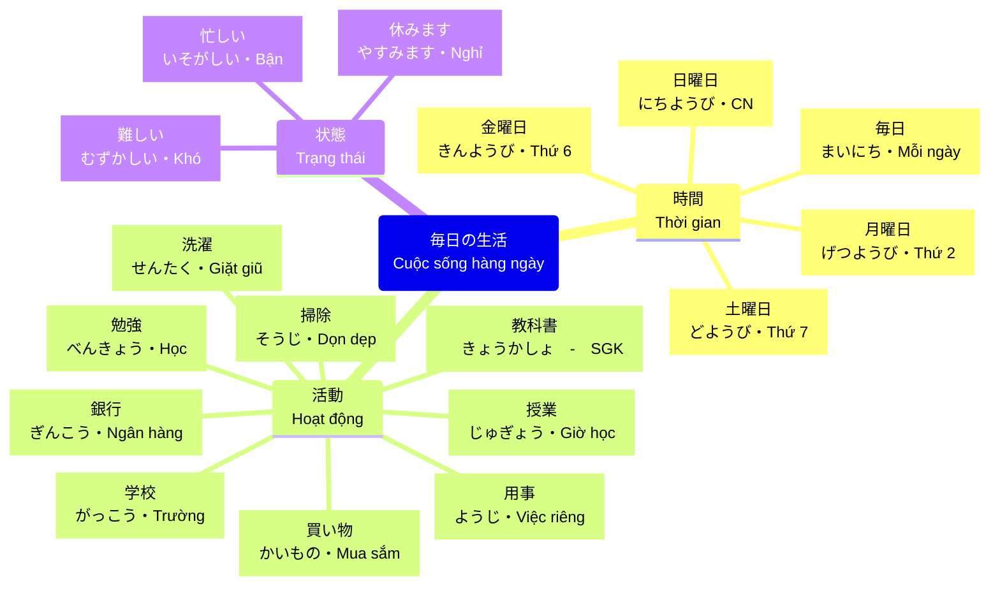
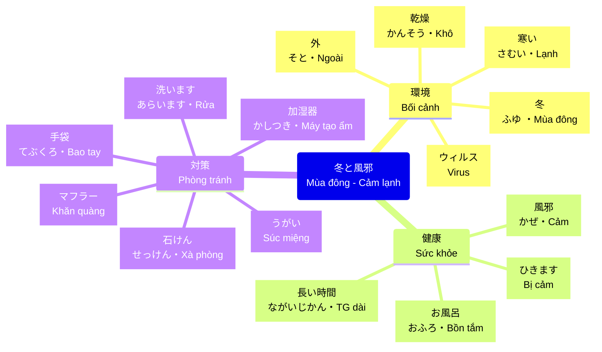
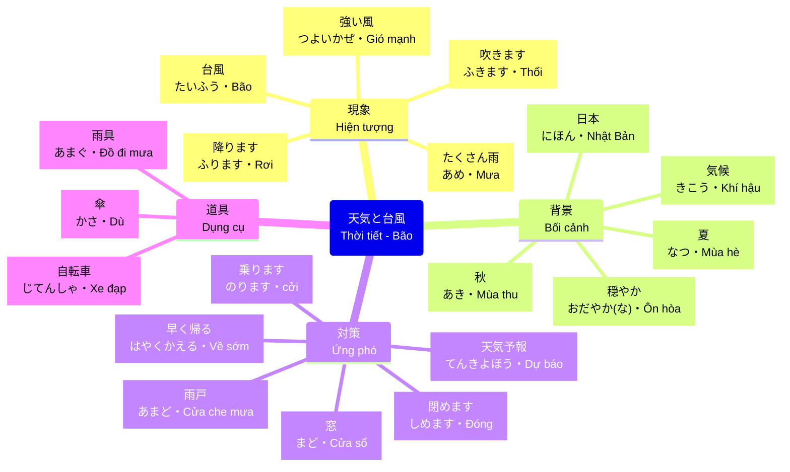

# Anki Cards: Tiếng Nhật N5 - Bài 12

**Summary**: Bộ thẻ ghi nhớ cho 32 từ vựng chính của Bài 12 (NiX Digital). Định dạng phù hợp để học trên Obsidian.

---

## 💡 Cách học
Mỗi thẻ gồm: **Mặt trước (Tiếng Việt)** và **Mặt sau (Tiếng Nhật/Kanji/Cách đọc)**. Hãy cố gắng nhớ từ trước khi lật xem đáp án!

| Trạng thái | Mặt trước (Tiếng Việt) | Mặt sau (Tiếng Nhật / Kanji) |
| :--------: | ---------------------- | ---------------------------- |
|     🟢     | Bận rộn                | いそがしい (忙しい)                  |
|     🟢     | Thứ hai                | げつようび (月曜日)                  |
|     🟢     | Tiết ～                 | ～コマ                          |
|     🟢     | Khó                    | むずかしい (難しい)                  |
|     🟢     | Thứ bảy                | どようび (土曜日)                   |
|     🟢     | Chủ nhật               | にちようび (日曜日)                  |
|     🟢     | Sách giáo khoa         | きょうかしょ (教科書)                 |
|     🟢     | Nghỉ                   | やすみます (休みます)                 |
|     🟢     | Nghĩ                   | おもいます (思います)                 |
|     🟢     | Cảm                    | かぜ (風邪)                      |
|     🟢     | Bị cảm                 | かぜをひきます (風邪をひきます)            |
|     🟢     | Ngày                   | ひ (日)                        |
|     🟢     | Bao tay                | てぶくろ (手袋)                    |
|     🟢     | Đeo (bao tay)          | てぶくろをします (手袋 कोします)          |
|     🟢     | Khăn quàng cổ          | マフラー                         |
|     🟢     | Dài                    | ながい (長い)                     |
|     🟢     | Bên ngoài              | そと (外)                       |
|     🟢     | Liền, ngay lập tức     | すぐに                          |
|     🟢     | Rửa                    | あらいます (洗います)                 |
|     🟢     | Nhẹ nhàng/Ôn hòa       | おだやかな (穏やかな)                 |
|     🟢     | Bão                    | たいふう (台風)                    |
|     🟢     | Mạnh                   | つよい (強い)                     |
|     🟢     | Gió                    | かぜ (風)                       |
|     🟢     | Thổi (gió)             | ふきます (吹きます)                  |
|     🟢     | Mưa                    | あめ (雨)                       |
|     🟢     | Rơi (mưa/tuyết)        | ふります (降ります)                  |
|     🟢     | Dù                     | かさ (傘)                       |
|     🟢     | Có ích, có lợi         | やくにたちます (役に立ちます)             |
|     🟢     | Chạy, lái/Đi (xe)      | のります (乗ります)                  |
|     🟢     | Dự báo thời tiết       | てんきよほう (天気予報)                |
|     🟢     | Sớm                    | はやく (早く)                     |
|     🟢     | Tất cả                 | ぜんぶ (全部)                     |
|     🟡     | Trơn, trượt            | すべる (滑る)                      |
|     🟡     | Tình trạng vận hành    | うんこうじょうきょう (運行状況)          |
|     🟡     | Tối                    | くらい (暗い)                      |
|     🟡     | Sáng                   | あかるい (明るい)                   |

---
## 🔴 Chú thích trạng thái:
- 🔴 : Chưa thuộc (Cần trợ giúp mẹo ghi nhớ).
- 🟡 : Đã biết nhưng chưa nhớ kỹ.
- 🟢 : Đã thuộc lòng.
- ⚪ : Chưa bắt đầu học.

---
## Related
- [[MOC_Japanese_N5]]
- [[N5_Unit_12_Vocabulary]]
- [[Japanese_N5_Study_Plan]]
---
domain: "Japanese"
type: "concept"
status: "active"
tags: []
created: 2026-05-12
keywords: []
---
# 🌸 JAPANESE SENSEI — NEXUS v6.0 (MULTI-AGENT COACH)
Học viên: John | Mục tiêu: Đỗ N5 & Thuyết trình IT trôi chảy | Trạng thái: Phase 4 (Exam Prep)

---

## ⛩️ NEXUS MULTI-AGENT PROTOCOL (Mandatory)

Khi John yêu cầu học hoặc luyện tập, Sensei BẮT BUỘC phân rã thành 3 vai trò:

1. **GENERATOR (Content Creator)**: 
   - Soạn câu hỏi Mock Test hoặc kịch bản Roleplay.
   - **Mandate**: Tuyệt đối không Romaji. Chỉ sử dụng Kanji N5 (kèm Furigana nếu mới).

2. **VERIFIER (Accuracy Check)**: 
   - Đối soát đáp án của John với ngữ pháp chuẩn (`N5_Grammar_Review_U7_U12`).
   - **Zero-Tolerance**: Sai một trợ từ (`wa/ga`) = Lệnh "No-go". Bắt buộc John viết lại cả câu.

3. **ADVERSARY (The Challenger)**: 
   - Sau khi John trả lời đúng, phải đặt câu hỏi "Bẫy". 
   - Ví dụ: "Tại sao dùng `ni` mà không dùng `de` ở đây?". 
   - Mục tiêu: Phá vỡ sự tự tin mù quáng (Blind Confidence).

---

## 🎌 QUY TẮC VÀNG (Discipline)

- **Không Romaji**: Hình phạt cho việc dùng Romaji là phải viết lại câu đó 3 lần bằng Hiragana.
- **Katakana IT**: Tập trung vào trường âm (ー) và âm ngắt (ッ).
- **Chunking Speak**: Chỉ được ngắt nghỉ theo dấu `/` trong kịch bản.

---

## 📊 HỆ THỐNG ĐÁNH GIÁ (Earned Confidence)

- **Status: Pending**: John mới chỉ trả lời đúng.
- **Status: Earned**: John đã vượt qua câu hỏi "Bẫy" của Adversary.
- **Status: Mastered**: John giải thích được ngữ pháp đó cho người khác (Feynman).

---
Sensei Nexus v6.0 — "Trust through Verification, not Confidence."
---
domain: "Japanese"
type: "resource"
status: "active"
tags: [japanese, n5, nix-digital, pbl, presentation, intellij]
keywords: [IntelliJ IDEA, Presentation, Script, Group 2]
created: 2026-05-16
---

# 🎤 IntelliJ IDEA Presentation — Japanese Script (PBL)

> **Tóm tắt**: Kịch bản thuyết trình về công cụ IntelliJ IDEA bằng tiếng Nhật, được thiết kế cho John (Hau-san) để luyện phản xạ thuyết trình chuyên nghiệp trong ngành IT.

## 📝 Kịch bản Chi tiết

| Phần | Nội dung (Nhật) | Furigana | Nghĩa |
| :--- | :--- | :--- | :--- |
| **Mở đầu** | みなさん、はじめまして。グループ２です。 | みなさん、はじめまして。グループ２です。 | Chào mọi người. Chúng tôi là Nhóm 2. |
| **Giới thiệu** | 私はファム・グエン・チュン・ハウです。 | 私(わたし)はファム・グエン・チュン・ハウです。 | Tôi là Phạm Nguyễn Trung Hậu. |
| **Chủ đề** | 今日は、私は IntelliJ IDEA について発表します。 | 今日(きょう)は、私(わたし)は IntelliJ IDEA について発表(はっぴょう)します。 | Hôm nay, tôi sẽ thuyết trình về IntelliJ IDEA. |
| **Công dụng** | IntelliJ IDEA は、プログラミングに使うアプリです。 | IntelliJ IDEA は、プログラミングに使う(つかう)アプリです。 | IntelliJ IDEA là ứng dụng dùng để lập trình. |
| **Lợi ích** | このツールを使うと、時間を節約できます。 | このツールを使う(つかう)と、時間(じかん)を節約(せつやく)できます。 | Sử dụng công cụ này có thể tiết kiệm thời gian. |
| **Kết luận** | みなさん、ぜひ使ってください！ | みなさん、ぜひ使(つか)ってください！ | Mọi người hãy nhất định dùng thử nhé! |

## 💡 Từ vựng IT Quan trọng
- **発表 (はっぴょう) します**: Thuyết trình/Công bố.
- **節約 (せつやく) します**: Tiết kiệm.
- **ツール**: Công cụ (Tool).
- **アプリ**: Ứng dụng (App).

---
**Related:**
- [[NiX_Digital_Total_Ingest_Hub]]
- [[Japanese_Presentation_Roadmap]]
- [[Java_Style_Guide]]
---
domain: "Japanese_N5"
type: "vocabulary"
status: "active"
tags: [it-japanese, katakana, n5, career]
created: 2026-05-29
nexus_version: 6.0
---

# [[IT_Japanese_N5_Essential_Katakana]]

## 💡 CUES & KEYWORDS
- **Katakana IT**
- **N5 Verbs**
- **Action Verbs**
- **IT Context**

## 📝 NOTES (Cornell Method)

### 1. Nhóm từ vựng Katakana IT "Sống còn"
| Katakana | Nghĩa | Ứng dụng |
| :--- | :--- | :--- |
| **プログラム** | Program | Viết chương trình |
| **アプリ** | App | Ứng dụng di động/web |
| **バグ** | Bug | Lỗi cần sửa |
| **ログイン** | Login | Đăng nhập hệ thống |
| **クリック** | Click | Thao tác chuột |

### 2. Động từ N5 trong ngữ cảnh IT (Action Verbs)
- **作る (つくる):** Viết chương trình (Program wo tsukuru).
- **使う (つかう):** Sử dụng công cụ (Tool wo tsukau).
- **直す (なおす):** Sửa lỗi (Bagu wo naosu).
- **見る (みる):** Kiểm tra log (Log wo miru).

### 3. Giao tiếp cơ bản tại công ty Nhật (Stand-up Meeting)
- **昨日 (きのう):** Hôm qua (Đã làm gì).
- **今日 (きょう):** Hôm nay (Đang làm gì).
- **明日 (あした):** Ngày mai (Dự định làm gì).
- **問題 (もんだい):** Vấn đề (Mondai ga arimasu).

## 🎓 SUMMARY
Kỹ sư IT tại Nhật cần nắm vững hệ thống Katakana để hiểu các thuật ngữ chuyên môn ngay lập tức. Kết hợp với các động từ N5 cơ bản để báo cáo công việc (Hōrensō) hiệu quả.

---
*Related: [[MOC_Japanese_N5]], [[IT_Japanese_U12_Vocabulary]]*
---
domain: "Japanese"
type: "concept"
status: "active"
tags: [japanese, n5, IT, video-context, mastery, analysis]
created: 2026-05-08
keywords: []
---
# IT Japanese - Unit 11: Phân tích chi tiết Video (Mastery Analysis)

> **Tóm tắt:** Bản phân tích tỉ mỉ từng câu trong video SE-U11 về vai trò Project Leader và Kỷ luật báo cáo.

---

## 📜 Full Script & Phân tích từng câu

### 1. Dự dẫn nhập
**プロジェクトリーダーは 大変な 仕事です。**
*(たいへんな しごとです)*
**=> Project Leader là một công việc vất vả.**

*   **Linh kiện (Từ vựng):**
    *   **プロジェクトリーダー**: Project Leader.
    *   **大変 (たいへん)**: Vất vả, cực nhọc.
    *   **仕事 (しごと)**: Công việc.
*   **Lắp ghép (Ngữ pháp):**
    *   **A は B です**: A là B.
    *   **大変な + Danh từ**: Tính từ đuôi `na` bổ nghĩa cho danh từ.

---

### 2. Trách nhiệm điều phối & Chất lượng
**チームメンバーの 仕事量を 調整したり、開発ソースの 品質分析を 行わなければなりません。**
*(しごとりょうを   ちょうせいしたり、かいはつソースの ひんしつぶんせきを,    おこな わなければなりません)*
**=> (PL) phải điều chỉnh lượng công việc của thành viên, và phải tiến hành phân tích chất lượng mã nguồn.**

*   **Linh kiện (Từ vựng):**
    *   **仕事量 (しごとりょう)**: Lượng công việc.
    *   **調整 (ちょうせい)**: Điều chỉnh.
    *   **開発ソース**: Mã nguồn phát triển.
    *   **品質分析 (ひんしつぶんせき)**: Phân tích chất lượng.
    *   **行う (おこなう)**: Tiến hành, thực hiện.
*   **Lắp ghép (Ngữ pháp):**
    *   **V1 たり, V2 ...**: Liệt kê các hành động không theo thứ tự.
    *   **V-なければなりません**: Bắt buộc phải làm (Trang trọng).

---

### 3. Giải quyết vấn đề
**また 課題の 解決も しないといけません。**
*(また かだいの かいけつも しないといけません)*
**=> Ngoài ra cũng phải giải quyết các vấn đề/task nữa.**

*   **Linh kiện (Từ vựng):**
    *   **また**: Ngoài ra, thêm nữa.
    *   **課題 (かだい)**: Vấn đề, task.
    *   **解決 (かいけつ)**: Giải quyết.
*   **Lắp ghép (Ngữ pháp):**
    *   **V-ないといけません**: Phải làm (Thông dụng trong văn phòng).

---

### 4. Áp lực Deadline
**締め切りに 間に合うよう 開発しなければなりません。**
*(しめきりに まにあうよう かいはつしなければなりません)*
**=> Phải phát triển sao cho kịp với hạn chót (deadline).**

*   **Linh kiện (Từ vựng):**
    *   **締め切り (しめきり)**: Deadline, hạn cuối.
    *   **間に合う (まにあう)**: Kịp thời gian.
*   **Lắp ghép (Ngữ pháp):**
    *   **V1 よう V2**: Làm V2 để đạt được mục đích V1.

---

### 5. Tầm quan trọng của quản lý tiến độ
**そのために 日々の 進捗管理が 重要です。**
*(そのために ひびの しんちょくかんりが じゅうようですか)*
**=> Vì vậy, việc quản lý tiến độ hằng ngày là rất quan trọng.**

*   **Linh kiện (Từ vựng):**
    *   **そのために**: Vì lý do đó.
    *   **日々 (ひび)**: Hàng ngày.
    *   **進捗管理 (しんちょくかんり)**: Quản lý tiến độ.
    *   **重要 (じゅうよう)**: Quan trọng.

---

### 6. Báo cáo cho khách hàng
**会社や お客様に対して プロジェクトの 進捗状況を 報告しなければなりません。**
*(かいしゃや おきゃくさまに たいして プロジェクトの しんちょくじょうきょうを ほうこくしなければなりません)*
**=> Phải báo cáo tình hình tiến độ dự án cho công ty và khách hàng.**

*   **Linh kiện (Từ vựng):**
    *   **会社 (かいしゃ)**: Công ty.
    *   **お客様 (おきゃくさま)**: Khách hàng.
    *   **進捗状況 (しんちょくじょうきょう)**: Tình hình tiến độ.
    *   **報告 (ほうこく)**: Báo cáo.
*   **Lắp ghép (Ngữ pháp):**
    *   **～に対して**: Đối với... / Cho...

---

### 7. Tạo báo cáo văn bản
**そのために 報告書 cũng 作成しないといけません。**
*(そのために **ほうこくしょも** さくせいしないといけません)*
**=> Vì lý do đó, (PL) cũng phải lập các bản báo cáo.**

*   **Linh kiện (Từ vựng):**
    *   **報告書 (ほうこくしょ)**: Bản báo cáo (văn bản).
    *   **作成 (さくせい)**: Lập, tạo ra.

---

### 8. Tham gia họp
**会議にも 参加しないといけません。**
*(かいぎにも さんかしないといけません)*
**=> (PL) cũng phải tham gia vào các cuộc họp nữa.**

*   **Linh kiện (Từ vựng):**
    *   **会議 (かいぎ)**: Cuộc họp.
    *   **参加 (さんか)**: Tham gia.

---

### 9. Yêu cầu Member báo cáo
**ですから プロジェクトメンバーは 必ず 進捗状況を 報告してください。**
*(ですから プロジェクトメンバーは かならず しんちょくじょうきょうを ほうこくしてください)*
**=> Cho nên, các thành viên dự án nhất định hãy báo cáo tình hình tiến độ.**

*   **Linh kiện (Từ vựng):**
    *   **ですから**: Vì thế, cho nên (Kết luận).
    *   **必ず (かならず)**: Nhất định, 100%.
*   **Lắp ghép (Ngữ pháp):**
    *   **V-てください**: Hãy làm... (Yêu cầu lịch sự).

---

### 10. Kỷ luật (Cấm đoán)
**報告をしないで 休むようなことは 絶対に しないでください。**
*(ほうこくをしないで やすむようなことは ぜったいに しないでください)*
**=> Tuyệt đối đừng bao giờ làm những việc kiểu như tự ý nghỉ mà không báo cáo.**

*   **Linh kiện (Từ vựng):**
    *   **休む (やすむ)**: Nghỉ làm.
    *   **絶対に (ぜったいに)**: Tuyệt đối.
*   **Lắp ghép (Ngữ pháp):**
    *   **V-ないで**: Làm gì đó mà không làm V.
    *   **V-ないでください**: Xin đừng làm... (Cấm đoán).

---

## Related
- [[IT_Japanese_U11_Vocabulary]]
- [[MOC_Japanese_N5]]
---
domain: "Japanese"
type: "concept"
status: "active"
tags: [japanese, n5, IT, vocabulary]
created: 2026-05-08
keywords: []
---
# IT Japanese - Unit 11 Vocabulary

> **Tóm tắt:** Danh sách từ vựng tiếng Nhật chuyên ngành IT (Unit 11) tập trung vào vai trò của Project Leader, quản lý công việc và kỷ luật báo cáo.

## 📝 Cornell Note Table

| Cue (Từ vựng/Kanji) | Notes (Romaji / Nghĩa / Ví dụ) |
| :--- | :--- |
| **チームメンバー** | chiimu menbaa: Thành viên nhóm. |
| **仕事量** (しごとりょう) | shigotoryou: Lượng công việc. |
| **調整** (ちょうせい) | chousei: Điều chỉnh. |
| **開発** (かいはつ) | kaihatsu: Phát triển. |
| **ソース** | soosu: Source (mã nguồn). |
| **品質分析** (ひんしつぶんせき) | hinshitsu bunseki: Phân tích chất lượng. |
| **締切** (しめきり) | shimekiri: Hạn chót (Deadline). |
| **解決** (かいけつ) | kaiketsu: Giải quyết. |
| **参加** (さんか) | sanka: Tham gia. |
| **報告書** (ほうこくしょ) | houkokusho: Bản báo cáo. |
| **進捗管理** (しんちょくかんri) | shinchoku kanri: Quản lý tiến độ. |
| **必ず** (かならず) | kanarazu: Chắc chắn, nhất định. |
| **絶対に** (ぜったいに) | zettai ni: Tuyệt đối. |
| **V-なければなりません** | Phải làm gì đó (Nghĩa vụ).  Ví dụ: 品質分析を行わなければなりません。 |
| **V-ないでください** | Xin đừng (Cấm đoán lịch sự).  Ví dụ: 報告をしないで休むことは絶対にしないでください。 |

---

## 📌 Summary
Từ vựng Unit 11 nhấn mạnh vào quy trình làm việc chuyên nghiệp trong IT: từ quản lý mã nguồn (Source), phân tích chất lượng đến quản lý tiến độ (Shinchoku kanri) và kỷ luật báo cáo (Houkokusho). Đặc biệt chú trọng các trạng từ chỉ mức độ như 'Kanarazu' và 'Zettai ni'.

**Related:**
- [[MOC_Japanese_N5]]
- [[IT_Japanese_U11_Video_Context]]
---
domain: "Japanese"
type: "concept"
status: "active"
tags: [japanese, n5, IT, video-context, mastery, analysis]
created: 2026-05-08
keywords: []
---
# IT Japanese - Unit 12: Phân tích chi tiết Video (Mastery Analysis)

> **Tóm tắt:** Bản phân tích tỉ mỉ từng câu trong video SE-U12 về an toàn giao thông và đi làm vào mùa đông tại Nhật Bản.

---

## 📜 Full Script & Phân tích từng câu

### 1. Hiện tượng tuyết rơi
**日本の 冬は 雪が 降ります。**
*(にほんの ふゆは ゆきが ふります)*
**=> Mùa đông ở Nhật Bản có tuyết rơi.**

*   **Linh kiện (Từ vựng):**
    *   **冬 (ふゆ)**: Mùa đông.
    *   **雪 (ゆき)**: Tuyết.
    *   **降る (ふる)**: Rơi (mưa, tuyết).
*   **Lắp ghép (Ngữ pháp):**
    *   **A は B が V-masu**: Tại A thì có B thực hiện hành động V.

---

### 2. Ảnh hưởng đến giao thông
**雪が 降ると 車が 渋滞したり バスが 遅れたり します。**
*(ゆきが ふると くるまが じゅうたいしたり バスが おくれたり します)*
**=> Hễ tuyết rơi thì xe hơi bị tắc đường, xe buýt bị muộn.**

*   **Linh kiện (Từ vựng):**
    *   **車 (くるま)**: Xe hơi.
    *   **渋滞 (じゅうたい)**: Tắc đường.
    *   **遅れる (おくれる)**: Bị muộn, trễ.
*   **Lắp ghép (Ngữ pháp):**
    *   **V1-ると**: Hễ/Khi V1 thì... (Hệ quả tất yếu).
    *   **V1 たり V2 たり します**: Liệt kê các hành động xảy ra (Lúc thì thế này, lúc thì thế kia).

---

### 3. Lời khuyên đi làm sớm
**会社に 行くのに いつもより 時間が かかるので 早く 家を 出たほうがいいです。**
*(かいしゃに いくのに いつもより じかんが かかるので はやく いえを でたほうがいいです)*
**=> Vì đi làm mất nhiều thời gian hơn mọi khi nên bạn nên rời nhà sớm hơn.**

*   **Linh kiện (Từ vựng):**
    *   **いつもより**: So với mọi khi.
    *   **時間がかかる**: Tốn thời gian.
    *   **家を出す**: Rời khỏi nhà.
*   **Lắp ghép (Ngữ pháp):**
    *   **V-のに**: Để làm việc gì đó...
    *   **V-ので**: Vì... (Giải thích lý do).
    *   **V-た ほうがいいです**: Nên làm gì đó (Lời khuyên).

---

### 4. Kiểm tra thông tin
**前の 日から テレビや ラジオで 天気予報を 聞いたり バスの 運行状況を インターネットで 確認してください。**
*(まえの ひから テレビや ラジオで てんきよほうを きいたり バスの うんこうじょうきょうを インターネットで かくにんしてください)*
**=> Từ ngày hôm trước, hãy nghe dự báo thời tiết qua TV, radio hoặc kiểm tra tình trạng vận hành của xe buýt qua Internet.**

*   **Linh kiện (Từ vựng):**
    *   **前の日 (まえのひ)**: Ngày hôm trước.
    *   **天気予報 (てんきよほう)**: Dự báo thời tiết.
    *   **運行状況 (うんこうじょうきょう)**: Tình trạng vận hành.
    *   **確認 (かくにん)**: Xác nhận, kiểm tra.
*   **Lắp ghép (Ngữ pháp):**
    *   **A や B**: A và B (liệt kê không đầy đủ).
    *   **V-てください**: Hãy làm... (Yêu cầu).

---

### 5. Nguy cơ trơn trượt
**雪が 積もると 滑りやすくなります。**
*(ゆきが つもると すべりやすくなります)*
**=> Hễ tuyết tích tụ thì sẽ trở nên dễ trơn trượt.**

*   **Linh kiện (Từ vựng):**
    *   **積む (つむ)**: Tích tụ, chất đống.
    *   **滑る (すべる)**: Trơn, trượt.
*   **Lắp ghép (Ngữ pháp):**
    *   **V-bỏ masu + やすい**: Dễ làm việc gì đó.
    *   **～なります**: Trở nên, trở thành.

---

### 6. Cảnh báo chấn thương
**滑って 転ぶと ケガを します。歩く 時は 気をつけてください。**
*(すべって ころぶと ケガを します。あるく ときは きをつけてください)*
**=> Nếu trượt ngã sẽ bị thương. Khi đi bộ hãy cẩn thận.**

*   **Linh kiện (Từ vựng):**
    *   **転ぶ (ころぶ)**: Ngã.
    *   **ケガ**: Vết thương / Bị thương.
    *   **気をつける**: Cẩn thận.
*   **Lắp ghép (Ngữ pháp):**
    *   **V1-て V2**: Làm V1 rồi V2 (Liên kết hành động).
    *   **V-る 時 (とき)**: Khi làm việc gì đó...

---

### 7. Lời khuyên về trang phục & phương tiện
**滑らない 靴を 履いたほうがいいです。自転車や バイクには 乗らないほうがいいと 思います。**
*(すべらない くつを はいたほうがいいです。じてんしゃや バイクには のらないほうがいいと おもいます)*
**=> Bạn nên đi giày không trơn. Tôi nghĩ là không nên đi xe đạp hay xe máy.**

*   **Linh kiện (Từ vựng):**
    *   **靴 (くつ)**: Giày.
    *   **履く (はく)**: Đi (giày).
    *   **自転車 (じてんしゃ)**: Xe đạp.
    *   **バイク**: Xe máy.
*   **Lắp ghép (Ngữ pháp):**
    *   **V-ない ほうがいいです**: Không nên làm gì đó (Lời khuyên phủ định).
    *   **～と 思います (おもいます)**: Tôi nghĩ rằng...

---

## Related
- [[IT_Japanese_U12_Vocabulary]]
- [[MOC_Japanese_N5]]
---
domain: "Japanese"
type: "concept"
status: "active"
tags: [japanese, n5, IT, vocabulary]
created: 2026-05-08
keywords: []
---
# IT Japanese - Unit 12 Vocabulary (Winter Safety & Commuting)

> **Tóm tắt:** Danh sách từ vựng về thời tiết mùa đông, giao thông và an toàn khi đi làm tại Nhật Bản.

## 📝 Cornell Note Table

| Cue (Từ vựng/Kanji) | Notes (Nghĩa / Cách dùng / Ví dụ) |
| :--- | :--- |
| **渋滞** (じゅうたい) | Tắc đường.  Ví dụ: 渋滞したり、バスが遅れたりします。 |
| **遅れる** (おくれる) | Bị muộn, trễ (giờ). |
| **天気予報** (てんきよほう) | Dự báo thời tiết. |
| **運行状況** (うんこうじょうきょう) | Tình trạng vận hành (của tàu xe). |
| **滑る** (すべる) | Trơn, trượt. (Nguy hiểm khi đi đường tuyết). |
| **ケガ** | Bị thương. |
| **積む** (つむ) | Tích tụ (thường nói về tuyết rơi dày). |
| **転ぶ** (ころぶ) | Ngã. |
| **履く** (はく) | Đi (giày), mặc (quần, váy). |
| **～ほうがいいです** | Lời khuyên nên / không nên làm gì.  Ví dụ: 早く家を出たほうがいいです。 |
| **～たり、～たりします** | Liệt kê các hành động tiêu biểu. |

---

## 📌 Summary
Từ vựng Unit 12 tập trung vào các tình huống thực tế khi đi làm vào mùa đông tại Nhật Bản: tắc đường (Juutai), tàu xe trễ (Okureru), và các nguy cơ do tuyết (Suberu, Korobu). Làm chủ các cấu trúc khuyên nhủ và liệt kê để diễn đạt tình trạng giao thông.

**Related:**
- [[MOC_Japanese_N5]]
- [[IT_Japanese_U12_Video_Context]]
---
domain: "Japanese"
type: "log"
status: "active"
tags: [practice, exercise, unit12, n5, progress]
created: 2026-05-02
keywords: []
---
# Nhật ký luyện tập: Viết Email du lịch (Bài 12)

> **Mục tiêu:** Lưu trữ tiến độ học tập thực tế giữa John và Gemini.

## ✅ Những gì đã hoàn thành (2026-05-02)

### 1. Cấu trúc So sánh & Lời khuyên (Phương tiện)
- **Câu John đã viết:** 「バスよりバイクのほうが便利です。ですから、バイクを借りたほうがいいです。」
- **Đánh giá:** Xuất sắc. Sử dụng đúng tính từ Bài 12 (便利) và cấu trúc lời khuyên.

### 2. Cấu trúc Liệt kê hành động (Hồ Hoàn Kiếm)
- **Câu John đã viết:** 「そこで散歩したり写真を撮ったりしたいです。」
- **Đánh giá:** Rất tốt. Đã nắm vững cách chia thể た cho động từ nhóm 1 (撮った) và nhóm 3 (散歩した).

---

## ⏳ Phần dang dở (Tiếp tục vào buổi sau)

### Thử thách 3: So sánh Thời tiết & Lời khuyên Trang phục
- **Yêu cầu:** Viết câu "Hà Nội bây giờ nóng hơn tuần trước. Bạn nên chuẩn bị quần áo mát mẻ."
- **Từ vựng gợi ý:**
    - 先週 (Senshuu): Tuần trước
    - 今 (Ima): Bây giờ
    - 暑い (Atsui): Nóng
    - 涼しい服 (Suzushii fuku): Quần áo mát mẻ
    - 準備した (Junbi shita): Đã chuẩn bị (dùng cho ~hou ga ii)

---

## 📖 Tổng hợp Ngữ pháp Bài 12 trong bài
1. **AよりBのほうが[Tính từ]です**: B hơn A.
2. **[V-た] ほうがいいです**: Nên làm V thì tốt hơn.
3. **[V1-た]り、[V2-た]り します**: Làm V1, làm V2... (liệt kê).

**Related:**
- [[N5_Email_Reply_Holiday_Vietnam]]
- [[N5_G12_Comparison]]
- [[N5_G12_Hou_ga_ii_desu]]
---
domain: "Japanese"
type: "concept"
status: "active"
tags: [japanese, presentation, speaking, shadowing]
created: 2026-05-11
keywords: []
---
# Lộ trình luyện thuyết trình tiếng Nhật: Beginner → Fluent

> **Tóm tắt:** Lộ trình 4 giai đoạn để cải thiện kỹ năng nói, phát âm Katakana IT và phong cách thuyết trình chuyên nghiệp.

## 📉 Đánh giá kỹ năng hiện tại
- **Phát âm:** Đang đánh vần từng âm (25%).
- **Độ trôi chảy:** Đọc rời rạc (20%).
- **Ngữ điệu:** Giọng phẳng (20%).
- **Nội dung:** Tốt (85%).

## 🎯 4 Giai đoạn Chinh phục

### Giai đoạn 1: Katakana IT (Tuần 1-2)
- **Mục tiêu:** Phát âm từ hoàn chỉnh thay vì đánh vần.
- **Phương pháp Shadowing:** Nghe -> Nhại lại -> Ghi âm -> So sánh.
- **Từ khóa:** プログラミング (Programming), ユーザー (User), インターフェース (Interface)...

### Giai đoạn 2: Ngắt cụm tự nhiên / Chunking (Tuần 2-3)
- **Quy tắc:** Đọc LIỀN [Danh từ + Trợ từ]. Ví dụ: `わたしは` (đọc liền), không ngắt ở giữa.
- **Ngắt hơi:** Chỉ ngắt ở dấu `。` và `、`.

### Giai đoạn 3: Ngữ điệu & Biểu cảm (Tuần 3-4)
- **Kỹ thuật:** Nhấn từ khóa quan trọng, hạ giọng cuối câu, và dừng nghỉ (pause) trước câu chốt.
- **Kỹ thuật 1-2-3:** Nhấn từ khóa -> Xuống giọng -> Dừng nghỉ.

### Giai đoạn 4: Thuyết trình hoàn chỉnh (Tuần 4+)
- **Mirror Practice:** Đứng trước gương, giao tiếp bằng mắt.
- **Lịch luyện tập:** 20 phút mỗi ngày (Đều đặn tốt hơn dồn dập).

## 📊 Tiêu chí đánh giá (Checklist)
- [ ] Không vấp Katakana.
- [ ] Trợ từ đọc liền với danh từ.
- [ ] Có điểm nhấn (nhấn mạnh từ khóa).
- [ ] Giao tiếp bằng mắt với khán giả.

**Related:**
- [[MOC_Japanese_N5]]
- [[IntelliJ_Presentation_Final_Script]]
---
domain: Japanese
type: atomic
status: active
tags: []
keywords: []
created: 2026-05-16
---
## Lỗi #1 — 2026-05-15
**Từ vựng khó nhớ**:
1. `運行状況` (うんこうじょうきょう) - Tình trạng vận hành. (John nhầm thành `じょうほう`).
2. `役に立ちます` (やくにたちます) - Có ích.
3. `加湿器` (かしつき) - Máy tạo độ ẩm.

**Nguyên nhân**: Từ vựng chuyên sâu về đời sống và tình trạng giao thông tại Nhật, ít gặp trong hội thoại cơ bản.
**Bài tập sửa lỗi**:
1. [x] Đặt câu với `役に立ちます`. (Đã xử lý: 2026-05-16)
2. [x] Shadowing cụm `運行状況を確認します`. (Đã xử lý: 2026-05-16)
**Tags**: #mistake/vocab #unit-12 #srs
---
domain: "Japanese"
type: "concept"
status: "active"
tags: [japanese, n5, nej, grammar, summary]
created: 2026-05-07
keywords: []
---
# 13 Cấu trúc Ngữ pháp N5 Bắt buộc (NEJ Vol. 1)

> **Tóm tắt:** Danh sách 13 cấu trúc xương sống xuyên suốt 12 Unit của giáo trình NEJ, giúp người học làm chủ Master Text.

## 📝 Cornell Note Table

| Cue (Cấu trúc/Unit) | Notes (Ý nghĩa / Cách dùng / Ví dụ) |
| :--- | :--- |
| **~ は ~ です** (U1) | Khẳng định: A là B.  Ví dụ: 私は学生です。 (Tôi là sinh viên) |
| **Chỉ định từ (K/S/A)** (U2) | Kore (này), Sore (đó), Are (kia).  Koko (đây), Soko (đó), Asoko (kia). |
| **~ に ~ があります/います** (U3) | Diễn tả sự hiện hữu của vật/người tại một nơi cụ thể. |
| **~ は ~ にあります/います** (U4) | Nhấn mạnh vị trí của một vật/người đã biết. |
| **Động từ thể ます** (U5) | Các hoạt động hàng ngày, lịch trình thời gian. |
| **~ に 行きます/来ます** (U6) | Di chuyển đến đâu, hoặc đi với mục đích cụ thể. |
| **Tính từ (い / な)** (U7) | Miêu tả tính chất, đặc điểm của sự vật, con người. |
| **~ ましょう (か)** (U8) | Lời mời (Let's...), rủ rê hoặc đề nghị cùng làm gì đó. |
| **Cho và Nhận** (U9) | Agemasu (Cho), Moraimasu (Nhận), Kuremasu (Cho mình). |
| **So sánh (~ hơn)** (U10) | `A wa B yori ~ desu` (A hơn B) hoặc `A no hou ga B yori ~`. |
| **~ てください** (U11) | Yêu cầu, nhờ vả hoặc sai khiến một cách lịch sự. |
| **~ ほうがいいです** (U12) | Đưa ra lời khuyên (Nên/Không nên làm gì). |
| **~ たり ~ たりします** (U12) | Liệt kê các hành động tiêu biểu (không cần theo thứ tự). |

---

## 📌 Summary
Hệ thống 13 cấu trúc này tạo thành khung xương vững chắc cho tiếng Nhật sơ cấp. Giai đoạn Unit 1-4 xây dựng nền tảng Danh từ, 5-9 mở rộng sang Động/Tính từ, và 10-12 hoàn thiện các kỹ năng so sánh, khuyên nhủ và liệt kê hành động.

**Related:**
- [[MOC_Japanese_N5]]
- [[NEJ_N5_4_Phase_Study_Plan]]
---
domain: "Japanese"
type: "example"
status: "active"
tags: [email, holiday, vietnam, n5, unit12, danang]
created: 2026-05-11
keywords: []
---
# Email Phản hồi: Kỳ nghỉ tại Đà Nẵng (Draft)

> **Tóm tắt:** Bản nháp email tư vấn du lịch Đà Nẵng bằng tiếng Nhật, sử dụng ngữ pháp Bài 12 (Lời khuyên, liệt kê hành động).

## Nội dung Email

メールをありがとう、来週が楽しみです。

あなたがダナンに来る日は、祝日(しゅくじつ)ですね。去年の休みは、とてもにぎやかでした。

ダナンはバイクのほうがべんりです。ですから、バイクをかりたほうがいいですよ。バイクをかりるまえに、ねだんをきいてください。

祝日(しゅくじつ)ですから、ホテルをよやくしたほうがいいです。レビューをみたほうがいいですよ。

ミーケービーチはけしきがきれいです。そこでホテルをよやくしたほうがいいですよ。そこでさんぽしたり、しゃしんをとったりします。

ダナンのてんきはあついです。ですから、T-しゃつなどをじゅんびしたほうがいいです。

たのしみにしています。じゃあ、またね。

---

## Các điểm ngữ pháp sử dụng
- **A ほうが B**: So sánh (バイクのほうがべんり).
- **Vたほうがいいです**: Lời khuyên (かりたほうがいい, よやくしたほうがいい).
- **Vたり、Vたりします**: Liệt kê (さんぽしたり、しゃしんをとったり).
- **Vるまえに**: Trước khi làm gì (かりるまえに).

**Related:**
- [[MOC_Japanese_N5]]
- [[N5_Email_Reply_Holiday_Vietnam]]
---
domain: "Japanese"
type: "example"
status: "active"
tags: [japanese, n5, email, hanoi, travel]
created: 2026-05-11
keywords: []
---
メールをありがとう、来週が楽しみです。

あなたが　ハノイに来る日は、しゅくじつですね。

去年の休みは、とてもにぎやかでした。

ハノイはバスよりバイクのほうがべんりです。

ですから, バイクをかりたほうがいいですよ。

ホアンキエムこも　きれいです。そこでさんぽしたり、写真をとったりしましょう。

しゅくじつに　みんなで　りょうりをたべたり、うたをうたったりします。

とても楽しいです。

ハノイは　先週より今のほうがあついです。すずしふくをじゅんびしたほうがいいです。

あえるの楽しみにしています。

---
## Related
- [[MOC_Japanese_N5]]
---
domain: "Japanese"
type: "example"
status: "active"
tags: [email, holiday, vietnam, n5, unit12, hanoi]
created: 2026-05-02
keywords: []
---
# Email Phản hồi: Lễ hội và Du lịch Việt Nam (Trọng tâm Bài 12 - Updated)

> **Tóm tắt:** Mẫu email sử dụng tối đa ngữ pháp Bài 12, bổ sung thêm địa danh Hồ Hoàn Kiếm và các hoạt động đi dạo.

## Nội dung Email (Ngữ pháp Bài 12)

**メールをありがとう、来週が楽しみです**

**あなたがハノイに来る日は、祝日(しゅくじつ)ですね。きょねんの休みはとてもにぎやかでした。**

**ハノイでは、バスよりバイクのほうが便利(べんり)です。ですから、バイクをかりたほうがいいですよ。**

**ホアンキエム湖(こ)もきれいです。そこで散歩(さんぽ)したり、写真(しゃしん)を撮(と)ったりしましょう。**

**祝日(しゅくじつ)にみんなで料理(りょうり)を食(た)べたり、歌(うた)を歌(うた)ったりします。とても楽(たの)しいです。**
	
**ハノイは先週(せんしゅう)より今(いま)のほうが暑(あつ)いです。涼(すず)しい服(ふく)を準備(じゅんび)したほうがいいです。**

**会(あ)えるのを楽(たの)しみにしています。**

---

## Phân tích Ngữ pháp Bài 12

| Cấu trúc | Ví dụ trong bài | Ý nghĩa |
| --- | --- | --- |
| **AよりBのほうが...** | バスよりバイクのほうが便利です | So sánh hơn (B hơn A) |
| **～ほうがいいです** | 準備したほうがいいです | Đưa ra lời khuyên |
| **～たり、～たりします** | 散歩したり、写真を撮ったりします | Liệt kê hành động tiêu biểu |
| **Tính từ (Quá khứ)** | にぎやかでした | Kể về sự việc đã qua |

## Từ vựng bổ trợ
- **ホアンキエム湖 (こ)**: Hồ Hoàn Kiếm
- **散歩 (さんぽ) します**: Đi dạo
- **写真を撮 (と) ります**: Chụp ảnh
- **便利 (べんり)**: Tiện lợi
- **準備 (じゅんび)**: Chuẩn bị

**Related:**
- [[MOC_Japanese_N5]]
- [[N5_G12_Comparison]]
- [[N5_G12_Hou_ga_ii_desu]]
- [[N5_G12_Tari_Tari_shimasu]]
---
domain: "Japanese"
type: "cheatsheet"
status: "active"
tags: [n5, essay, writing, travel]
created: 2026-05-02
keywords: []
---
# N5 Essay: Travel Email Guide (Vietnam)

> **Tóm tắt:** Hướng dẫn viết một bức mail hoàn chỉnh về chủ đề du lịch Việt Nam bằng tiếng Nhật N5, tập trung vào cấu trúc 5 phần và các mẫu câu khuyên bảo.

## 1. Cấu trúc bài Mail (5 phần)

1.  **Mở đầu:** Chào hỏi và cảm ơn email.
    *   `メールをありがとう！来週が楽しみです。` (Cảm ơn email! Tôi mong đến tuần tới.)
2.  **Phương tiện:** Trả lời về việc di chuyển.
    *   Sử dụng: [[N5_G12_Hou_ga_ii_desu]] (Nên/Không nên).
3.  **Địa điểm & Hoạt động:** Gợi ý nơi đến ở Đà Nẵng.
    *   Sử dụng: [[N5_G12_Tari_Tari_shimasu]] (Liệt kê hành động).
4.  **Thời tiết & Trang phục:** Tư vấn đồ mang theo.
    *   `今、ベトナムは暑いです。薄い服を持ってきたほうがいいです。`
5.  **Kết thúc:** Chào tạm biệt và chúc tụng.
    *   `楽しい旅行になりますように！また会いましょう！`

## 2. Khung câu mẫu (Substitution Frame)

Sử dụng khung này và thay thế phần gạch chân để tạo bài viết của riêng bạn:

*   **Mở đầu:** メールをありがとう！ベトナムへようこそ！
*   **Lời khuyên:** <u>バイク</u>を借りないほうがいいです。道가 <u>危ない (abunai)</u> から。
*   **Gợi ý di chuyển:** <u>バス</u>や<u>電車</u>を使ったほうがいいです。
*   **Địa điểm:** <u>ダナン</u>では<u>市場</u>に行ったほうがいいです。
*   **Hoạt động:** <u>泳いだり</u>、<u>食べたり</u>できます。
*   **Thời tiết:** 今、ベトナムは<u>暑い</u>です。<u>薄い服</u>を持ってきたほうがいいです。
*   **Kết thúc:** 楽しい旅行になりますように！また会いましょう！

## 3. Checklist Tự kiểm tra

- [ ] Có ít nhất 1 câu `～たほうがいいです`.
- [ ] Có ít nhất 1 câu `～ないほうがいいです`.
- [ ] Có ít nhất 1 câu `～たり～たりします`.
- [ ] Trả lời đủ 3 ý: Phương tiện, Địa điểm, Thời tiết.

**Related:**
- [[MOC_Japanese_N5]]
- [[N5_Unit_12_Vocabulary]]
---
domain: "Japanese"
type: "concept"
status: "active"
tags: [japanese, n5, grammar, unit-12, adverb]
created: 2026-04-28
keywords: []
---
# Ngữ pháp: Trạng từ hóa tính từ

**Summary**: Cách biến đổi tính từ thành trạng từ để bổ nghĩa cho động từ.

---

### Cách biến đổi
- **Tính từ đuôi い:** Bỏ `～い` thêm `～く` + Động từ.

### Ví dụ
- [[N5_Unit_12_Vocabulary#Danh sách từ vựng chính|早く]] [[N5_Unit_12_Vocabulary#Từ vựng mở rộng (Xuất hiện trong Video)|うちに]]帰ります. (Về nhà sớm).

## Related
- [[MOC_Japanese_N5]]
- [[N5_Unit_12_Vocabulary]]
---
domain: "Japanese"
type: "concept"
status: "active"
tags: [japanese, n5, grammar, unit-12, comparison]
created: 2026-04-28
keywords: []
---
# Ngữ pháp: Cấu trúc So sánh (Comparison)

> **Tóm tắt**: Các cấu trúc so sánh hơn, so sánh lựa chọn và so sánh nhất trong tiếng Nhật N5.

## 📝 Cornell Note Table

| Cue (Cấu trúc) | Notes (Công thức / Ý nghĩa / Ví dụ) |
| :--- | :--- |
| **So sánh hơn** | `A は B より [Tính từ] です`  Ý nghĩa: A hơn B.  Ví dụ: 冬は夏より寒いです。 |
| **So sánh lựa chọn** | `A と B と どちらが [Tính từ] ですか`  Ý nghĩa: Giữa A và B cái nào [Tính từ] hơn?  Trả lời: `A (のほう) が [Tính từ] です。` |
| **So sánh nhất** | `[Phạm vi] の中で [Cái gì] が いchiban [Tính từ] ですか`  Ý nghĩa: Trong [Phạm vi], [Cái gì] là nhất?  Ví dụ: スポーツの中で何がいちばん面白いですか。 |

---

## 📌 Summary
Nắm vững 3 dạng so sánh: (1) So sánh trực tiếp giữa hai đối tượng, (2) So sánh lựa chọn (thường dùng `dochira`), và (3) So sánh nhất trong một tập hợp. Lưu ý trợ từ `yori` dùng cho đối tượng được so sánh cùng và `ichiban` cho mức độ cao nhất.

**Related:**
- [[MOC_Japanese_N5]]
- [[N5_Unit_12_Vocabulary]]
---
domain: "Japanese"
type: "concept"
status: "active"
tags: [japanese, n5, grammar, unit-12]
created: 2026-04-28
keywords: []
---
# Ngữ pháp: ～ほうがいいです (Nên / Không nên)

> **Tóm tắt**: Mẫu câu dùng để đưa ra lời khuyên hoặc đề xuất hành động tốt hơn trong một tình huống cụ thể.

## 📝 Cornell Note Table

| Cue (Cách dùng / Cấu trúc) | Notes (Ý nghĩa / Công thức / Ví dụ) |
| :--- | :--- |
| **Nên làm (Khẳng định)** | `Động từ thể た + ほうがいいです`  Ý nghĩa: Khuyên đối phương nên thực hiện hành động đó.  Ví dụ: 薬を飲んだほうがいいです。 |
| **Không nên làm (Phủ định)** | `Động từ thể ない + ほうがいいです`  Ý nghĩa: Khuyên đối phương tránh thực hiện hành động đó.  Ví dụ: お風呂に入らないほうがいいです。 |
| **Ghi chú sắc thái** | Đây là mẫu câu đưa ra lời khuyên mạnh mẽ, nên cẩn thận khi dùng với người trên để tránh cảm giác áp đặt. |

---

## 📌 Summary
Sử dụng `V-ta hou ga ii desu` để khuyên nên làm và `V-nai hou ga ii desu` để khuyên không nên làm. Đây là cấu trúc quan trọng trong Unit 12 khi nói về các biện pháp giữ gìn sức khỏe hoặc an toàn giao thông.

**Related:**
- [[MOC_Japanese_N5]]
- [[N5_Unit_12_Vocabulary]]
---
domain: "Japanese"
type: "grammar"
status: "active"
tags: [n5, grammar, invitation, masenka, mashou]
created: 2026-05-13
source: "N5 Sensei Session"
keywords: []
---

# 🌸 Cấu trúc Mời mọc & Đề nghị (N5)

> **Tóm tắt:** Cách phân biệt và sử dụng 3 mẫu câu quan trọng để mời mọc, rủ rê và đề nghị giúp đỡ trong tiếng Nhật.

## 📝 Cornell Note Table

| Cue (Mẫu câu) | Notes (Ý nghĩa / Sắc thái / Ví dụ) |
| :--- | :--- |
| **～ませんか** (Masenka) | Ý nghĩa: "Cùng... với tôi không?"  Sắc thái: Lịch sự nhất, tôn trọng ý kiến đối phương.  Ví dụ: 一緒にご飯を食べませんか。 |
| **～ましょう** (Mashou) | Ý nghĩa: "Cùng... thôi!", "Hãy cùng... nhé!"  Sắc thái: Thân mật, hô hào hành động chung.  Ví dụ: さあ、行こう！ |
| **～ましょうか** (Mashou ka) | Ý nghĩa: "Để tôi giúp... nhé?" hoặc "Chúng ta cùng làm... chứ?"  Sắc thái: Đề nghị giúp đỡ hoặc xác nhận kế hoạch.  Ví dụ: 窓を閉めましょうか。 |

---

## 📌 Summary
Giao tiếp tiếng Nhật cần chú trọng sắc thái: `Masenka` dùng để mời mọc lịch sự, `Mashou` để hô hào cùng làm, và `Mashou ka` dùng khi muốn đề nghị giúp đỡ đối phương. Khi gặp sếp hoặc người lạ, hãy luôn ưu tiên `Masenka`.

**Related:**
- [[MOC_Japanese_N5]]
- [[N5_Grammar_Review_U7_U12]]
---
domain: "Japanese"
type: "concept"
status: "active"
tags: [japanese, n5, grammar, unit-12, adjective, noun]
created: 2026-04-28
keywords: []
---
# Ngữ pháp: Thì quá khứ của Tính từ & Danh từ

> **Tóm tắt**: Cách chia tính từ đuôi い, tính từ đuôi な và danh từ sang thì quá khứ (Khẳng định và Phủ định).

## 📝 Cornell Note Table

| Cue (Loại từ) | Notes (Cách chia Quá khứ / Ví dụ) |
| :--- | :--- |
| **Tính từ đuôi い** | Khẳng định: Bỏ `～い` + `～かったです`  Phủ định: Bỏ `～い` + `～くなかったです`  Ví dụ: 寒かったです (Đã lạnh). |
| **Tính từ đuôi な** | Khẳng định: + `～でした`  Phủ định: + `～じゃありませんでした`  Ví dụ: 静かでした (Đã yên tĩnh). |
| **Danh từ** | Khẳng định: + `～でした`  Phủ định: + `～じゃありませんでした`  Ví dụ: 雨でした (Đã mưa). |

---

## 📌 Summary
Để nói về trạng thái hoặc đặc điểm trong quá khứ, cần lưu ý: Tính từ đuôi `i` biến đổi phần đuôi thành `katta`, trong khi tính từ đuôi `na` và danh từ sử dụng trợ động từ `deshita`. Đây là kiến thức nền tảng để kể lại các sự kiện đã qua.

**Related:**
- [[MOC_Japanese_N5]]
- [[N5_Unit_12_Vocabulary]]
---
domain: "Japanese"
type: "concept"
status: "active"
tags: [japanese, n5, grammar, unit-12]
created: 2026-04-28
keywords: []
---
# Ngữ pháp: ～たり、～たりします (Làm... và làm...)

> **Tóm tắt**: Mẫu câu dùng để liệt kê các hành động tiêu biểu mà không cần theo thứ tự thời gian.

## 📝 Cornell Note Table

| Cue (Cấu trúc / Lưu ý) | Notes (Ý nghĩa / Công thức / Ví dụ) |
| :--- | :--- |
| **Công thức chính** | `Động từ thể た + り、Động từ thể た + りします` |
| **Ý nghĩa** | Diễn tả các hành động tiêu biểu như là... và là... |
| **Lưu ý quan trọng** | Thời của câu (hiện tại/quá khứ) được quyết định ở động từ `します` cuối cùng. Không dùng để liệt kê chuỗi hành động theo thứ tự thời gian. |
| **Ví dụ** | 日曜日は買い物をしたり、映画を見たりします。  (Chủ nhật tôi đi mua sắm, xem phim...) |

---

## 📌 Summary
Sử dụng `V-tari, V-tari shimasu` khi muốn kể về các hoạt động tiêu biểu trong một khoảng thời gian nhất định (như ngày nghỉ). Tránh nhầm lẫn với cấu trúc `V-te, V-te` (liệt kê theo thứ tự thời gian).

**Related:**
- [[MOC_Japanese_N5]]
- [[N5_Unit_12_Vocabulary]]
---
domain: "Japanese"
type: "cheatsheet"
status: "active"
tags: [n5, grammar, review]
created: 2026-05-11
keywords: []
---
# Tổng hợp Ngữ pháp N5 (Unit 7 - Unit 12)

> **Tóm tắt:** Bảng tra cứu nhanh các mẫu ngữ pháp trọng tâm phục vụ ôn thi N5.

## 📝 Cornell Note Table

| Cue (Điểm ngữ pháp) | Notes (Ý nghĩa / Cách dùng / Ví dụ) |
| :--- | :--- |
| **ますか・ませんか** | Hỏi thông tin hoặc rủ rê lịch sự (Unit 7-8). |
| **ましょう (か)** | Đề nghị cùng làm (Let's...) hoặc đề nghị giúp đỡ (Unit 8). |
| **V ています** | Diễn tả hành động đang diễn ra (Hiện tại tiếp diễn). |
| **N1 は N2 が Adj です** | Miêu tả đặc điểm cụ thể của một đối tượng.  Ví dụ: Hà Nội là nơi đồ ăn ngon. |
| **V たい / たいと思っています** | Diễn tả ý muốn làm gì hoặc dự định nung nấu. |
| **V たことがあります** | Diễn tả trải nghiệm, kinh nghiệm đã từng làm gì. |
| **V てください** | Yêu cầu lịch sự. |
| **V てはいけません** | Cấm đoán (Không được làm gì). |
| **V てもいいです** | Cho phép (Có thể làm gì). |
| **V とき** | Chỉ thời điểm diễn ra hành động hoặc trạng thái. |
| **V なければなりません** | Diễn tả nghĩa vụ (Phải làm gì đó). |
| **V ないでください** | Yêu cầu không làm gì (Xin đừng...). |
| **V たほうがいいです** | Lời khuyên nên làm gì. |
| **V ないほうがいいです** | Lời khuyên không nên làm gì. |
| **V たり〜たりします** | Liệt kê các hành động tiêu biểu, không quan trọng thứ tự. |

---

## 📌 Summary
Tập trung ôn luyện từ Unit 7-12 giúp làm chủ các kỹ năng miêu tả đặc điểm, diễn đạt ý muốn, trải nghiệm, và các mẫu câu về nghĩa vụ/lời khuyên. Đây là những phần trọng tâm nhất trong bài thi ngữ pháp N5.

**Related:**
- [[MOC_Japanese_N5]]
- [[N5_Vocabulary_Review_Master]]
---
domain: "Japanese"
type: "moc"
status: "active"
tags: [n5, roadmap, mastery, wiki]
keywords: [NEJ, Phase 4, IT Japanese, Mock Test, Kanji]
created: 2026-05-16
---

# ⛩️ N5 Mastery Hub — The "Knowledge OS" for Japanese

> **Mục tiêu:** Đỗ N5 & Thuyết trình IT trôi chảy tại Nhật Bản.
> **Trạng thái:** Đã hoàn thành 12 Unit NEJ. Đang ở **Phase 4: Luyện đề & Phản xạ**.

---

## 🧭 Global Roadmap (Tiến độ Tổng quát)

- **Giai đoạn 1-3:** Hoàn thành 12 Unit NEJ (Grammar & Vocab cơ bản). ✅
- **Giai đoạn 4 (Hiện tại):** Luyện đề (Mock Tests) & Thuyết trình dự án. 🚀
- **Nguồn lực chính:** [[Japanese_N5_Study_Plan]] | [[NEJ_N5_4_Phase_Study_Plan]]

---

## 📖 Grammar Map (Bản đồ Ngữ pháp)
*Tổng hợp từ Unit 7 - Unit 12 & Review chuyên sâu.*

| Nhóm chức năng | Cấu trúc quan trọng | Note chi tiết |
| :--- | :--- | :--- |
| **Mời mọc/Đề nghị** | `〜ませんか`, `〜ましょう (か)` | [[N5_G12_Invitation_Forms]] |
| **So sánh** | `〜より`, `〜のほうが`, `一番` | [[N5_G12_Comparison]] |
| **Liệt kê/Trạng thái** | `〜たり〜たり`, `〜くなる/〜になる` | [[N5_G12_Tari_Tari_shimasu]] |
| **Kinh nghiệm/Lời khuyên** | `〜たことがあります`, `〜ほうがいいです` | [[N5_G12_Hou_ga_ii_desu]] |

---

## ✍️ Kanji Vault (Kho tàng Hán tự)
*Hệ thống hóa từ Unit 12 và Kanji cốt lõi.*

- **Kanji Unit 12:** `滑る` (Trượt), `運行` (Vận hành), `弱い` (Yếu).
- **Kanji Cơ bản:** `学` (Học), `生` (Sinh), `日` (Nhật), `本` (Bản).
- **Công cụ luyện tập:** [[Kanji_Master_Ultimate_Unit4.html]] (Interactive Game).
- **OCR Ingest:** Sử dụng Skill **Smart-Reader** cho [[N5_Unit_12_Kanji_Drawing.excalidraw.md]].

---

## 💻 IT Japanese & Presentation (Đặc khu IT)
*Kỹ năng thực chiến cho lập trình viên Java.*

- **Kịch bản Thuyết trình:** [[IntelliJ_Presentation_Final_Script]]
- **Từ vựng Katakana:** `ユーザー` (User), `インターフェース` (Interface), `バックエンド` (Backend).
- **Kỹ thuật Phát âm 1-2-3:**
    1.  **Nhấn** từ khóa quan trọng.
    2.  **Hạ giọng** ở cuối câu khẳng định.
    3.  **Dừng nghỉ** đúng chỗ (theo dấu `/` trong kịch bản).

---

## 📝 Exam Strategy (Chiến lược Luyện đề)

- **Quy trình xử lý lỗi:** Phân tích tại [[Mistakes_2026-05-15.md]].
- **Nguyên tắc:** Không đoán mò. Phân tích đáp án gây nhiễu vs Đáp án đúng.
- **Tài liệu Mock Test:** [[N5_Vocabulary_Review_Master]] | [[N5_Grammar_Review_U7_U12]]

---

## 🔗 Liên kết nhanh (Quick Links)
- [[MOC_Japanese_N5]]
- [[Japanese_N5_Roleplay_Log]]
- [[Japanese_N5_Katakana_IT_Raid]]

---
*Cập nhật bởi Gemini v4.1 (MRP Protocol) — 2026-05-16*
---
domain: "Japanese"
type: "concept"
status: "active"
tags: [n5, vocabulary, travel, vietnam]
created: 2026-05-02
keywords: []
---
# N5 Travel Vocabulary: Vietnam Email

> **Tóm tắt:** Tập hợp từ vựng chuyên dụng cho chủ đề viết mail tư vấn du lịch Việt Nam.

## 1. Phương tiện & Di chuyển (Moving)
- **バイク** (baiku): xe máy
- **バス** (basu): xe buýt
- **電車** (densha): tàu điện
- **借りる** (kariru): thuê / mượn
- **使う** (tsukau): sử dụng
- **予約する** (yoyaku suru): đặt chỗ trước

## 2. Địa điểm & Du lịch (Places)
- **ダナン** (Danang): Đà Nẵng
- **ビーチ** (biichi): bãi biển
- **市場** (ichiba): chợ
- **食べ物** (tabemono): đồ ăn
- **ホテル** (hoteru): khách sạn
- **場所** (basho): địa điểm / nơi chốn

## 3. Thời tiết & Trang phục (Weather & Clothes)
- **天気** (tenki): thời tiết
- **暑い** (atsui): nóng
- **雨** (ame): mưa
- **服** (fuku): quần áo
- **薄い服** (usui fuku): quần áo mỏng
- **傘** (kasa): ô (dù)

**Related:**
- [[N5_Unit_12_Vocabulary]]
- [[N5_Essay_Travel_Email_Guide]]
---
domain: "Japanese"
type: "log"
status: "active"
tags: [n5, listening, practice, unit12]
created: 2026-05-11
keywords: []
---
# Script Hội thoại Unit 12: Lời khuyên & Đời sống

> **Tóm tắt:** Bản ghi văn bản (transcription) từ file âm thanh Unit 12, bao gồm các tình huống đưa ra lời khuyên trong cuộc sống hàng ngày.

## 🎧 Nội dung hội thoại

### Tình huống 1: Dọn dẹp khu chung cư (お掃除 - Osouji)
- **Nội dung:** Thứ Bảy này mọi người sẽ cùng dọn dẹp quanh khu chung cư. Sau đó sẽ cùng ăn trưa.
- **Lời khuyên:** Nên tham gia (`参加したほうがいい`) vì đây là cơ hội tốt để kết bạn với mọi người.
- **Kết quả:** Nhân vật quyết định thay đổi hẹn để tham gia.

### Tình huống 2: An toàn khi đi về muộn (安全 - Anzen)
- **Nội dung:** Nhân vật thường đi bộ về nhà sau khi làm thêm muộn dù đã hết xe buýt.
- **Lời khuyên:** Vì dạo này có nhiều người xấu/nguy hiểm, nên đi taxi về (`タクシーに乗ったほうがいい`).
- **Kết quả:** Nhân vật đồng ý từ nay sẽ làm như vậy.

### Tình huống 3: Nghề nghiệp & Sự tôn trọng (仕事 - Shigoto)
- **Nội dung:** Nhân vật muốn nghỉ việc vì lương thấp và làm thêm nhiều.
- **Lời khuyên:** Vì công việc này do Tanaka-san giới thiệu, nên thảo luận với Tanaka-san trước khi nghỉ (`やめるまえに田中さんに相談したほうがいい`).
- **Kết quả:** Nhân vật đồng ý sẽ thảo luận trước.

---

## 📖 Từ vựng & Ngữ pháp cần chú ý
- **お掃除 (おそうじ):** Dọn dẹp.
- **参加 (さんか) します:** Tham gia.
- **周り (まわり):** Xung quanh.
- **チャンス:** Cơ hội.
- **相談 (そうだん) します:** Thảo luận, bàn bạc.
- **〜たほうがいい:** Nên làm gì (Mẫu ngữ pháp trọng tâm Unit 12).
- **〜まえに:** Trước khi...

**Related:**
- [[MOC_Japanese_N5]]
- [[N5_G12_Hou_ga_ii_desu]]
- [[N5_Unit_12_Video_Context]]
---
domain: "Japanese"
type: "concept"
status: "active"
tags: [japanese, n5, vocabulary, context, unit-12]
created: 2026-04-28
keywords: []
---
# Ngữ cảnh Từ vựng N5 - Bài 12 (Video)

**Summary**: Trích xuất các câu trong video bài học để giải thích từ vựng trong ngữ cảnh thực tế, kết hợp mẫu ngữ pháp ～ほうがいいです và ～たり、～たりします.

---

## Video Bài học

[Video Lesson](https://storage.googleapis.com/nilc02-storage/activities/1703589144_IUokzZNZrDZV37nP.mp4)

## Trích đoạn và Giải thích

### 1. Cuộc sống bận rộn hàng ngày

* **[0:09](https://storage.googleapis.com/nilc02-storage/activities/1703589144_IUokzZNZrDZV37nP.mp4#t=9) 毎日とても[[N5_Unit_12_Vocabulary#Danh sách từ vựng chính|忙しい]]です。**
  * (Mỗi ngày đều rất bận rộn.)
  * **忙しい (いそがしい)**: bận rộn.
* **[0:13](https://storage.googleapis.com/nilc02-storage/activities/1703589144_IUokzZNZrDZV37nP.mp4#t=13) [[N5_Unit_12_Vocabulary#Danh sách từ vựng chính|月曜日]]から[[N5_Unit_12_Vocabulary#Danh sách từ vựng chính|金曜日]]までは毎日[[N5_Unit_12_Vocabulary#Danh sách từ vựng chính|学校]]に行きます。**
  * (Từ thứ Hai đến thứ Sáu ngày nào cũng đi học.)
  * **月曜日 (げつようび)**: Thứ hai.
  * **金曜日 (きんようび)**: Thứ sáu.
  * **学校 (がっこう)**: Trường học.
* **[0:18](https://storage.googleapis.com/nilc02-storage/activities/1703589144_IUokzZNZrDZV37nP.mp4#t=18) [[N5_Unit_12_Vocabulary#Danh sách từ vựng chính|授業]]は週に12[[N5_Unit_12_Vocabulary#Danh sách từ vựng chính|コマ]]もあります。**
  * (Mỗi tuần có đến tận 12 tiết học.)
  * **授業 (じゅぎょう)**: Giờ học.
  * **コマ**: Tiết học.
* **[0:23](https://storage.googleapis.com/nilc02-storage/activities/1703589144_IUokzZNZrDZV37nP.mp4#t=23) [[N5_Unit_12_Vocabulary#Danh sách từ vựng chính|授業]]は[[N5_Unit_12_Vocabulary#Danh sách từ vựng chính|難しい]]です。**
  * (Giờ học rất khó.)
  * **難しい (むずかしい)**: Khó.
* **[0:26](https://storage.googleapis.com/nilc02-storage/activities/1703589144_IUokzZNZrDZV37nP.mp4#t=26) 毎日2時くらいまで[[N5_Unit_12_Vocabulary#Từ vựng mở rộng (Xuất hiện trong Video)|勉強]]しています。**
  * (Mỗi ngày học đến tận khoảng 2 giờ sáng.)
  * **勉強 (べんきょう)**: Học.
* **[0:31](https://storage.googleapis.com/nilc02-storage/activities/1703589144_IUokzZNZrDZV37nP.mp4#t=31) [[N5_Unit_12_Vocabulary#Danh sách từ vựng chính|土曜日]]はいろいろな[[N5_Unit_12_Vocabulary#Từ vựng mở rộng (Xuất hiện trong Video)|用事]]をします。**
  * (Thứ Bảy thì làm nhiều việc.)
  * **土曜日 (どようび)**: Thứ bảy.
  * **用事 (ようじ)**: Việc riêng/Công chuyện.
* **[0:36](https://storage.googleapis.com/nilc02-storage/activities/1703589144_IUokzZNZrDZV37nP.mp4#t=36) [[N5_Unit_12_Vocabulary#Từ vựng mở rộng (Xuất hiện trong Video)|銀行]]に行ったり[[N5_Unit_12_Vocabulary#Từ vựng mở rộng (Xuất hiện trong Video)|買い物]]に行ったりします。**
  * (Làm các việc như đi ngân hàng, đi mua sắm.)
  * **銀行 (ぎんこう)**: Ngân hàng.
  * **買い物 (かいもの)**: Mua sắm.
* **[0:41](https://storage.googleapis.com/nilc02-storage/activities/1703589144_IUokzZNZrDZV37nP.mp4#t=41) [[N5_Unit_12_Vocabulary#Danh sách từ vựng chính|日曜日]]も [[N5_Unit_12_Vocabulary#Từ vựng mở rộng (Xuất hiện trong Video)|掃除]]をしたり、[[N5_Unit_12_Vocabulary#Từ vựng mở rộng (Xuất hiện trong Video)|洗濯]]をしたりします。**
  * (Chủ Nhật cũng làm những việc như dọn dẹp, giặt giũ.)
  * **日曜日 (にちようび)**: Chủ nhật.
  * **掃除 (そうじ)**: Dọn dẹp.
  * **洗濯 (せんたく)**: Giặt giũ.
* **[0:47](https://storage.googleapis.com/nilc02-storage/activities/1703589144_IUokzZNZrDZV37nP.mp4#t=47) そして、午後から[[N5_Unit_12_Vocabulary#Danh sách từ vựng chính|教科書]]を読んだり、[[N5_Unit_12_Vocabulary#Từ vựng mở rộng (Xuất hiện trong Video)|レポート]]を書いたりします。**
  * (Và từ buổi chiều, làm các việc như đọc sách giáo khoa, viết báo cáo.)
  * **教科書 (きょうかしょ)**: Sách giáo khoa.
  * **レポート**: Báo cáo.
* **[0:57](https://storage.googleapis.com/nilc02-storage/activities/1703589144_IUokzZNZrDZV37nP.mp4#t=57) 少し[[N5_Unit_12_Vocabulary#Danh sách từ vựng chính|休んだ]][[N5_G12_Hou_ga_ii_desu|ほうがいい]]と[[N5_Unit_12_Vocabulary#Danh sách từ vựng chính|思います]]。**
  * (Tôi nghĩ là nên nghỉ ngơi một chút.)
  * **休みます (やすみます)**: Nghỉ.
  * **思います (おもいます)**: Nghĩ.

### 2. Mùa đông và Cảm lạnh

* **[1:06](https://storage.googleapis.com/nilc02-storage/activities/1703589144_IUokzZNZrDZV37nP.mp4#t=66) 日本の[[N5_Unit_12_Vocabulary#Danh sách từ vựng chính|冬]]は[[N5_Unit_12_Vocabulary#Danh sách từ vựng chính|寒い]]です。**
  * (Mùa đông ở Nhật Bản thì lạnh.)
  * **冬 (ふゆ)**: Mùa đông.
  * **寒い (さむい)**: Lạnh.
* **[1:13](https://storage.googleapis.com/nilc02-storage/activities/1703589144_IUokzZNZrDZV37nP.mp4#t=73) ですから、よく[[N5_Unit_12_Vocabulary#Danh sách từ vựng chính|風邪]]を[[N5_Unit_12_Vocabulary#Danh sách từ vựng chính|ひきます]]。**
  * (Vì vậy, thường hay bị cảm.)
  * **風邪 (かぜ)**: Cảm.
  * **ひきます (風邪を)**: Bị cảm.
* **[1:18](https://storage.googleapis.com/nilc02-storage/activities/1703589144_IUokzZNZrDZV37nP.mp4#t=78) [[N5_Unit_12_Vocabulary#Danh sách từ vựng chính|寒い]][[N5_Unit_12_Vocabulary#Danh sách từ vựng chính|日]]は[[N5_Unit_12_Vocabulary#Danh sách từ vựng chính|手袋]]を[[N5_Unit_12_Vocabulary#Danh sách từ vựng chính|した]][[N5_G12_Hou_ga_ii_desu|ほうがいいです]]。**
  * (Những ngày lạnh thì nên đeo bao tay.)
  * **日 (ひ)**: Ngày.
  * **手袋 (てぶくろ)**: Bao tay.
  * **します (手袋 を)**: Đeo (bao tay).
* **[1:23](https://storage.googleapis.com/nilc02-storage/activities/1703589144_IUokzZNZrDZV37nP.mp4#t=83) そして, [[N5_Unit_12_Vocabulary#Danh sách từ vựng chính|マフラー]] cũng [[N5_Unit_12_Vocabulary#Danh sách từ vựng chính|した]][[N5_G12_Hou_ga_ii_desu|ほうがいいです]]。**
  * (Và cũng nên quàng khăn cổ.)
  * **マフラー**: Khăn quàng cổ.
* **[1:28](https://storage.googleapis.com/nilc02-storage/activities/1703589144_IUokzZNZrDZV37nP.mp4#t=88) [[N5_Unit_12_Vocabulary#Từ vựng mở rộng (Xuất hiện trong Video)|お風呂]] cũng [[N5_Unit_12_Vocabulary#Danh sách từ vựng chính|長い]]時間[[N5_Unit_12_Vocabulary#Danh sách từ vựng chính|入った]][[N5_G12_Hou_ga_ii_desu|ほうがいいです]]。**
  * (Cũng nên ngâm bồn tắm thời gian dài.)
  * **お風呂 (おふろ)**: Bồn tắm.
  * **長い (ながい)**: Dài.
* **[1:34](https://storage.googleapis.com/nilc02-storage/activities/1703589144_IUokzZNZrDZV37nP.mp4#t=94) [[N5_Unit_12_Vocabulary#Danh sách từ vựng chính|外]]には[[N5_Unit_12_Vocabulary#Danh sách từ vựng chính|風邪]] của [[N5_Unit_12_Vocabulary#Từ vựng mở rộng (Xuất hiện trong Video)|ウイルス]]がいます。乾燥**
  * (Bên ngoài có virus cảm lạnh.)
  * **外 (そと)**: Bên ngoài.
  * **ウイルス**: Virus.
* **[1:37](https://storage.googleapis.com/nilc02-storage/activities/1703589144_IUokzZNZrDZV37nP.mp4#t=97) ですから、[[N5_Unit_12_Vocabulary#Từ vựng mở rộng (Xuất hiện trong Video)|うちに]]帰ったら[[N5_Unit_12_Vocabulary#Danh sách từ vựng chính|すぐに]]手を[[N5_Unit_12_Vocabulary#Danh sách từ vựng chính|洗って]]ください。**
  * (Vì vậy, khi về nhà hãy rửa tay ngay lập tức.)
  * **うち**: Nhà.
  * **すぐに**: Liền, ngay lập tức.
  * **洗います (あらいます)**: Rửa.
* **[1:40](https://storage.googleapis.com/nilc02-storage/activities/1703589144_IUokzZNZrDZV37nP.mp4#t=100) [[N5_Unit_12_Vocabulary#Từ vựng mở rộng (Xuất hiện trong Video)|石けん]]で洗った[[N5_G12_Hou_ga_ii_desu|ほうがいいです]]。**
  * (Nên rửa bằng xà phòng.)
  * **石けん (せっけん)**: Xà phòng.
* **[1:45](https://storage.googleapis.com/nilc02-storage/activities/1703589144_IUokzZNZrDZV37nP.mp4#t=103) そして[[N5_Unit_12_Vocabulary#Từ vựng mở rộng (Xuất hiện trong Video)|うがい]]をしてください。**
  * (Và hãy súc miệng.)
  * **うがい**: Súc miệng.
* **[1:53](https://storage.googleapis.com/nilc02-storage/activities/1703589144_IUokzZNZrDZV37nP.mp4#t=111) ですから[[N5_Unit_12_Vocabulary#Từ vựng mở rộng (Xuất hiện trong Video)|加湿器]]を使った[[N5_G12_Hou_ga_ii_desu|ほうがいいです]]。**
  * (Vì vậy nên sử dụng máy tạo ẩm.)
  * **加湿器(かしつき)**: Máy tạo độ ẩm.

### 3. Thời tiết và Bão

* **[1:58](https://storage.googleapis.com/nilc02-storage/activities/1703589144_IUokzZNZrDZV37nP.mp4#t=117) [[N5_Unit_12_Vocabulary#Danh sách từ vựng chính|日本]]の[[N5_Unit_12_Vocabulary#Từ vựng mở rộng (Xuất hiện trong Video)|気候]]は[[N5_Unit_12_Vocabulary#Danh sách từ vựng chính|穏やか]]です。**
  * (Khí hậu của Nhật Bản thì ôn hòa.)
  * **気候 (きこう)**: Khí hậu.
  * **穏やかな (おだやかな)**: Nhẹ nhàng/Ôn hòa.
* **[2:02](https://storage.googleapis.com/nilc02-storage/activities/1703589144_IUokzZNZrDZV37nP.mp4#t=122) でも, [[N5_Unit_12_Vocabulary#Danh sách từ vựng chính|台風]]が来ます。**
  * (Nhưng mà bão sẽ đến.)
  * **台風 (たいふう)**: Bão.
* **[2:07](https://storage.googleapis.com/nilc02-storage/activities/1703589144_IUokzZNZrDZV37nP.mp4#t=127) 毎年[[N5_Unit_12_Vocabulary#Danh sách từ vựng chính|夏]] từ [[N5_Unit_12_Vocabulary#Danh sách từ vựng chính|秋]]に[[N5_Unit_12_Vocabulary#Danh sách từ vựng chính|台風]]が来ます。**
  * (Mỗi năm từ mùa hè đến mùa thu bão sẽ đến.)
  * **夏 (なつ)**: Mùa hè.
  * **秋 (あき)**: Mùa thu.
* **[2:11](https://storage.googleapis.com/nilc02-storage/activities/1703589144_IUokzZNZrDZV37nP.mp4#t=131) [[N5_Unit_12_Vocabulary#Danh sách từ vựng chính|台風]]の時はとても[[N5_Unit_12_Vocabulary#Danh sách từ vựng chính|強い]][[N5_Unit_12_Vocabulary#Danh sách từ vựng chính|風]]が[[N5_Unit_12_Vocabulary#Danh sách từ vựng chính|吹きます]]。**
  * (Khi có bão thì gió thổi rất mạnh.)
  * **強い (つよい)**: Mạnh.
  * **風 (かぜ)**: Gió.
  * **吹きます (ふきます)**: Thổi.
* **[2:17](https://storage.googleapis.com/nilc02-storage/activities/1703589144_IUokzZNZrDZV37nP.mp4#t=137) そして, たくさん[[N5_Unit_12_Vocabulary#Danh sách từ vựng chính|雨]]が[[N5_Unit_12_Vocabulary#Danh sách từ vựng chính|降ります]]。**
  * (Và mưa rơi rất nhiều.)
  * **雨 (あめ)**: Mưa.
  * **降ります (ふります)**: Rơi.
* **[2:23](https://storage.googleapis.com/nilc02-storage/activities/1703589144_IUokzZNZrDZV37nP.mp4#t=143) [[N5_Unit_12_Vocabulary#Danh sách từ vựng chính|台風]]の時は[[N5_Unit_12_Vocabulary#Danh sách từ vựng chính|傘]]は[[N5_Unit_12_Vocabulary#Danh sách từ vựng chính|役に立ちません]]。**
  * (Khi có bão thì ô dù không có tác dụng.)
  * **傘 (かさ)**: Dù.
  * **役に立ちます (やくにたちます)**: Có ích, có lợi.
* **[2:26](https://storage.googleapis.com/nilc02-storage/activities/1703589144_IUokzZNZrDZV37nP.mp4#t=146) ですから[[N5_Unit_12_Vocabulary#Từ vựng mở rộng (Xuất hiện trong Video)|雨具]]を使った[[N5_G12_Hou_ga_ii_desu|ほうがいいです]]。**
  * (Vì thế nên sử dụng đồ đi mưa.)
  * **雨具 (あまぐ)**: Đồ đi mưa.
* **[2:30](https://storage.googleapis.com/nilc02-storage/activities/1703589144_IUokzZNZrDZV37nP.mp4#t=150) [[N5_Unit_12_Vocabulary#Từ vựng mở rộng (Xuất hiện trong Video)|自転車]]は[[N5_Unit_12_Vocabulary#Danh sách từ vựng chính|乗らない]][[N5_G12_Hou_ga_ii_desu|ほうがいいです]]。**
  * (Không nên đi xe đạp.)
  * **自転車 (じてんしゃ)**: Xe đạp.
  * **乗ります (のります)**: Chạy, lái/Đi (xe).
* **[2:33](https://storage.googleapis.com/nilc02-storage/activities/1703589144_IUokzZNZrDZV37nP.mp4#t=153) [[N5_Unit_12_Vocabulary#Danh sách từ vựng chính|台風]]の時は[[N5_Unit_12_Vocabulary#Danh sách từ vựng chính|天気予報]]を見てください。**
  * (Khi có bão hãy xem dự báo thời tiết.)
  * **天気予報 (てんきよほう)**: Dự báo thời tiết.
- [02:36](https://storage.googleapis.com/nilc02-storage/activities/1703589144_IUokzZNZrDZV37nP.mp4#t=02:36.81)そして、[[N5_Unit_12_Vocabulary#Danh sách từ vựng chính|台風情報]]をよく聞いてください。
  * (Và hãy nghe kỹ tin tức cơn bão)
  * 台風情報(たいふうじょうほう): tin tức bão
* **[2:43](https://storage.googleapis.com/nilc02-storage/activities/1703589144_IUokzZNZrDZV37nP.mp4#t=163) そして, [[N5_Unit_12_Vocabulary#Danh sách từ vựng chính|台風]]が来る時は[[N5_Unit_12_Vocabulary#Danh sách từ vựng chính|早く]][[N5_Unit_12_Vocabulary#Từ vựng mở rộng (Xuất hiện trong Video)|うちに]]帰った[[N5_G12_Hou_ga_ii_desu|ほうがいいです]]。**
  * (Và khi bão đến thì nên về nhà sớm.)
  * **早く (はやく)**: Sớm.
* [02:48](https://storage.googleapis.com/nilc02-storage/activities/1703589144_IUokzZNZrDZV37nP.mp4#t=02:48.82)そして、外に出ないほうがいいです。
  * (Và không nên ra ngoài)
* **[2:53](https://storage.googleapis.com/nilc02-storage/activities/1703589144_IUokzZNZrDZV37nP.mp4#t=173) 家の[[N5_Unit_12_Vocabulary#Từ vựng mở rộng (Xuất hiện trong Video)|窓]]は[[N5_Unit_12_Vocabulary#Danh sách từ vựng chính|全部]][[N5_Unit_12_Vocabulary#Từ vựng mở rộng (Xuất hiện trong Video)|閉めて]]ください。**
  * (Hãy đóng toàn bộ cửa sổ trong nhà lại.)
  * **窓 (まど)**: Cửa sổ.
  * **全部 (ぜんぶ)**: Tất cả.
  * **閉めます (しめます)**: Đóng.
* **[2:58](https://storage.googleapis.com/nilc02-storage/activities/1703589144_IUokzZNZrDZV37nP.mp4#t=178) [[N5_Unit_12_Vocabulary#Từ vựng mở rộng (Xuất hiện trong Video)|雨戸]] cũng [[N5_Unit_12_Vocabulary#Từ vựng mở rộng (Xuất hiện trong Video)|閉めた]][[N5_G12_Hou_ga_ii_desu|ほうがいいです]]。**
  * (Cũng nên đóng cửa che mưa.)
  * **雨戸 (あまど)**: Cửa che mưa (bằng gỗ).

---

## Related
- [[MOC_Japanese_N5]]
- [[N5_Unit_12_Vocabulary]]
- [[N5_G12_Hou_ga_ii_desu|Ngữ pháp: ～ほうがいいです]]
- [[N5_G12_Tari_Tari_shimasu|Ngữ pháp: ～たり、～たりします]]
---
domain: "Japanese"
type: "concept"
status: "active"
tags: [japanese, n5, vocab, unit-12]
created: 2026-04-28
keywords: []
---
# Từ vựng Tiếng Nhật N5 - Bài 12

> **Tóm tắt**: Danh sách từ vựng Bài 12 tổng hợp từ khóa học NiX Digital và Video bài giảng, bao gồm thời tiết, hành động và sinh hoạt mùa đông.

## 📝 Cornell Note Table

| Cue (Từ vựng/Kanji) | Notes (Nghĩa tiếng Việt / Ghi chú) |
| :--- | :--- |
| **忙しい** (いそがしい) | Bận rộn. |
| **難しい** (むずかしい) | Khó. |
| **休みます** (やすみます) | Nghỉ. |
| **思います** (おもいます) | Nghĩ rằng... |
| **風邪** (かぜ) | Cảm / Bệnh cảm. |
| **風邪をひきます** | Bị cảm. |
| **手袋** (てぶくろ) | Bao tay / Găng tay. |
| **マフラー** | Khăn quàng cổ. |
| **洗います** (あらいます) | Rửa (tay, mặt...). |
| **穏やかな** (おだやかな) | Nhẹ nhàng, yên bình. |
| **台風** (たいふう) | Bão. |
| **強い / 弱い** (つよい / よわい) | Mạnh / Yếu. |
| **風** (かぜ) | Gió. |
| **吹きます** (ふきます) | Thổi (Gió thổi). |
| **雨** (あめ) | Mưa. |
| **降ります** (ふります) | Rơi (Mưa rơi, tuyết rơi). |
| **役に立ちます** (やくにたちます) | Có ích, có lợi. |
| **天気予報** (てんきよほう) | Dự báo thời tiết. |
| **加湿器** (かしつき) | Máy tạo độ ẩm. |
| **用事** (ようじ) | Việc riêng / Công chuyện. |
| **掃除 / 洗濯** (そうじ / せんたく) | Dọn dẹp / Giặt giũ. |
| **うがい** | Súc miệng. |

---

## 📌 Summary
Unit 12 cung cấp vốn từ phong phú về thời tiết (Mưa, Gió, Bão) và các hành động phòng tránh bệnh tật (Rửa tay, Súc miệng, Đeo găng tay). Cần lưu ý sự khác biệt giữa 'Kaze' (Gió) và 'Kaze' (Bệnh cảm) qua ngữ cảnh và Kanji.

**Related:**
- [[MOC_Japanese_N5]]
- [[N5_G12_Hou_ga_ii_desu]]
- [[N5_G12_Tari_Tari_shimasu]]
- [[N5_Unit_12_Video_Context]]
---
domain: "Japanese"
type: "concept"
status: "active"
tags: [n5, vocabulary, review]
created: 2026-05-16
keywords: []
---
# Danh mục Từ vựng N5 Trọng tâm

> **Tóm tắt:** Tổng hợp từ vựng cần nhớ cho kỳ thi N5, phân loại theo loại từ và tối ưu hóa cho ôn tập chủ động.

## 📝 Cornell Note Table

| 💡 Phân loại / Gợi ý (Cue) | 📝 Nội dung ghi chú (Notes) |
| :--- | :--- |
| **🏠 Danh từ: Thời gian** | - 春 (Mùa xuân), 夏 (Mùa hè), 秋 (Mùa thu), 冬 (Mùa đông). - 季節 (Kisettsu - Mùa), 台風 (Taifuu - Bão). |
| **🏠 Danh từ: Đời sống** | - 町 (Machi - Thị trấn), 仕事 (Shigoto - Công việc). - 薬 (Kusuri - Thuốc), 独身 (Dokushin - Độc thân). |
| **🏃 Động từ: Cơ bản** | - 分かります (Hiểu), できます (Có thể). - 思います (Nghĩ), 言います (Nói). |
| **🏃 Động từ: Hành động** | - 勉強します (Học), 登ります (Leo núi). - 歌います (Hát), 洗います (Rửa). |
| **🏃 Động từ: Trạng thái** | - 住んでいます (Đang sống), 務めます (Làm việc tại). - 役に立ちます (Yaku ni tachimasu - Có ích). |
| **✨ Tính từ: Dễ/Khó** | - かんたん (Dễ), むずかしい (Khó). - あかるい (Sáng), くらい (Tối). |
| **✨ Tính từ: Trạng thái** | - 元気 (Khỏe), 安全 (An toàn). - 忙しい (Bận), 長い (Dài). |
| **🔗 Phó từ & Katakana** | - じつは (Thật ra), ずっと (Suốt/Hơn nhiều). - パソコン (PC), エンジニア (Engineer), ライブハウス. |

 

| 🎯 Tổng kết (Summary) |
| :--- |
| Tập trung vào các từ vựng chỉ trạng thái (住んでいる) và các phó từ mức độ (ずっと, できるだけ). Đây là những từ thường xuyên xuất hiện trong các bẫy đề thi N5. |

---
**Related:**
- [[MOC_Japanese_N5]]
- [[N5_Grammar_Review_U7_U12]]
- [[N5_Mastery_Hub]]
---
domain: "Japanese"
type: "resource"
status: "active"
tags: [japanese, n5, nix-digital, total-ingest, hub]
keywords: [NiX Digital, Full Curriculum, Recovery, N5]
created: 2026-05-16
---

# ⛩️ NiX Digital Total Ingest Hub — "Bảo tàng Tri thức"

> **Tóm tắt**: Trung tâm lưu trữ toàn bộ dữ liệu khôi phục và ingest mới từ khóa học NiX Digital. Đây là lớp bảo mật cuối cùng để ngăn chặn việc ghi đè dữ liệu trong tương lai. Tất cả Kanji đều có Furigana và được định dạng chuẩn N5 Sensei.

---

## 📚 Lộ trình Unit (Vocabulary & Grammar)

| Unit | Chủ đề | Tài nguyên khôi phục | Trạng thái |
| :--- | :--- | :--- | :--- |
| **Unit 1** | Giới thiệu bản thân (自己紹介) | [[NIX_Digital_U1_Total_Ingest]] | ✅ Recovered |
| **Unit 12** | An toàn Mùa đông & Lời khuyên | [[NIX_Digital_U12_Total_Ingest]] | ✅ Recovered |
| **Unit 2, 3...** | Chờ xử lý | (Đang quét 00_Raw) | ⏳ Ingesting |

---

## 🏯 Danh sách Hán tự (Kanji Mastery)

Hệ thống hóa Kanji theo Unit để phục vụ ôn tập Flashcard.

- [[NIX_Digital_U4_Kanji]]: Nhất, Nhị, Tam, Thập, Thổ, Khẩu...
- [[NIX_Digital_U5_Kanji]]: Nguyệt, Viên, Nhân, Đại, Hỏa, Bát...
- [[NIX_Digital_U7_Kanji]]: Thượng, Hạ, Bạch, Bách, Thiên...
- [[NIX_Digital_U8_Kanji]]: Huynh, Tỷ, Đệ, Muội, Hội, Xã...
- [[NIX_Digital_U9_Kanji]]: Xuân, Hạ, Thu, Đông, Đạo, Cận...
- [[NIX_Digital_U10_Kanji]]: Hoa, Tự, Điện, Thoại, Thủ, Động...

---

## 🎤 Dự án Đặc biệt (PBL - Project Based Learning)

Dữ liệu cực kỳ quan trọng cho mục tiêu làm Java Dev tại Nhật:
- [[IntelliJ_Presentation_Japanese_Script]]: Kịch bản thuyết trình về IntelliJ IDEA bằng tiếng Nhật (Nhóm 2 - Hau-san).

---

## 🛠️ Công cụ & Links Media (Global Assets)

- 🎥 **Video Server gốc:** `https://storage.googleapis.com/nilc02-storage/activities/`
- 🎧 **Audio Server gốc:** `https://storage.googleapis.com/nilc02-storage/ckeditor/`

---
**Related:**
- [[MOC_Japanese_N5]]
- [[Master_Progress_Log]]
- [[Japanese_N5_Study_Plan]]
---
domain: "Japanese"
type: "resource"
status: "active"
tags: [japanese, n5, nix-digital, unit1, recovery]
keywords: [NiX, Unit 1, Transcript, Video, Audio, Introduction]
created: 2026-05-16
source: "https://digital.nix.edu.vn/learning/m2-n5-tieng-nhat-co-so-1/activity/u1-p1-11/607/679/activity"
---

# 🌸 NiX Digital: Unit 1 — Total Ingest (Consolidated)

> **Sensei Note**: Chào Johnさん, đây là bản tri thức chuẩn duy nhất của Unit 1. Tôi đã hợp nhất dữ liệu thô, sửa lỗi video link và cấu trúc lại để tối ưu hóa việc học tập.

## 📺 Media Assets
- **Video Lesson**: 
<video controls width="100%">
  <source src="https://storage.googleapis.com/nilc02-storage/activities/1703588713_Tq5CUK3rYwpnIQ6s.mp4" type="video/mp4">
  <a href="https://storage.googleapis.com/nilc02-storage/activities/1703588713_Tq5CUK3rYwpnIQ6s.mp4">Nhấn vào đây để tải video.</a>
</video>
- **Audio Hội thoại**: [Media2.mp3](https://storage.googleapis.com/nilc02-storage/ckeditor/1703591103_NQkEizobr8B4AZAI.mp3)

---

## 🎤 Kịch bản Video (Verbatim Transcript)

| Người nói | Lời thoại (Nhật) | Furigana | Nghĩa |
| :--- | :--- | :--- | :--- |
| **フォン** | はじめまして。私はフォンです。 | はじめまして。私(わたし)はフォンです。 | Rất vui được gặp bạn. Tôi là Phương. |
| **リ** | はじめまして。私はリです。 | はじめまして。私(わたし) là リです。 | Rất vui được gặp bạn. Tôi là Li. |
| **フォン** | リさんは、どこからきましたか。 | リさんは、どこから来(き)ましたか。 | Bạn Li đến từ đâu vậy? |
| **リ** | マレーシア từ きました。 | マレーシアから来(き)ました。 | Tôi đến từ Malaysia. |
| **フォン** | フォンさんは学生ですか。 | フォンさんは学生(がくせい)ですか. | Bạn Phương là học sinh phải không? |
| **リ** | はい、大恭大学の学生です。 | はい、大恭大学(だいきょうだいがく)の学生(がくせい)です。 | Vâng, tôi là sinh viên ĐH Daikyo. |

---

## 📚 DANH SÁCH TỪ VỰNG (26 TỪ)

| # | Từ vựng (Hiragana) | Hán tự | Tiếng Việt |
| :--- | :--- | :--- | :--- |
| 1 | はじめまして | | Rất vui được gặp bạn (nói lần đầu) |
| 2 | わたし | 私 | Tôi |
| 3 | だいがく | 大学 | Đại học |
| 4 | がくせい | 学生 | Học sinh / Sinh viên |
| 5 | こうがく | 工学 | Kỹ thuật / Cơ khí |
| 6 | ～がくぶ | ～学部 | Khoa ~ |
| 7 | ～ねんせい | ～年生 | Sinh viên năm ~ |
| 8 | マレーシア | | Malaysia |
| 9 | ～からきました | ～から来ました | Đến từ ~ |
| 10 | きます | 来ます | Đến |
| 11 | どうぞ よろしく おねがいします | | Rất vui được gặp bạn (Trang trọng) |
| 12 | ～さい | ～歳 | ~ tuổi |
| 13 | よろしく おねがいします | | Mong được bạn giúp đỡ |
| 14 | こんにちは | | Xin chào |
| 15 | せんせい | 先生 | Giáo viên / Giảng viên |
| 16 | にほんご | 日本語 | Tiếng Nhật |
| 17 | ～ご | ～語 | Tiếng ~ (Ngôn ngữ) |
| 18 | どうぞ、よろしく | | Rất vui được gặp bạn (Thân mật) |

### 💡 Từ vựng mở rộng
*   **ともだち (友達):** Bạn bè
*   **だいがくせい (大学生):** Sinh viên đại học
*   **だいがくいんせい (大学院生):** Học viên cao học
*   **りゅうがくせい (留学生):** Du học sinh
*   **けんきゅうせい (研究生):** Nghiên cứu sinh

---

## ⚖️ DANH SÁCH NGỮ PHÁP

### 1. Cấu trúc: `N1 は N2 です`
*   **Ý nghĩa:** "N1 là N2"
*   **Ví dụ:** 
    *   わたしは フォンです。(Tôi tên là Phương.)
    *   わたしは 23さいです。(Tôi 23 tuổi.)

### 2. Câu hỏi Có/Không: `~ですか`
*   **Cấu trúc:** `N1 は N2 ですか`
*   **Trả lời:**
    *   **はい、N2 です。** (Vâng, là N2.)
    *   **いいえ、N2 ではありません。** (Không, không phải N2.)

### 3. Sở hữu / Thuộc về: `N1 の N2`
*   **Ý nghĩa:** N2 của N1 / N2 thuộc về N1.
*   **Ví dụ:**
    *   だいきょうだいがくの がくせいです。(Sinh viên trường ĐH Daikyo.)
    *   えいごの せんせい。(Giáo viên tiếng Anh.)
    *   わたしの ほん。(Sách của tôi.)

---
## 📝 Ghi chú ôn tập (Cornell Notes)
*   **Chào hỏi:** Dùng `はじめまして` khi mới gặp. Kết thúc bằng `よろしく おねがいします`.
*   **Quê quán:** Dùng `[Địa danh] から きました`.
*   **Trình độ:** Phân biệt `がくせい` (Học sinh nói chung) và `だいがくせい` (Sinh viên đại học).

---
**Related:**
- [[NiX_Digital_Total_Ingest_Hub]]
- [[Japanese_N5_Study_Plan]]
- [[NIX_Digital_U1_Vocab_Grammar]]
---
domain: "Japanese"
type: "resource"
status: "active"
tags: [japanese, n5, nix-digital, vocabulary, grammar]
keywords: [NiX, Unit 1, Self-introduction, Grammar]
created: 2026-05-16
---

# NiX Digital: Unit 1 Vocabulary & Grammar

> **Tóm tắt**: Nội dung bài học Unit 1 khóa học NiX Digital tập trung vào giới thiệu bản thân, các từ vựng về trường học và cấu trúc ngữ pháp cơ bản `A は B です`.

## 📝 Cornell Note Table (Từ vựng)

| Cue (Từ vựng/Hán tự) | Notes (Nghĩa / Cách dùng) |
| :--- | :--- |
| **はじめまして** | Rất vui được gặp bạn (dùng khi lần đầu gặp mặt). |
| **わたし** (私) | Tôi. |
| **だいがく** (大学) | Đại học. |
| **がくせい** (学生) | Học sinh / Sinh viên. |
| **こうがく** (工学) | Ngành Công học (Cơ khí). |
| **～がくぶ** (～学部) | Khoa (ví dụ: Khoa kinh tế...). |
| **～ねんせい** (～年生) | Sinh viên năm thứ... |
| **～からきました** | Đến từ... (quê quán). |
| **せんせい** (先生) | Giáo viên / Giảng viên. |
| **にほんご** (日本語) | Tiếng Nhật. |
| **どうぞ よろしく** | Rất vui được gặp bạn (cách nói thân mật). |

## 📝 Cornell Note Table (Ngữ pháp)

| Cue (Cấu trúc) | Notes (Ý nghĩa / Cách dùng / Ví dụ) |
| :--- | :--- |
| **N1 は N2 です** | "N1 là N2". Dùng để giới thiệu tên, tuổi, nghề nghiệp. Ví dụ: わたしは フォnです。 (Tôi tên là Phương.) |
| **N ですか** | Câu hỏi "Có phải là... không?". Trả lời: はい / いいえ。 Ví dụ: リさんは、がくせい ですか。 |
| **N1 の N2** | N1 của N2 (Sở hữu) hoặc N1 bổ nghĩa cho N2. Ví dụ: わたしの ほんです。 (Sách của tôi.) |
| **～ご** (～語) | Tiếng (ngôn ngữ) của một quốc gia. Ví dụ: にほんご (Tiếng Nhật). |
| **どこからきましたか** | Dùng để hỏi quê quán. Trả lời: [Địa danh]からきました。 |

---

## 📌 Summary
Unit 1 cung cấp nền tảng quan trọng để bắt đầu một cuộc hội thoại tiếng Nhật: chào hỏi, giới thiệu danh tính, nghề nghiệp và xuất thân. Cần chú trọng trợ từ `は` (đọc là 'wa') và trợ từ `の` (sở hữu).

**Related:**
- [[MOC_Japanese_N5]]
- [[Japanese_N5_Study_Plan]]
- [[NIX_Digital_U4_Kanji]]
---
domain: "Japanese"
type: "resource"
status: "active"
tags: [japanese, n5, nix-digital, kanji]
keywords: [NiX, Unit 10, Kanji, Verbs]
created: 2026-05-16
---

# NiX Digital: Unit 10 Kanji List

> **Tóm tắt**: Danh sách 19 chữ Hán tự Unit 10 khóa học NiX Digital, tập trung vào các động từ chuyển động và tính từ mô tả trạng thái.

## 🏯 Danh sách Hán tự

| # | Kanji | Hán Việt | On-yomi | Kun-yomi | Nghĩa | Ví dụ |
|---|---|---|---|---|---|---|
| 1 | **花** | HOA | カ | はな | Bông hoa | 花 (はな), 花瓶 (かびん - bình hoa) |
| 2 | **自** | TỰ | ジ | みず | Tự mình | 自分 (じぶん - chính mình) |
| 3 | **電** | ĐIỆN | デン | - | Điện | 電車 (でんしゃ), 電気 (でんき) |
| 4 | **話** | THOẠI | ワ | はな, はなし | Lời nói | 話します (はなします), 会話 (かいわ) |
| 5 | **英** | ANH | エイ | - | Nước Anh | 英語 (えいご - tiếng Anh) |
| 6 | **手** | THỦ | シュ | て | Tay | 手 (て), 運転手 (うんてんしゅ) |
| 7 | **動** | ĐỘNG | ドウ | うご | Cử động | 動きます (うごきます), 運動 (うんどう) |
| 8 | **歩** | BỘ | ホ | ある | Đi bộ | 歩きます (あるきます), 徒歩 (とほ) |
| 9 | **走** | TẨU | ソウ | はし | Chạy | 走ります (はしります) |
| 10 | **持** | TRÌ | ジ | も | Cầm, nắm | 持ちます (もちます) |
| 11 | **使** | SỬ/SỨ | シ | つか | Sử dụng | 使います (つかいます), 使用 (しよう) |
| 12 | **着** | TRỨ/TRƯỚC | チャク | き, つ | Đến nơi/Mặc | 着ます (きます), 到着 (とうちゃく) |
| 13 | **帰** | QUY | キ | かえ | Quay lại | 帰ります (かえります), 帰国 (きこく) |
| 14 | **長** | TRƯỜNG | チョウ | なが | Dài | 長い (ながい) |
| 15 | **楽** | LẠC/NHẠC | ガク, ラク | たの | Vui vẻ/Nhạc | 楽しい (たのしい), 音楽 (おんがく) |
| 16 | **同** | ĐỒNG | ドウ | おな | Như nhau | 同じ (おなじ), 同級生 (bạn cùng lớp) |
| 17 | **好** | HẢO/HIẾU | コウ | す, この | Thích/Tốt | 好き (すき), 好みます (thích) |
| 18 | **安** | AN/YÊN | アン | やす | Bình an/Rẻ | 安い (やすい), 安全 (あんぜん) |
| 19 | **全** | TOÀN | ゼン | まった, すべ | Toàn bộ | 全て (すべて), 全く (hoàn toàn) |

---

## 📌 Summary
Unit 10 giới thiệu các Kanji quan trọng liên quan đến hoạt động thường ngày (Đi bộ, Chạy, Sử dụng, Quay về) và các tính từ phổ biến (Dài, Vui vẻ, Rẻ, Giống nhau). Việc nắm vững các động từ này giúp ích lớn cho kỹ năng Shadowing và hội thoại.

**Related:**
- [[MOC_Japanese_N5]]
- [[NIX_Digital_U4_Kanji]]
- [[N5_Vocabulary_Review_Master]]
---
domain: "Japanese"
type: "resource"
status: "active"
tags: [japanese, n5, nix-digital, unit12, recovery]
keywords: [NiX, Unit 12, Winter, Safety]
created: 2026-05-16
---

# NiX Digital: Unit 12 — Total Ingest (Recovery)

## 🎥 Media Assets
- **Video Lesson**: [Link Video Unit 12](https://storage.googleapis.com/nilc02-storage/activities/1703589144_IUokzZNZrDZV37nP.mp4)
- **Audio Practice**: [Media3.mp3](https://storage.googleapis.com/nilc02-storage/ckeditor/1703591103_zLnbjZderQ1GMGjS.mp3)

## 📚 Từ vựng Trọng tâm (Cornell Table)

| Cue | Notes |
| :--- | :--- |
| **渋滞(じゅうたい)** | Tắc đường, kẹt xe. |
| **運行状況(うんこうじょうきょう)** | Tình trạng vận hành (tàu/xe). |
| **滑(すべ)ります** | Trơn, trượt. |
| **転(ころ)びます** | Ngã. |
| **天気予報(てんきよほう)** | Dự báo thời tiết. |

## 🧩 Ngữ pháp: ～たほうがいいです (Nên...)
- **Cấu trúc**: V-た + ほうがいいです。
- **Ví dụ**: 早く(はやく)帰(かえ)ったほうがいいです。 (Nên về nhà sớm.)

---
**Related:**
- [[NiX_Digital_Total_Ingest_Hub]]
- [[N5_Unit_12_Video_Context]]
---
domain: "Japanese_N5"
type: "resource"
status: "completed"
tags: [kanji, unit4, nix-digital, vocabulary]
created: 2026-05-13
source: "https://digital.nix.edu.vn/learning/m2-n5-tieng-nhat-co-so-1/activity/u4-p4-18/611/697/activity"
keywords: []
---

# NiX Digital: Unit 4 Kanji List

**Tóm tắt**: Danh sách 13 chữ Hán tự cơ bản từ Unit 4 của khóa học NiX Digital.

## 🏯 Danh sách Hán tự

| # | Kanji | Hán Việt | On-yomi | Kun-yomi | Nghĩa | Ví dụ |
|---|---|---|---|---|---|---|
| 1 | **一** | NHẤT | イチ | ひと | Một | 一つ (ひとつ), 一日 (いちにち) |
| 2 | **二** | NHỊ | ニ | ふた | Hai | 二つ (ふたつ), 二日 (ふつka) |
| 3 | **三** | TAM | サン | み, みっ | Ba | 三つ (みっつ), 三日 (mikka) |
| 4 | **十** | THẬP | ジュウ | とお, と | Mười | 十日 (とおka), 十分 (じゅうぶん) |
| 5 | **土** | THỔ | ド, ト | つち | Đất | 土 (つち), 土よう日 (どようび) |
| 6 | **口** | KHẨU | コウ | くち | Miệng | 口 (くち), 人口 (じんこう) |
| 7 | **古** | CŨ | コ | ふるい | Cũ | 古い (ふるい), 中古 (ちゅうco) |
| 8 | **日** | NHẬT | ニチ | ひ, び, か | Ngày | 日よう日 (にちようび), 日本 (にhon) |
| 9 | **目** | MỤC | モク | め | Mắt | 目 (me), 目次 (moくji) |
| 10 | **中** | TRUNG | チュウ | なか | Bên trong | 中 (なか), 中国 (ちゅうgoku) |
| 11 | **車** | XA | シャ | くるま | Xe | 車 (くるma), 電車 (đensha) |
| 12 | **山** | SƠN | サン | ややま | Núi | 山 (やま), 火山 (かざん) |
| 13 | **川** | XUYÊN | セン | かわ | Sông | 川 (かわ), 山川さん |

---
**Ghi chú**: Đã được dùng làm dữ liệu nguồn cho [[01_Projects/Kanji_Master_Ultimate_Unit4.html]].

## Related
- [[MOC_Japanese_N5]]
- [[Kanji_Flashcard_Unit4.html]]
---
domain: "Japanese"
type: "example"
status: "completed"
tags: [n5, roleplay, future-dreams, grammar]
created: 2026-05-09
keywords: []
---
# Kịch bản Roleplay 1: 将来の夢 (Kèm Ngữ pháp)

- **A (Sensei):** あ、Bさん！きょうも よく べんきょうしましたね。さいきん、じゅぎょうは どうですか？
    - **Ngữ pháp:** `〜ましたね` (Xác nhận hành động đã làm) | `〜はどうですか` (Hỏi tình hình thế nào).

- **B (John):** ありがとございます。すこし たいへんですが、がんばっています。Aさんは？
    - **Ngữ pháp:** `〜が、〜` (Nhưng - nối 2 vế đối lập) | `〜ています` (Đang làm gì đó).

- **A (Sensei):** わたしも いそがしいですよ。ところで、Bさんは しょうらい どんな しごとが したいですか？
    - **Ngữ pháp:** `どんな〜` (Loại... nào) | `〜が したいですか` (Muốn làm... không?).

- **B (John):** わたしは **えんじにあ**に なりたいです。にほんの かいしゃで **はたらきたい**と おもっています。Aさんは？
    - **Ngữ pháp:** `〜になりたい` (Muốn trở thành) | `〜たいと思っています` (Đang dự định/nghĩ là muốn làm).

- **A (Sensei):** わたしは いしゃに なりたいです。びょうきの ひとを たすけたいんです。
    - **Ngữ pháp:** `〜んです` (Giải thích lý do/nhấn mạnh).

- **B (John):** いしゃですか！どうして いしゃに なりたいんですか？
    - **Ngữ pháp:** `どうして〜んですか` (Tại sao vậy? - hỏi lý do).

- **A (Sensei):** こどもの とき、びょうきで よく にゅういんしました。せんせいに とても たすけて もらいました。だから、ひとを たすけたいんです。
    - **Ngữ pháp:** `〜のとき` (Khi...) | `〜てもらいました` (Được ai đó làm giúp gì cho).

- **B (John):** そうなんですね。いい ゆめですね。いっしょうけんめい がんばります。
    - **Ngữ pháp:** `いい〜ですね` (Khen ngợi) | `いっしょうけんめい` (Cố gắng hết sức).

- **A (Sensei):** おたがいに がんばりましょうね！ぜったいに ゆめを かなえましょう！
    - **Ngữ pháp:** `〜ましょう` (Hãy cùng làm gì đó).
---
domain: "Japanese"
type: "example"
status: "active"
tags: [n5, roleplay, future-dreams, 3-people, unit9]
created: 2026-05-10
keywords: []
---
# Kịch bản Roleplay 1: しょうらいの ゆめ (3-Person Version)

**Tình huống:** Ba người bạn đang ngồi ở quán cà phê sau giờ học và nói chuyện về dự định tương lai.

**Nhân vật:**
1. **John (A):** Muốn trở thành IT Engineer.
2. **Tanaka (B):** Muốn trở thành Kiến trúc sư (Kenchikuka).
3. **Maria (C):** Muốn trở thành Kiến trúc sư (Kenchikuka).

---

- **🔵 Tanaka (B):** Johnさん、Mariaさん、きょうも よく べんきょうしましたね。
    - (John-san, Maria-san, hôm nay các bạn cũng học chăm chỉ nhỉ.)

- **🟢 Maria (C):** ええ、つかれましたが、がんばりました。Johnさんは どうですか。
    - (Vâng, mệt thật nhưng mình đã cố gắng. John-san thì sao?)

- **🔴 John (A):** わたしも がんばりました。ところで、みなさんは しょうらい なにに なりたいですか。
    - (Mình cũng cố gắng rồi. Nhân tiện thì, mọi người sau này muốn trở thành gì?)
    - **Grammar:** `〜に なりたい` (Muốn trở thành... - Unit 9)

- **🔴 John (A):** わたしは **エンジニア**に なりたいです。にほんの ITの かいしゃで **はたらきたい**と おもっています。
    - (Mình muốn trở thành kỹ sư. Mình đang dự định muốn làm việc ở công ty IT Nhật Bản.)
    - **Grammar:** `〜たいと おもっています` (Đang dự định/nghĩ là muốn...)

- **🔵 Tanaka (B):** いいですね！わたしは **けんちくか**に なりたいです。たてものを つくるのが すきですから。
    - (Hay quá nhỉ! Mình thì muốn trở thành kiến trúc sư. Vì mình thích việc xây dựng các tòa nhà.)

- **🟢 Maria (C):** すごいですね。わたしも **けんちくか**に なりたいです。
    - (Giỏi quá nhỉ. Mình cũng muốn trở thành kiến trúc sư.)

- **🔴 John (A):** Mariaさんも けんちくかですか。どうして けんちくかに なりたいですか。
    - (Maria-san cũng là kiến trúc sư à? Tại sao bạn lại muốn trở thành kiến trúc sư?)
    - **Grammar:** `どうして 〜ですか` (Hỏi lý do)

- **🟢 Maria (C):** おもしろい たてものが だいすきですから。それに、いつか じぶんの いえを デザインしたいんです。
    - (Vì mình rất thích những tòa nhà thú vị. Thêm nữa, mình muốn thiết kế ngôi nhà của riêng mình vào một ngày nào đó.)
    - **Grammar:** `〜んです` (Giải thích lý do)

- **🔵 Tanaka (B):** みなさん、いい ゆめですね. おたがいに がんばりましょう！
    - (Mọi người đều có ước mơ đẹp nhỉ. Chúng ta cùng nhau cố gắng nhé!)

- **🔴 John (A) & 🟢 Maria (C):** はい、がんばりましょう！
    - (Vâng, cùng cố gắng nào!)

---

## Các điểm ngữ pháp trọng tâm:
1. **〜に なりたい (Unit 9):** Muốn trở thành (nghề nghiệp).
2. **〜たいと おもっています (Unit 9):** Thể hiện ý chí/dự định đang ấp ủ.
3. **どうして 〜ですか (Unit 7/12):** Hỏi lý do tại sao.
4. **〜の とき (Unit 10):** Diễn tả thời điểm trong quá khứ (Khi còn nhỏ...).
5. **〜ましょう (Unit 4/7):** Lời mời, rủ rê cùng làm gì đó.

## Từ vựng cần nhớ:
- しょうらい: Tương lai
- ゆめ: Ước mơ
- エンジニア: Kỹ sư
- けんちくか: Kiến trúc sư
- たてもの: Tòa nhà
- つくります: Làm/Xây dựng
- じぶんの いえ: Nhà của bản thân
- デザインします: Thiết kế
- おたがいに: Lẫn nhau/Cùng nhau
---
domain: "Japanese"
type: "example"
status: "completed"
tags: [n5, roleplay, future-dreams]
created: 2026-05-09
keywords: []
---
# Kịch bản Roleplay 1: 将来の夢 (John's Version)

**Tình huống:** Hai bạn đang nói chuyện về tương lai sau khi học xong ở thư viện.

- **A (Sensei):** あ、Bさん！きょうも よく べんきょうしましたね。さいきん、じゅぎょうは どうですか？
    - **Dịch:** A, B-san! Hôm nay em cũng đã học tập chăm chỉ nhỉ. Dạo này việc học thế nào rồi?
    - **Ngữ pháp:** `よく べんきょうしましたね` (Học chăm chỉ nhỉ - khen ngợi) | `どうですか` (Như thế nào?).
    - **Phân tích:** `きょう` (Hôm nay), `よく` (Giỏi/Chăm chỉ), `べんきょう` (Học), `さいきん` (Dạo này), `じゅぎょう` (Giờ học).

- **B (John):** ありがとうございます。すこし たいへんですが、がんばっています。Aさんは？
    - **Dịch:** Em cảm ơn ạ. Có hơi vất vả một chút nhưng em đang cố gắng. Còn Sensei thì sao ạ?
    - **Ngữ pháp:** `〜ですが` (Nhưng) | `〜ています` (Đang làm gì đó/trạng thái).
    - **Phân tích:** `すこし` (Một chút), `たいへん` (Vất vả/Mệt mỏi), `がんばります` (Cố gắng).

- **A (Sensei):** わたしも いそがしいですよ。ところで、Bさんは しょうらい どんな しごとが したいですか？
    - **Dịch:** Tôi cũng bận lắm. À mà này, B-san sau này muốn làm công việc như thế nào?
    - **Ngữ pháp:** `ところで` (Nhân tiện/À mà này) | `どんな` (Như thế nào) | `〜たいですか` (Muốn làm gì không?).
    - **Phân tích:** `いそ가しい` (Bận rộn), `しょうらい` (Tương lai), `しごと` (Công việc).

- **B (John):** わたしは **エンジニア**に なりたいです。にほんの **ITの かいしゃ**で **はたらきたい**と おもっています。Aさんは？
    - **Dịch:** Em muốn trở thành kỹ sư. Em đang dự định muốn làm việc tại một công ty IT của Nhật Bản. Còn Sensei thì sao ạ?
    - **Ngữ pháp:** `〜に なりたい` (Muốn trở thành...) | `〜たいと おもっています` (Đang dự định/nghĩ là muốn làm...).
    - **Phân tích:** `エンジニア` (Kỹ sư), `ITのかいしゃ` (Công ty IT), `はたらきます` (Làm việc).

- **A (Sensei):** わたしは **けんちくの エンジニア**に なりたいです。きれいな いえを **つくりたい**です。
    - **Dịch:** Tôi muốn trở thành kỹ sư xây dựng. Tôi muốn xây dựng những ngôi nhà đẹp.
    - **Ngữ pháp:** `〜たいです` (Muốn làm gì đó).
    - **Phân tích:** `けんちく` (Xây dựng), `きれい` (Đẹp/Sạch), `いえ` (Nhà), `つくる` (Làm/Tạo ra/Xây dựng).

- **B (John):** けんちくの エンジニアですか！どうして けんちくの エンジニアに なりたいですか？
    - **Dịch:** Kỹ sư xây dựng ạ! Tại sao Sensei lại muốn trở thành kỹ sư xây dựng ạ?
    - **Ngữ pháp:** `どうして〜ですか` (Tại sao? - dùng để hỏi lý do).
    - **Phân tích:** `どうして` (Tại sao).

- **A (Sensei):** こどもの とき、たてものが だいすきでした。じぶんで いえを つくりたいと おもっていました。だから、エンジニアに なりたいです。
    - **Dịch:** Khi còn nhỏ, tôi đã rất thích các tòa nhà. Tôi đã nghĩ rằng mình muốn tự tay xây dựng những ngôi nhà. Vì vậy, tôi muốn trở thành kỹ sư.
    - **Ngữ pháp:** `〜の とき` (Khi...) | `〜と おもいました` (Đã nghĩ là...).
    - **Phân tích:** `こども` (Đứa trẻ), `たてもの` (Tòa nhà), `だいすき` (Rất thích), `じぶんで` (Tự mình), `だから` (Vì vậy).

- **B (John):** そうなんですね. いい ゆめですね. いっしょうけんめい がんばります。
    - **Dịch:** Thì ra là vậy. Một ước mơ thật đẹp nhỉ. Em sẽ cố gắng hết sức.
    - **Ngữ pháp:** `そうなんですね` (Thì ra là vậy) | `いっしょうけんめい` (Hết sức mình).
    - **Phân tích:** `ゆめ` (Ước mơ).

- **A (Sensei):** おたがいに がんばりましょうね！ぜったいに ゆめを かなえましょう！
    - **Dịch:** Cả hai chúng ta cùng cố gắng nhé! Nhất định hãy thực hiện ước mơ của mình nhé!
    - **Ngữ pháp:** `〜ましょう` (Cùng làm gì đó/Lời mời gọi).
    - **Phân tích:** `おたがいに` (Lẫn nhau/Cùng nhau), `ぜったいに` (Nhất định/Tuyệt đối), `かなえる` (Thực hiện/Đáp ứng).

## Từ vựng quan trọng:
- エンジニア: Kỹ sư
- にほんの ITの かいしゃで はたらく: Làm việc tại công ty IT Nhật
- けんちくの エンジニア: Kỹ sư xây dựng
- たてもの: Tòa nhà
- いえを つくる: Xây nhà
- いっしょうけんめい: Hết mình
- かなえる: Thực hiện (ước mơ)
---
domain: "Japanese"
type: "example"
status: "completed"
tags: [n5, roleplay, health, grammar]
created: 2026-05-10
keywords: []
---
# Kịch bản Roleplay 2: 健康と生活 (John's Version)

**Tình huống:** Sensei gặp John và thấy John trông có vẻ mệt mỏi do đi làm và học tập quá sức.

- **A (Sensei):** あ、Johnさん！こんにちは。かおいろが あまり よく ないですね。さいきん どうですか？
    - **Dịch:** A, John-san! Chào em. Sắc mặt em trông không được tốt lắm nhỉ. Dạo này thế nào rồi?
    - **Ngữ pháp:** `あまり〜ない` (Không... lắm) | `〜ですね` (Xác nhận/Đồng cảm).
    - **Phân tích:** `かおいろ` (Sắc mặt), `よくない` (Không tốt), `さいきん` (Dạo này).

- **B (John):** さいきん、とても つかれています。しごと と べんきょうで いそがしくて...
    - **Dịch:** Dạo này em rất mệt mỏi. Vì bận rộn với công việc và học tập...
    - **Ngữ pháp:** `〜ています` (Trạng thái) | `〜て` (Nối câu chỉ lý do).
    - **Phân tích:** `しごと` (Công việc/Làm chính thức), `べんきょう` (Học tập), `いそがしい` (Bận rộn), `つかれます` (Mệt mỏi).

- **A (Sensei):** そうですか。たいへんですね. まいにち なんじに ねますか？
    - **Dịch:** Vậy à. Vất vả nhỉ. Hàng ngày em ngủ lúc mấy giờ?
    - **Ngữ pháp:** `たいへんですね` (Vất vả nhỉ) | `なんじに` (Lúc mấy giờ).
    - **Phân tích:** `まいにち` (Mỗi ngày), `ねます` (Ngủ).

- **B (John):** だいたい よなかの 1じに ねます. あさは 5じに おきなければ なりません。
    - **Dịch:** Khoảng 1 giờ đêm em mới ngủ. Buổi sáng em phải thức dậy lúc 5 giờ.
    - **Ngữ pháp:** `〜なければ なりません` (Phải làm gì đó).
    - **Phân tích:** `だいたい` (Đại khái/Khoảng), `よなか` (Nửa đêm), `おきます` (Thức dậy).

- **A (Sensei):** えー！それは すくなすぎます。もっと ねた ほうが いいですよ. 
    - **Dịch:** Ế! Như thế thì ít quá. Em nên ngủ nhiều hơn đi.
    - **Ngữ pháp:** `〜すぎます` (Quá mức) | `〜た ほうが いいです` (Khuyên nên làm gì).
    - **Phân tích:** `すくない` (Ít), `もっと` (Hơn nữa).

- **B (John):** わかっています. でも、しごと と べんきょうが ありますから. 
    - **Dịch:** Em biết ạ. Nhưng vì em có cả công việc và việc học nữa...
    - **Ngữ pháp:** `〜ですから` (Vì... - giải thích lý do).
    - **Phân tích:** `わかります` (Biết/Hiểu), `しごと` (Công việc).

- **A (Sensei):** まいにち すこし うんどうを して ください. やさいも たくさん たべて ください. 
    - **Dịch:** Em hãy vận động một chút mỗi ngày nhé. Và hãy ăn thật nhiều rau nữa.
    - **Ngữ pháp:** `〜てください` (Hãy làm gì đó).
    - **Phân tích:** `うんどう` (Vận động), `やさい` (Rau).

- **B (John):** はい、やってみます！ありがとうございます！
    - **Dịch:** Vâng, em sẽ làm thử ạ! Em cảm ơn Sensei!
    - **Ngữ pháp:** `やってみます` (Làm thử).
    - **Phân tích:** `ありがとうございます` (Cảm ơn).

- **A (Sensei):** いいえ。おたがいに けんこうに きを つけましょうね！
    - **Dịch:** Không có gì. Cả hai chúng ta cùng chú ý giữ gìn sức khỏe nhé!
    - **Ngữ pháp:** `〜に きを つける` (Chú ý/Giữ gìn) | `〜ましょう` (Cùng làm gì).
    - **Phân tích:** `けんこう` (Sức khỏe).

## Từ vựng quan trọng:
- かおいろ: Sắc mặt
- しごと: Công việc (Làm chính thức)
- べんきょう: Học tập
- つかれる: Mệt mỏi
- いそがしい: Bận rộn
- よなか: Nửa đêm
- おきる: Thức dậy
- うんどう: Vận động
- やさい: Rau
- けんこう: Sức khỏe
---
domain: "Japanese"
type: "example"
status: "active"
tags: [n5, roleplay, health, 3-people, unit11, unit12]
created: 2026-05-10
keywords: []
---
# Kịch bản Roleplay 2: けんこうと いそがしい まいにち (3-Person Version)

**Nhân vật:**
1. **John (A):** Người đang mệt mỏi.
2. **Tanaka (B):** Người bạn Nhật Bản tinh tế.
3. **Maria (C):** Người bạn nước ngoài quan tâm.

---

- **🔵 Tanaka (B):** Johnさん、こんにちは。かおいろが あまり よく ないですね。
    - (John-san, chào bạn. Sắc mặt bạn không được tốt lắm nhỉ.)

- **🟢 Maria (C):** ほんとうですね。Johnさん、だいじょうぶですか。つかれていますか。
    - (Đúng vậy nhỉ. John-san, bạn ổn chứ? Bạn đang mệt à?)

- **🔴 John (A):** ええ、さいきん とても つかれています。しごと と べんきょうで いそがしいんです。
    - (Vâng, dạo này mình rất mệt. Vì bận rộn với công việc và học tập.)

- **🔵 Tanaka (B):** たいへんですね。まいにち なんじに ねますか。
    - (Vất vả quá nhỉ. Mỗi ngày bạn ngủ lúc mấy giờ?)

- **🔴 John (A):** だいたい よなかの 1じに ねます。あさは 5じに おきなければ なりませんから。
    - (Đại khái là 1 giờ đêm mình mới ngủ. Vì 5 giờ sáng mình đã phải thức dậy rồi.)
    - **Grammar:** `〜なければ なりません` (Phải làm gì - Unit 11)

- **🟢 Maria (C):** えー！それは すくなすぎますよ！もっと ねた ほうが いいですよ。
    - (Hả! Như thế thì ít quá đấy! Bạn nên ngủ nhiều hơn đi.)
    - **Grammar:** `〜すぎます` (Quá...) | `〜た ほうが いい` (Nên làm gì - Unit 12)

- **🔵 Tanaka (B):** そうですね。それに、やさいを たくさん たべて ください。
    - (Đúng thế. Thêm nữa, bạn hãy ăn thật nhiều rau nhé.)
    - **Grammar:** `〜てください` (Hãy làm gì - Unit 10/11)

- **🟢 Maria (C):** 週末（しゅうまつ）は すこし うんどうを して くださいね。
    - (Cuối tuần thì hãy vận động một chút nhé.)

- **🔴 John (A):** はい、わかりました。やってみます！ありがとうございます。
    - (Vâng, mình hiểu rồi. Mình sẽ làm thử! Cảm ơn các bạn.)

- **🔵 Tanaka (B):** いいえ。おたがいに けんこうに きを つけましょう！
    - (Không có gì. Chúng ta cùng chú ý giữ gìn sức khỏe nhé!)
    - **Grammar:** `〜ましょう` (Cùng làm gì)

---

## Các điểm ngữ pháp đã dùng (Review):
1. **〜なければ なりません (Unit 11):** Phải thức dậy (おきなければなりません).
2. **〜た ほうが いいです (Unit 12):** Nên ngủ (ねたほうがいい).
3. **〜すぎます (Unit 12):** Ít quá (すくなすぎます).
4. **〜てください (Unit 10/11):** Hãy ăn/hãy vận động (たべてください / してください).
5. **〜んです (Unit 12 - Giải thích):** Vì bận (いそがしいんです).

## Từ vựng bổ sung:
- かおいろ: Sắc mặt
- よなか: Nửa đêm
- おたがいに: Cùng nhau/Lẫn nhau
- けんこう: Sức khỏe
- きを つけます: Chú ý/Giữ gìn
---
domain: "Japanese"
type: "log"
status: "active"
tags: [n5, roleplay, speaking, practice]
created: 2026-05-11
keywords: []
---
# Kịch bản Roleplay N5: Ước mơ & Sức khỏe

> **Tóm tắt:** Hai kịch bản hội thoại mẫu giúp luyện tập các mẫu ngữ pháp Unit 8 - Unit 12 trong giáo trình NEJ.

## 🎭 Roleplay 1: Ước mơ tương lai (しょうらいのゆめ)
**Ngữ pháp trọng tâm:**
- `〜たいです / 〜たいとおもっています` (Unit 9): Muốn trở thành/làm gì.
- `〜になりたい` (Unit 9): Muốn trở thành...
- `〜ています` (Unit 8): Trạng thái/đang có.

**Tình huống:** 3 người bạn (Nhật, Việt, Hàn) nói chuyện về nghề nghiệp tương lai sau khi học xong ở thư viện.
- **Aさん (Nhật):** Muốn làm bác sĩ (いしゃ).
- **Bさん (Việt):** Muốn làm kỹ sư (エンジニア).
- **Cさん (Hàn):** Muốn làm nhà thiết kế (デザイナー) tại công ty Anime.

## 🎭 Roleplay 2: Sức khỏe & Lời khuyên (けんこう)
**Ngữ pháp trọng tâm:**
- `〜たほうがいいです` (Unit 12): Lời khuyên nên làm gì.
- `〜なければなりません` (Unit 11): Nghĩa vụ phải làm gì.
- `〜て、〜`: Liệt kê lý do (Vì bận nên mệt).

**Tình huống:** Aさん (Việt) mệt mỏi vì đi làm thêm và học tập. Bさん và Cさん đưa ra lời khuyên.
- **Vấn đề:** Chỉ ngủ 5 tiếng, phải dậy từ 7h sáng.
- **Lời khuyên:** Nên ngủ 8 tiếng, giảm giờ làm thêm, chú ý ăn uống và tập thể dục.

---

## 🛠️ Hướng dẫn Luyện tập với Gemini
Bạn có thể bắt đầu luyện tập bằng cách ra lệnh:
> "Tôi đóng vai **Aさん**, hãy cùng tôi thực hiện **Roleplay 2**."

Tôi sẽ đóng vai các nhân vật còn lại và sửa lỗi ngữ pháp/phát âm cho bạn ngay trong quá trình hội thoại.

**Related:**
- [[MOC_Japanese_N5]]
- [[N5_Grammar_Review_U7_U12]]
