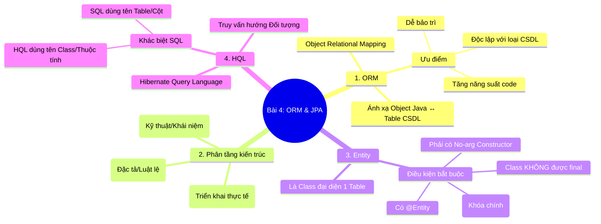

1. ORM là gì? Ưu điểm của ORM?  
2. Phân biệt ORM, JPA, Hibernate?  
3. Entity là gì? Các điều kiện để 1 class trở thành 1 Entity?  
4. HQL là gì?.Khác gì với SQL?
----
# 1. ORM là gì? Ưu điểm của ORM?  
- Là kỹ thuật 
- ánh xạ đối tượng với  bảng csdl quan hệ
## Ưu điểm
- Giảm viết SQL thủ công
- Dể bảo trì, mở rộng
- Độc lập với các loại csdl
- Tích hợp tốt với mô hình hướng đối tượng
# 2. Phân biệt ORM, JPA, Hibernate?
- ORM là kỹ thuật
- JPA là 1 quy chuẩn của Java Persistence API.
- Hibernate là framework hiện thực JPA.
# 3. Entity là gì? Các điều kiện để 1 class trở thành 1 Entity?
- Entity là lớp, ánh xạ với 1 bảng trong csdl
## Điều kiện (Lớp Entity)
- Annotation : @Entity (object ánh xạ table)
- Annotation : @Id (primary key)
- Không có final class/filed
- có contructor.
# 4. HQL là gì? Khác gì với SQL?
- HQL là ngôn ngữ truy vấn của Hibernate framework. hướng đối tượng (áp dụng các khái niệm của OOP)
## Khác biệt với SQL
- SQL là ngôn ngữ truy vấn của CSDL. hướng bảng, column, row trong csdl quan hệ
- SQL ánh xạ kết quả cho schema, còn HQL ánh xạ kết quả cho đối tượng Java

---
## 🗺️ Sơ đồ Tư duy Tổng quan

- **ORM** là khái niệm/kỹ thuật chung.
- **JPA** (Java Persistence API) là một **Đặc tả (Specification)**, chỉ chứa các Interface và Annotation (như bản thiết kế).
- **Hibernate** là một **Implementation (Triển khai)** của JPA (là phần code thực sự chạy).