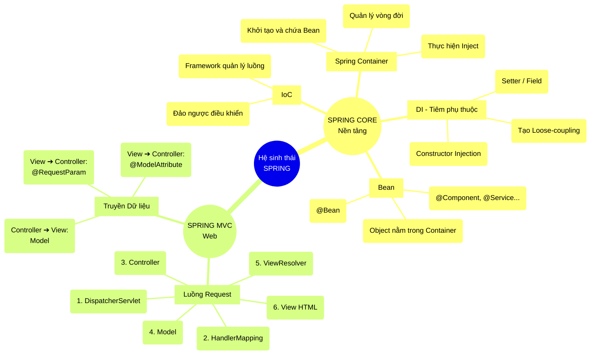

| Khái niệm                                        | Nội dung chi tiết                                                                                                                                                                                                                                                                                                                                                                                                                                                                                                                                                                                                                                                                                                                                               |
| :----------------------------------------------- | :-------------------------------------------------------------------------------------------------------------------------------------------------------------------------------------------------------------------------------------------------------------------------------------------------------------------------------------------------------------------------------------------------------------------------------------------------------------------------------------------------------------------------------------------------------------------------------------------------------------------------------------------------------------------------------------------------------------------------------------------------------------- |
| **Library** *(Thư viện)*                      | - Là các đoạn code được viết sẵn để giải quyết một vấn đề cụ thể. - **Quyền điều khiển:** Do chương trình chủ động gọi khi cần.                                                                                                                                                                                                                                                                                                                                                                                                                                                                                                                                                                                                                              |
| **Framework** *(Khung sườn)*                  | - Là bộ khung được dựng sẵn chứa công cụ và thư viện. - **Quyền điều khiển:** Do framework chủ động gọi code của bạn khi cần.                                                                                                                                                                                                                                                                                                                                                                                                                                                                                                                                                                                                                                |
| **IoC** *(Inversion of Control)*              | - Đảo ngược quyền điều khiển: Thay vì ứng dụng tự quản lý thì giao nhiệm vụ cho framework quản lý luồng chạy.                                                                                                                                                                                                                                                                                                                                                                                                                                                                                                                                                                                                                                                   |
| **DI** *(Dependency Injection)*               | - **Mục đích:** Tạo ra liên kết lỏng (loose-coupling) nhằm dễ dàng thay thế các bộ phận khi cần. - **Triển khai:** &nbsp;&nbsp;1. Constructor Injection &nbsp;&nbsp;2. Setter Injection &nbsp;&nbsp;3. Field Injection                                                                                                                                                                                                                                                                                                                                                                                                                                                                                                                              |
| **Spring Container**                             | - **Đại diện:** `ApplicationContext` - **Nhiệm vụ:** &nbsp;&nbsp;1. Khởi tạo đối tượng. &nbsp;&nbsp;2. Chứa đối tượng. &nbsp;&nbsp;3. Thực hiện Injection (tiêm) các Object liên quan với nhau. &nbsp;&nbsp;4. Quản lý vòng đời của Object.                                                                                                                                                                                                                                                                                                                                                                                                                                                                                                      |
| **Bean**                                         | - Là các đối tượng được chứa và quản lý trong Spring Container *(đối tượng bạn tự `new` thì không được gọi là Bean)*. - **Cách định nghĩa:** &nbsp;&nbsp;1. Gắn annotation lên class (`@Component`, `@Service`, `@Repository`, `@Controller`, `@RestController`). &nbsp;&nbsp;2. Gắn annotation `@Bean` lên method của class có chứa `@Configuration`.                                                                                                                                                                                                                                                                                                                                                                                                 |
| **MVC**                                          | - Là mô hình thiết kế kiến trúc phần mềm.                                                                                                                                                                                                                                                                                                                                                                                                                                                                                                                                                                                                                                                                                                                       |
| **Spring MVC**                                   | - Là framework được thiết kế dựa trên kiến trúc MVC.                                                                                                                                                                                                                                                                                                                                                                                                                                                                                                                                                                                                                                                                                                            |
| **Luồng đi của 1 Request**                       | **1.** Client gửi Request (ví dụ: `GET /users`). **2.** `DispatcherServlet` (Front Controller) tiếp nhận Request. &nbsp;&nbsp;*(2.1. Tìm trong `HandlerMapping` để biết đưa cho Controller nào).* **3.** `Controller` tiếp nhận. **4.** `Controller` gọi `Service` xử lý logic. **5.** `Service` gọi `Repository` chọc xuống Database lấy dữ liệu. **6.** `Controller` đóng gói Dữ liệu (`Model`) và ném trả Tên Giao Diện cho `DispatcherServlet`. **7.** `DispatcherServlet` gửi Tên Giao Diện tới `ViewResolver`. **8.** `ViewResolver` tìm và trả về đường dẫn file View thực tế. **9.** `DispatcherServlet` nhồi `Model` vào View để kết xuất ra HTML hoàn chỉnh. **10.** Trả HTML về cho Trình duyệt của Client (Response). |
| **Chuyển nhận dữ liệu** *(View ↔ Controller)* | - **Controller ➔ View:** Sử dụng interface `Model` và hàm `addAttribute("key", value)`. - **View ➔ Controller:** &nbsp;&nbsp;1. Đối với 1 param: `@RequestParam` &nbsp;&nbsp;2. Đối với 1 object (form): `@ModelAttribute`                                                                                                                                                                                                                                                                                                                                                                                                                                                                                                                             |
| **⭐ SUMMARY**                                    | **Spring Core:** Quản lý luồng chạy (IoC) và tiêm phụ thuộc (DI) các Bean qua Spring Container để giảm phụ thuộc. **Spring MVC:** `DispatcherServlet` điều phối Request tới Controller lấy Data, rồi qua ViewResolver kết xuất file HTML.                                                                                                                                                                                                                                                                                                                                                                                                                                                                                                                    |

---

## 🧠 Sơ đồ tư duy (Mindmap)

