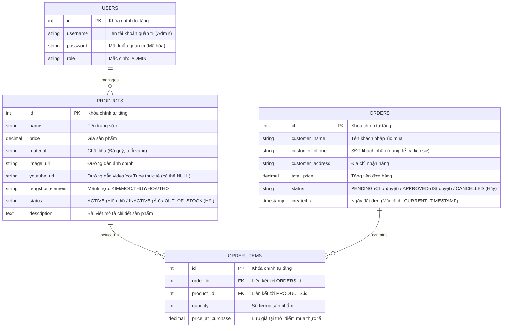

# 🗄️ THIẾT KẾ CƠ SỞ DỮ LIỆU CUỐI CÙNG (FINAL DATABASE SCHEMA)
## DỰ ÁN WEB TRANG SỨC PHONG THỦY (SERVLET & JSP + JDBC THUẦN)

> **Mục tiêu:** Cung cấp thiết kế cơ sở dữ liệu chi tiết, phẳng và tinh giản nhất, giải quyết trọn vẹn 25 chức năng nghiệp vụ của Admin & User mà không gây quá tải khi viết code JDBC thuần trong Java.

---

### 🗺️ 1. Sơ đồ thực thể quan hệ (ERD)

---

### 📋 2. Đặc tả chi tiết các bảng trong MySQL

#### Bảng 1: `users` (Chỉ dùng cho tài khoản quản trị - Admin)
- **Mục đích:** Đăng nhập vào trang quản trị để thao tác CRUD sản phẩm, duyệt đơn và xem thống kê.
- **Tại sao tối giản?** Vì tệp khách hàng lớn tuổi ngại đăng ký tài khoản, ta **bỏ hẳn tài khoản khách hàng ở Database**. Khách mua hàng không cần đăng ký.

| Tên trường (Column) | Kiểu dữ liệu | Thuộc tính (Constraints) | Ý nghĩa |
| :--- | :--- | :--- | :--- |
| `id` | `INT` | `PRIMARY KEY`, `AUTO_INCREMENT` | Khóa chính |
| `username` | `VARCHAR(50)` | `NOT NULL`, `UNIQUE` | Tài khoản đăng nhập Admin |
| `password` | `VARCHAR(255)` | `NOT NULL` | Mật khẩu (được mã hóa) |
| `role` | `VARCHAR(20)` | `DEFAULT 'ADMIN'` | Vai trò bảo mật |

---

#### Bảng 2: `products` (Quản lý thông tin sản phẩm trang sức phong thủy)
- **Mục đích:** Lưu trữ thông tin sản phẩm, hỗ trợ tìm kiếm giọng nói, lọc theo mệnh và nhúng video YouTube.

| Tên trường (Column) | Kiểu dữ liệu | Thuộc tính (Constraints) | Ý nghĩa |
| :--- | :--- | :--- | :--- |
| `id` | `INT` | `PRIMARY KEY`, `AUTO_INCREMENT` | Khóa chính |
| `name` | `VARCHAR(255)` | `NOT NULL` | Tên trang sức (Ví dụ: *Mặt dây chuyền Hồ Ly đá thạch anh hồng*) |
| `price` | `DECIMAL(12,2)` | `NOT NULL` | Giá bán sản phẩm |
| `material` | `VARCHAR(100)` | | Mô tả chất liệu (Ví dụ: *Đá thạch anh hồng tự nhiên, vàng non 10K*) |
| `image_url` | `VARCHAR(500)` | | Đường dẫn đến hình ảnh hiển thị trên web |
| `youtube_url` | `VARCHAR(500)` | `DEFAULT NULL` | **Đặc tả:** Link video YouTube thực tế để hiển thị ở trang chi tiết |
| `fengshui_element` | `VARCHAR(50)` | | **Đặc tả:** Mệnh phù hợp (`KIM`/`MOC`/`THUY`/`HOA`/`THO`) để phục vụ lọc sản phẩm |
| `status` | `VARCHAR(50)` | `DEFAULT 'ACTIVE'` | Trạng thái: `'ACTIVE'` (Đang bán), `'INACTIVE'` (Ẩn sản phẩm), `'OUT_OF_STOCK'` (Hết hàng) |
| `description` | `TEXT` | | Bài viết giới thiệu sản phẩm và công năng phong thủy |

---

#### Bảng 3: `orders` (Quản lý thông tin đơn đặt hàng nhanh)
- **Mục đích:** Lưu thông tin giao hàng của khách và phục vụ tính năng thống kê.
- **Giải pháp cho khách lớn tuổi:** Lưu trực tiếp Tên, SĐT, Địa chỉ của khách trong đơn hàng. 

| Tên trường (Column) | Kiểu dữ liệu | Thuộc tính (Constraints) | Ý nghĩa |
| :--- | :--- | :--- | :--- |
| `id` | `INT` | `PRIMARY KEY`, `AUTO_INCREMENT` | Khóa chính |
| `customer_name` | `VARCHAR(100)` | `NOT NULL` | Họ tên khách hàng nhập vào khi mua hàng |
| `customer_phone` | `VARCHAR(20)` | `NOT NULL` | **Đặc tả:** Số điện thoại khách hàng. Dùng để tra cứu lịch sử mua hàng mà không cần mật khẩu. |
| `customer_address`| `VARCHAR(255)` | `NOT NULL` | Địa chỉ nhận hàng |
| `total_price` | `DECIMAL(12,2)` | `NOT NULL` | Tổng trị giá đơn hàng |
| `status` | `VARCHAR(50)` | `DEFAULT 'PENDING'` | Trạng thái xử lý: `'PENDING'` (Chờ gọi duyệt), `'APPROVED'` (Đã gọi chốt đơn), `'CANCELLED'` (Khách hủy) |
| `created_at` | `TIMESTAMP` | `DEFAULT CURRENT_TIMESTAMP` | Ngày đặt hàng (Dùng để thống kê doanh thu theo Tháng/Quý/Năm) |

---

#### Bảng 4: `order_items` (Chi tiết các sản phẩm trong mỗi đơn hàng)
- **Mục đích:** Lưu danh sách các sản phẩm có trong đơn hàng. Giúp Admin có thể sửa/xóa từng sản phẩm trong đơn và bảo toàn lịch sử giá.

| Tên trường (Column) | Kiểu dữ liệu | Thuộc tính (Constraints) | Ý nghĩa |
| :--- | :--- | :--- | :--- |
| `id` | `INT` | `PRIMARY KEY`, `AUTO_INCREMENT` | Khóa chính |
| `order_id` | `INT` | `FOREIGN KEY` -> `orders(id)` | Liên kết tới đơn hàng |
| `product_id` | `INT` | `FOREIGN KEY` -> `products(id)` | Liên kết tới sản phẩm được mua |
| `quantity` | `INT` | `NOT NULL` | Số lượng mua của sản phẩm này |
| `price_at_purchase`| `DECIMAL(12,2)` | `NOT NULL` | Giá của sản phẩm tại thời điểm mua (Tránh sai lệch thống kê khi sản phẩm đổi giá sau này) |
