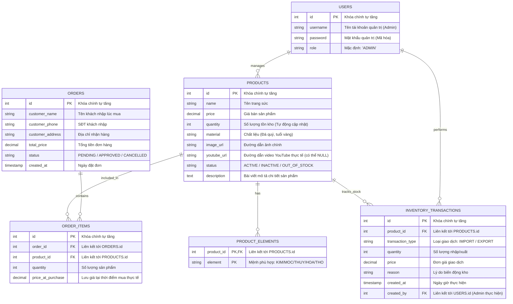

# 🗄️ THIẾT KẾ CƠ SỞ DỮ LIỆU CUỐI CÙNG (FINAL DATABASE SCHEMA)
## DỰ ÁN WEB TRANG SỨC PHONG THỦY (CHUYÊN NGHIỆP - CHUẨN 3NF)

> **Mục tiêu:** Cung cấp thiết kế cơ sở dữ liệu chuẩn hóa 3NF, tách biệt mối quan hệ Nhiều-Nhiều giữa Sản phẩm và Mệnh phong thủy bằng bảng trung gian `product_elements`. Tích hợp phân hệ Quản lý Nhập/Xuất kho (`inventory_transactions`) tự động hóa thông qua các SQL Triggers.

---

### 🗺️ 1. Sơ đồ thực thể quan hệ nâng cao (ERD)

---

### 📋 2. Đặc tả chi tiết các bảng trong MySQL

#### Bảng 1: `users` (Chỉ dùng cho tài khoản quản trị - Admin)
| Tên trường (Column) | Kiểu dữ liệu | Thuộc tính (Constraints) | Ý nghĩa |
| :--- | :--- | :--- | :--- |
| `id` | `INT` | `PRIMARY KEY`, `AUTO_INCREMENT` | Khóa chính |
| `username` | `VARCHAR(50)` | `NOT NULL`, `UNIQUE` | Tài khoản đăng nhập Admin |
| `password` | `VARCHAR(255)` | `NOT NULL` | Mật khẩu (được mã hóa) |
| `role` | `VARCHAR(20)` | `DEFAULT 'ADMIN'` | Vai trò bảo mật |

---

#### Bảng 2: `products` (Thông tin sản phẩm trang sức phong thủy)
| Tên trường (Column) | Kiểu dữ liệu | Thuộc tính (Constraints) | Ý nghĩa |
| :--- | :--- | :--- | :--- |
| `id` | `INT` | `PRIMARY KEY`, `AUTO_INCREMENT` | Khóa chính |
| `name` | `VARCHAR(255)` | `NOT NULL` | Tên trang sức |
| `price` | `DECIMAL(12,2)` | `NOT NULL` | Giá bán sản phẩm |
| `quantity` | `INT` | `NOT NULL`, `DEFAULT 0` | Số lượng tồn kho còn lại của sản phẩm (Triggers cập nhật) |
| `material` | `VARCHAR(100)` | | Mô tả chất liệu (Ví dụ: *Vàng non 10K, thạch anh*) |
| `image_url` | `VARCHAR(500)` | | Đường dẫn đến hình ảnh hiển thị trên web |
| `youtube_url` | `VARCHAR(500)` | `DEFAULT NULL` | Link video YouTube thực tế |
| `status` | `VARCHAR(50)` | `DEFAULT 'ACTIVE'` | Trạng thái: `'ACTIVE'` (Bán), `'INACTIVE'` (Ẩn), `'OUT_OF_STOCK'` (Hết) |
| `description` | `TEXT` | | Bài viết giới thiệu sản phẩm |

---

#### Bảng 3: `product_elements` (Bảng trung gian Sản phẩm - Mệnh phong thủy)
| Tên trường (Column) | Kiểu dữ liệu | Thuộc tính (Constraints) | Ý nghĩa |
| :--- | :--- | :--- | :--- |
| `product_id` | `INT` | `FOREIGN KEY` -> `products(id)` ON DELETE CASCADE | ID sản phẩm |
| `element` | `VARCHAR(50)` | | Mệnh phù hợp: `'KIM'`, `'MOC'`, `'THUY'`, `'HOA'`, `'THO'` |

---

#### Bảng 4: `orders` (Quản lý thông tin đơn đặt hàng nhanh)
| Tên trường (Column) | Kiểu dữ liệu | Thuộc tính (Constraints) | Ý nghĩa |
| :--- | :--- | :--- | :--- |
| `id` | `INT` | `PRIMARY KEY`, `AUTO_INCREMENT` | Khóa chính |
| `customer_name` | `VARCHAR(100)` | `NOT NULL` | Họ tên khách hàng |
| `customer_phone` | `VARCHAR(20)` | `NOT NULL` | Số điện thoại khách hàng (Tra lịch sử mua hàng) |
| `customer_address`| `VARCHAR(255)` | `NOT NULL` | Địa chỉ nhận hàng |
| `total_price` | `DECIMAL(12,2)` | `NOT NULL` | Tổng trị giá đơn hàng |
| `status` | `VARCHAR(50)` | `DEFAULT 'PENDING'` | Trạng thái: `'PENDING'`, `'APPROVED'`, `'CANCELLED'` |
| `created_at` | `TIMESTAMP` | `DEFAULT CURRENT_TIMESTAMP` | Ngày đặt hàng |

---

#### Bảng 5: `order_items` (Chi tiết các sản phẩm trong mỗi đơn hàng)
| Tên trường (Column) | Kiểu dữ liệu | Thuộc tính (Constraints) | Ý nghĩa |
| :--- | :--- | :--- | :--- |
| `id` | `INT` | `PRIMARY KEY`, `AUTO_INCREMENT` | Khóa chính |
| `order_id` | `INT` | `FOREIGN KEY` -> `orders(id)` ON DELETE CASCADE | Liên kết tới đơn hàng |
| `product_id` | `INT` | `FOREIGN KEY` -> `products(id)` | Liên kết tới sản phẩm |
| `quantity` | `INT` | `NOT NULL` | Số lượng mua |
| `price_at_purchase`| `DECIMAL(12,2)` | `NOT NULL` | Giá tại thời điểm mua thực tế |

---

#### Bảng 6: `inventory_transactions` (Quản lý Biến động Kho - Nhập/Xuất)
| Tên trường (Column) | Kiểu dữ liệu | Thuộc tính (Constraints) | Ý nghĩa |
| :--- | :--- | :--- | :--- |
| `id` | `INT` | `PRIMARY KEY`, `AUTO_INCREMENT` | Khóa chính |
| `product_id` | `INT` | `FOREIGN KEY` -> `products(id)` | ID sản phẩm cần thay đổi kho |
| `transaction_type`| `VARCHAR(20)` | `CHECK (IN ('IMPORT', 'EXPORT'))` | `'IMPORT'` (Nhập kho) hoặc `'EXPORT'` (Xuất kho) |
| `quantity` | `INT` | `NOT NULL`, `CHECK (quantity > 0)` | Số lượng nhập hoặc xuất |
| `price` | `DECIMAL(12,2)` | `NOT NULL` | Đơn giá tại thời điểm nhập/xuất kho |
| `reason` | `VARCHAR(255)`| | Lý do (Ví dụ: "Nhập xưởng", "Bán hàng tự động", "Trả hàng") |
| `created_at` | `TIMESTAMP` | `DEFAULT CURRENT_TIMESTAMP` | Thời điểm thực hiện |
| `created_by` | `INT` | `FOREIGN KEY` -> `users(id)` | Tài khoản admin thực hiện thao tác |

---

### ⚙️ 3. Cơ chế tự động hóa qua Database Triggers

Hệ thống được lập trình tự động hóa nhằm giảm thiểu xử lý logic phức tạp ở phần Java Web:

1. **Trigger chèn đơn hàng (`trg_after_insert_order_items`):** 
   * *Khi:* Khách mua hàng thành công và dòng chi tiết `order_items` được thêm mới.
   * *Hành vi:* Tự động chèn một bản ghi loại `'EXPORT'` vào bảng `inventory_transactions` với giá mua thực tế và lý do đi kèm mã đơn hàng.
2. **Trigger cập nhật tồn kho (`trg_after_insert_inventory_transaction`):**
   * *Khi:* Có bất kỳ giao dịch nhập hoặc xuất kho nào được chèn vào bảng `inventory_transactions` (kể cả nhập kho thủ công từ Admin hoặc xuất kho tự động khi bán hàng).
   * *Hành vi:* Tự động chạy lệnh `UPDATE products SET quantity = quantity +/- quantity` tương ứng để giữ dữ liệu tồn kho thực tế luôn chính xác thời gian thực.
