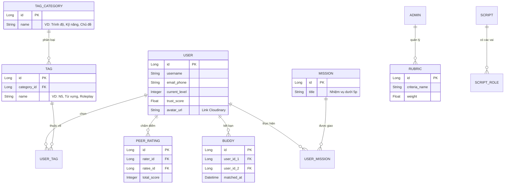

# 🏗️ Kiến trúc Hệ thống Web Học Tiếng Nhật qua Video Matching

Dự án này ứng dụng thuật toán xếp hàng thời gian thực (Real-time Queue) kết hợp đánh giá chéo (Peer Rating) để ghép cặp người học tiếng Nhật.

## 1. Thuật toán Ghép Cặp (3-Layer Matching)

Thuật toán giải quyết bài toán ưu tiên người học cấp độ thấp và giảm thời gian chờ đợi thông qua 3 lớp:

1.  **Lớp 1 (Hard Filter - Phân Kênh):** Người dùng khi bấm "Tìm kiếm" sẽ được đưa vào các hàng đợi (Buckets/Channels) độc lập dựa trên môn học/ngôn ngữ. Giúp giảm độ phức tạp từ $O(N^2)$ xuống $O(1)$.
2.  **Lớp 2 (Asymmetric Scoring - Điểm Bất đối xứng):** 
    * Xác định ai có cấp độ thấp hơn (Người cần được ưu tiên).
    * Điểm số Matching (Max 100) sẽ lấy 70% dựa trên mong muốn của người cấp thấp, và 30% dựa trên mong muốn của người cấp cao.
3.  **Lớp 3 (Time-based Relaxation - Nới lỏng gợn sóng):**
    * **< 15s (Strict Mode):** Chỉ match những người trong cùng kênh có điểm > 90. Sử dụng `Math.max(waitTimeA, waitTimeB)` để bảo vệ người đợi lâu.
    * **15s - 45s (Relax Mode):** Nới lỏng tiêu chí, chấp nhận điểm > 60, bắt đầu quét các kênh lân cận (Ví dụ: N5 thiếu người thì quét sang N4).
    * **> 45s (Survival Mode):** Chỉ cần pass Lớp 1 là ghép luôn để giữ chân người dùng.

## 2. Thiết kế Cơ sở Dữ liệu (MySQL - SQL)

Lưu trữ dữ liệu bền vững (Durable Data). Thiết kế chuẩn hóa với `TAG_CATEGORY` để quản lý Tag.

## 3. Kiến trúc Lưu trữ Lai (Polyglot Persistence)

*   **MySQL (SQL Database):** Dùng để lưu toàn bộ các bảng ở trên (User, Rating, Tag, Buddy...). Đảm bảo tính toàn vẹn dữ liệu (ACID).
*   **Cloudinary (Cloud Storage/CDN):** Dùng để lưu trữ File nhị phân (Media). Các ảnh đại diện (Avatar), file ghi âm, hoặc video tải lên sẽ được đẩy qua Cloudinary, sau đó Cloudinary trả về một đường link URL. Link URL này sẽ được lưu vào MySQL (trường `avatar_url` trong bảng USER).
*   **Redis (In-Memory NoSQL):** (Sẽ nghiên cứu khi bắt tay vào làm tính năng Queue). Dùng làm hàng đợi lưu trữ những người đang bấm tìm kiếm, vì lưu trên RAM nên tốc độ siêu nhanh (mili-giây), giải quyết bài toán đọc/ghi/xóa dữ liệu tạm thời mà không làm sập MySQL.

## 4. Lộ trình Thực thi (Roadmap)

Dưới đây là sơ đồ Mindmap / Flowchart các bước thực thi MVP:

![[Video_Match_Roadmap.excalidraw]]
