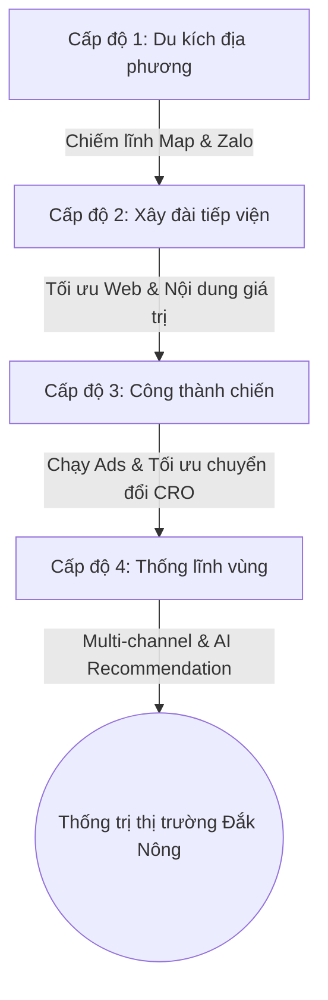

# CHI TIẾT CHIẾN LƯỢC SEO "VÂY ĐIỂM DIỆT VIỆN" — CỬA CUỐN ĐẮK NÔNG

Chiến lược này được thiết kế dựa trên nguyên lý **"Vây điểm diệt viện"** trong Binh pháp Tôn Tử: Thay vì trực tiếp đối đầu với các ông lớn tại thị trường trung tâm lớn ngay lập tức, chúng ta đánh chiếm và củng cố vững chắc các cứ điểm địa phương (các huyện, thị trấn tại Đắk Nông) để tạo thế bao vây, tích lũy tài nguyên (traffic, review, uy tín thực thể), sau đó tiến hành tổng tấn công chiếm lĩnh thị trường toàn tỉnh trên mọi công cụ tìm kiếm truyền thống (Google) và thế hệ mới (AI Search).

---

## 🗺️ BẢN ĐỒ CHIẾN THUẬT: 4 CẤP ĐỘ PHÁT TRIỂN



---

## 🟢 CẤP ĐỘ 1: DU KÍCH ĐỊA PHƯƠNG (ZERO TO ONE)
*Mục tiêu: Đạt sự hiện diện lập tức trên Google Maps và Zalo tại các cụm thị trường mục tiêu (Gia Nghĩa, Đắk Mil, Đắk Song...).*

### 1. Bản đồ số hóa (Google Business Profile - GBP)
Google Maps là mặt trận tạo ra cuộc gọi trực tiếp nhanh nhất. Người dân khi hỏng cửa cuốn hoặc cần lắp đặt sẽ có xu hướng mở bản đồ để tìm đơn vị gần họ nhất.

*   **Tối ưu hóa Tên Thực Thể (Name Optimization)**:
    *   Không đặt tên vô hồn như `Cơ khí Đức Hải`.
    *   Hãy đặt tên theo cấu trúc: **[Dịch vụ chính] + [Địa danh cụ thể] + [Thương hiệu]**.
    *   *Ví dụ cứ điểm*: 
        *   `Cửa Cuốn Gia Nghĩa Đắk Nông - Đức Hải` (Tập trung thị xã trung tâm)
        *   `Sửa Cửa Cuốn Đắk Mil Giá Rẻ - Đức Hải` (Tập trung huyện biên giới sầm uất)
*   **Geotagging Ảnh Công Trình (Tạo Tín Hiệu Địa Lý Giả Lập & Thực Tế)**:
    *   **Tại sao cần?** Google sử dụng siêu dữ liệu (Metadata EXIF) của ảnh để xác thực doanh nghiệp có thực sự thi công tại địa bàn đó hay không.
    *   **Cách làm**:
        1. Chụp ảnh thực tế công trình (thợ đang hàn, lắp nan cửa, lắp motor).
        2. Dùng công cụ (như Tool GeoImgr) nhúng tọa độ GPS chính xác của các khu vực tại Đắk Nông:
            *   *Gia Nghĩa*: `12.0016, 107.6844`
            *   *Đắk Mil*: `12.4414, 107.6331`
            *   *Krông Nô*: `12.4208, 107.8767`
        3. Upload đều đặn 3 ảnh/tuần lên Google Business Profile. Google sẽ đánh giá tài khoản này cực kỳ năng động và uy tín tại địa phương.

### 2. Chiến thuật Zalo Du Kích (Local CRM)
Ở Tây Nguyên, Zalo là công cụ giao tiếp bán hàng mạnh mẽ nhất nhờ tính riêng tư và dễ sử dụng đối với người lớn tuổi (chủ nhà, chủ thầu xây dựng).

*   **SEO trang Zalo cá nhân/OA**:
    *   Đổi tên Zalo hiển thị: `Đức Hải (Cửa Cuốn Đắk Nông - 09xx)` hoặc `Sửa Cửa Cuốn Đắk Nông 24/7`.
    *   Ảnh bìa và ảnh đại diện phải là hình chụp cửa hàng vật lý, hoặc công trình có số hotline to, rõ ràng.
*   **Khai thác danh bạ địa phương**:
    *   Kết bạn với tất cả các nhà thầu xây dựng, đại lý nhôm kính, thợ xây, cửa hàng vật liệu xây dựng (VLXD) tại địa bàn Đắk Nông.
    *   *Kịch bản tiếp cận*: Gửi tin nhắn chào hàng ngắn gọn, tặng kèm chiết khấu hoa hồng 5-10% cho mỗi đơn hàng giới thiệu thành công. Đây là cách "mượn lực" đại lý để phủ sóng cực nhanh mà không tốn chi phí marketing ban đầu.

### 3. Review thực tế chứa từ khóa địa phương
*   Nhờ khách hàng sau khi thi công xong quét mã QR để đánh giá 5 sao cho Google Map.
*   *Mẫu đánh giá định hướng*: "Lắp cửa cuốn Austdoor ở Gia Nghĩa nhanh, thợ Đức Hải nhiệt tình, giá rẻ hơn các bên khác." -> Đoạn này vừa chứa thực thể thương hiệu, vừa chứa từ khóa vị trí địa lý, vừa chứa tên sản phẩm.

---

## 🟡 CẤP ĐỘ 2: XÂY ĐÀI TIẾP VIỆN (STEADY BUILD)
*Mục tiêu: Xây dựng Website làm trung tâm lưu trữ thông tin, tạo Topic Authority (Độ phủ chuyên gia) để Google và các mô hình AI (Gemini, ChatGPT) tin tưởng trích xuất dữ liệu.*

### Giai đoạn 4: Đo lường & Tối ưu hóa (Hàng tháng)
*   Kiểm tra thứ hạng từ khóa trên Google.
*   Test hỏi thử các AI (Gemini, ChatGPT) để kiểm tra xem thương hiệu đã được đề xuất chưa.
*   Tiếp tục tối ưu hóa dựa trên phản hồi thực tế của khách hàng.

---

## 📚 TÀI LIỆU HỖ TRỢ TRIỂN KHAI
*   **Hướng dẫn đồng bộ Maps đa nền tảng (Google & Bing/Edge)**: [Local_SEO_Multiplatform_Sync.md](file:///D:/data/para_wiki_llm/02_Areas/IT_Knowledge/Local_SEO_Multiplatform_Sync.md)

### 1. Cấu trúc On-Page "Sạch & Thẳng"
Tạo các Landing Page (trang đích) nhắm thẳng vào các cụm từ khóa đã xác định trong `01_Projects/danh_sach_tu_khoa_content_dak_nong.md`.

*   **Cấu trúc URL chuẩn hóa**:
    *   `domain.com/cua-cuon-dak-nong` (Trang tổng hợp dịch vụ toàn tỉnh)
    *   `domain.com/sua-cua-cuon-gia-nghia` (Trang chuyên dịch vụ sửa chữa khẩn cấp)
    *   `domain.com/lap-dat-cua-cuon-dak-mil` (Trang đánh chiếm khu vực Đắk Mil)
*   **Tối ưu hóa Thẻ Heading (H1, H2, H3)**:
    *   `H1`: Phải chứa từ khóa chính + địa danh (Ví dụ: `<h1>Dịch Vụ Lắp Đặt Cửa Cuốn Uy Tín Tại Đắk Nông</h1>`).
    *   `H2`: Chia nhỏ các phần của bài viết (Báo giá, Quy trình, Các loại cửa cuốn phổ biến ở Đắk Nông).
    *   `H3`: Chi tiết từng huyện hoặc từng hãng cửa cuốn (Austdoor, Titadoor, Mitadoor).

### 2. Content Marketing theo mô hình Tảng Băng Trôi (The Iceberg Model)

```
       ▲  [20% BÀI BÁN HÀNG] -> Chốt đơn trực tiếp (Bảng giá, Khuyến mãi)
      / \
     /   \
    /     \
   /=======\
  /         \
 /  80% BÀI  \ -> Hướng dẫn kỹ thuật, xử lý sự cố (Kéo tay khi mất điện, 
/  GIÁ TRỊ   \   cách cài remote, chọn bình lưu điện phù hợp khí hậu...)
==============
```

*   **20% Bài viết bán hàng (Phần nổi)**:
    *   Tập trung vào tính rõ ràng, minh bạch: Bảng giá chi tiết nan cửa (tính theo m²), giá motor chính hãng (tải trọng 300kg, 500kg), giá bình lưu điện.
*   **80% Bài viết giá trị (Phần chìm - Thu hút Traffic và xây dựng Thực Thể AI)**:
    *   Người dân Tây Nguyên thường gặp vấn đề: Khí hậu ẩm ướt vào mùa mưa gây rỉ sét ray dẫn hướng, mất điện đột ngột do giông bão làm cửa không mở được.
    *   *Tiêu đề bài viết du kích*:
        *   "Hướng dẫn cách mở cửa cuốn bằng xích kéo tay khi mất điện tại Đắk Nông"
        *   "Tại sao motor cửa cuốn nhanh bị hỏng vào mùa mưa Tây Nguyên và cách khắc phục"
        *   "Nên chọn cửa cuốn khe thoáng hay cửa cuốn tấm liền cho nhà phố Gia Nghĩa?"

### 3. Tối ưu hóa kỹ thuật cho thiết bị di động (Mobile-First)
*   Hơn 85% người dùng tìm kiếm dịch vụ này trên điện thoại khi họ gặp sự cố kẹt cửa hoặc đang ở công trình.
*   **Mobile Sticky CTA (Nút liên hệ cố định)**:
    *   Cài đặt một thanh cố định ở đáy màn hình điện thoại bao gồm 2 nút: **[Gọi Điện Ngay (Màu đỏ/Cam)]** và **[Chat Zalo (Màu xanh dương)]**. Khi cuộn trang, thanh này luôn xuất hiện để kích thích hành động liên hệ tức thì.

---

## 🔴 CẤP ĐỘ 3: CÔNG THÀNH CHIẾN (COMPETENT)
*Mục tiêu: Đẩy mạnh lưu lượng truy cập và tỷ lệ chuyển đổi bằng các chiến dịch quảng cáo trả phí (Ads) có mục tiêu cực kỳ chính xác.*

### 1. Google Ads (Search) - Chiến thuật "Bắn Tỉa"
Đối với ngành sửa chữa/lắp đặt, khách hàng tìm kiếm trên Google khi họ đang có nhu cầu rất nóng (cần sửa ngay vì xe bị kẹt trong nhà, hoặc công trình xây dựng đến giai đoạn lắp cửa).

*   **Cài đặt vị trí địa lý (Geo-targeting)**:
    *   Không chạy quảng cáo toàn quốc hoặc toàn miền Nam.
    *   **Chỉ khoanh vùng**: Tỉnh Đắk Nông (hoặc thả ghim bán kính 30km xung quanh Gia Nghĩa, Đắk Mil).
*   **Danh sách từ khóa chạy Ads**:
    *   *Nhóm sửa chữa (Giá thầu cao, chuyển đổi nhanh)*: `sửa cửa cuốn gia nghĩa`, `sửa cửa cuốn đắk nông`, `cứu hộ cửa cuốn gấp`.
    *   *Nhóm lắp đặt*: `báo giá cửa cuốn austdoor đắk nông`, `lắp cửa cuốn giá rẻ đắk nông`.
*   **Loại trừ từ khóa phủ định (Negative Keywords)**:
    *   Để tránh lãng phí ngân sách, cần phủ định các từ khóa: `tự làm cửa cuốn`, `học sửa cửa cuốn`, `tài liệu thiết kế cửa cuốn`.

### 2. Facebook Ads - Chiến thuật "Quét Sạch Địa Bàn"
Dùng để xây dựng thương hiệu và tiếp cận các chủ nhà đang trong quá trình chuẩn bị xây/hoàn thiện nhà.

*   **Hình thức quảng cáo**:
    *   Sử dụng video thực tế công trình (30-45 giây): Quay cảnh cửa cuốn vận hành êm ái, chủ nhà chia sẻ cảm nhận.
    *   Dưới bài viết hiển thị rõ ràng: *Hỗ trợ khảo sát & đo đạc miễn phí tận nơi tại các huyện Đắk Nông.*
*   **Nhắm mục tiêu (Targeting)**:
    *   Thả ghim vị trí địa lý bán kính 20km quanh các đô thị đang phát triển mạnh tại Đắk Nông.
    *   Tuổi: 28 - 55 (độ tuổi xây nhà, có quyền quyết định tài chính).
    *   Sở thích/Hành vi: Thiết kế nội thất, Xây dựng, Cải tạo nhà cửa.

---

## 🏆 CẤP ĐỘ 4: THỐNG LĨNH VÙNG (ADVANCED - AUTHORITY)
*Mục tiêu: Trở thành thương hiệu số 1 được AI và người dùng nghĩ đến đầu tiên khi nhắc tới cửa cuốn tại Đắk Nông.*

### 1. Tối ưu hóa công cụ tìm kiếm AI (GEO/AEO - Generative/Answer Engine Optimization)
Khi người dùng hỏi Gemini, ChatGPT, hoặc Perplexity: *"Địa chỉ lắp cửa cuốn nào uy tín nhất ở Gia Nghĩa Đắk Nông?"*, AI sẽ quét các nguồn dữ liệu tin cậy để tổng hợp câu trả lời. Chúng ta tối ưu bằng cách:

*   **LocalBusiness Schema Markup (Dữ liệu cấu trúc)**:
    *   Khai báo mã Schema chi tiết trên trang web để AI hiểu cấu trúc thực thể:
        ```json
        {
          "@context": "https://schema.org",
          "@type": "LocalBusiness",
          "name": "Cửa Cuốn Đắk Nông Đức Hải",
          "address": {
            "@type": "PostalAddress",
            "streetAddress": "Nghĩa Trung",
            "addressLocality": "Gia Nghĩa",
            "addressRegion": "Đắk Nông",
            "addressCountry": "VN"
          },
          "geo": {
            "@type": "GeoCoordinates",
            "latitude": 12.0016,
            "longitude": 107.6844
          },
          "telephone": "+849xxxxxxxx",
          "priceRange": "$$"
        }
        ```
*   **Phủ Citation (Trích dẫn chéo)**:
    *   Đăng ký thông tin NAP (Name, Address, Phone) đồng nhất trên ít nhất 20 danh bạ doanh nghiệp lớn (Trang Vàng, LinkedIn, Medium, Pinterest, Web trẻ thơ, v.v.).
    *   Khi AI quét internet và thấy thông tin thương hiệu của bạn xuất hiện đồng nhất trên nhiều nền tảng lớn, nó sẽ xếp hạng thương hiệu của bạn là thực thể uy tín bậc nhất tại địa phương.

### 2. Xây dựng kênh Video ngắn (TikTok/YouTube Shorts) thực chiến
Người dân Tây Nguyên thích xem những gì thực tế và mộc mạc.
*   **Nội dung**:
    *   Quay các video xử lý lỗi thực tế: "Hôm nay đi cứu hộ cửa cuốn bị kẹt cho nhà anh A ở Đắk Mil...".
    *   Video so sánh: "Cửa cuốn Đức khe thoáng và cửa cuốn tấm liền: Loại nào chịu được gió bão Tây Nguyên tốt hơn?".
*   **Tối ưu**: Đặt tiêu đề video và hashtag rõ ràng: `#cuacuondaknong` `#suacuacuondaknong` `#cuacuongianghia`.

---

## 📈 KẾ HOẠCH HÀNH ĐỘNG HÀNG TUẦN (ACTION PLAN)

| Tuần | Cấp Độ | Công Việc Cụ Thể | Người Thực Hiện | Trạng Thái |
| :--- | :---: | :--- | :---: | :---: |
| **Tuần 1** | Cấp 1 | Xác minh 2 Google Map (Gia Nghĩa & Đắk Mil). Tối ưu tên chuẩn SEO. | John & AI | Đang chuẩn bị |
| **Tuần 2** | Cấp 1 | Nhúng tọa độ GPS vào 20 bức ảnh thực tế công trình và đăng lên Map. | John & AI | Đang chuẩn bị |
| **Tuần 3** | Cấp 2 | Thiết lập Landing Page cua-cuon-dak-nong, cài đặt Schema Markup. | John & AI | Đang chuẩn bị |
| **Tuần 4** | Cấp 2 | Viết 3 bài viết giá trị (Cách kéo xích khi mất điện, bảng giá lắp đặt). | John & AI | Đang chuẩn bị |
| **Tuần 5** | Cấp 3 | Kích hoạt Google Search Ads khoanh vùng Đắk Nông với ngân sách nhỏ (50k/ngày) để test chuyển đổi. | John | Đang chuẩn bị |

---

> [!TIP]
> **Chiến thuật "Bẻ đũa từng chiếc"**: Đừng cố gắng làm tất cả cùng lúc. John hãy tập trung hoàn thành dứt điểm **Cấp độ 1** (Google Business Profile & Zalo) trước khi bước sang Cấp độ 2. Việc này giúp giảm tải áp lực tâm lý (bypass Hạch hạnh nhân) và nhìn thấy kết quả cuộc gọi đầu tiên cực nhanh để tạo động lực (Dopamine Shot).
