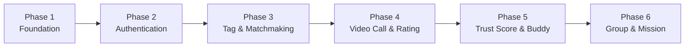

# 📋 Plan Board — Dự án `video_marching`

> Nguyên tắc: Mỗi Raid < 30 phút. Hoàn thành 100% mới sang Raid tiếp theo.
> Mỗi Raid kết thúc bằng **1 kết quả chạy được** (code compile, API trả đúng, hoặc UI hiển thị đúng).

---

## Sơ đồ Phụ thuộc giữa các Phase



---

## Phase 1: Foundation (Dọn nền)

### Raid 1.1 — Xóa Redis, giữ lại WebSocket

| Hạng mục | Chi tiết |
|---|---|
| **Mục tiêu** | Loại bỏ dependency Redis không dùng, giữ WebSocket |
| **File sửa** | [build.gradle](file:///C:/Users/dc130/Desktop/video_marching/build.gradle) |
| **Hành động** | Xóa dòng `spring-boot-starter-data-redis` (dòng 27) |
| **Kiểm tra** | Chạy `./gradlew bootRun` → App start thành công, không lỗi Redis connection |

### Raid 1.2 — Cấu hình WebSocket STOMP Simple Broker

| Hạng mục | Chi tiết |
|---|---|
| **Mục tiêu** | Kích hoạt WebSocket để server có thể push message cho client |
| **File tạo mới** | `config/WebSocketConfig.java` |
| **Nội dung** | `@EnableWebSocketMessageBroker`, Simple Broker prefix `/topic`, App prefix `/app`, Endpoint `/ws` |
| **Kiểm tra** | Mở browser console → `new SockJS('/ws')` kết nối thành công (HTTP 101 Switching Protocols) |

### Raid 1.3 — Bổ sung Entity còn thiếu

| Hạng mục | Chi tiết |
|---|---|
| **Mục tiêu** | Tạo các Entity cho Rubric, Buddy, Mission theo User Stories |
| **File tạo mới** | 3 Entity files |

**Entity cần tạo:**

```
entity/
├── RubricCriteria.java     ← Admin CRUD tiêu chí chấm điểm
│   ├── Long id
│   ├── String name          (VD: "Accuracy", "Fluency", ...)
│   ├── String description
│   └── boolean active
│
├── Buddy.java               ← Quan hệ buddy giữa 2 User
│   ├── Long id
│   ├── User user1
│   ├── User user2
│   └── LocalDateTime createdAt
│
└── Mission.java              ← Nhiệm vụ hệ thống giao cho User
    ├── Long id
    ├── String title
    ├── String description
    ├── int rewardPoints
    └── boolean active
```

| **Kiểm tra** | Chạy `bootRun` → Hibernate tự tạo 3 bảng mới trong MySQL |

### Raid 1.4 — Bổ sung Entity liên kết

| Hạng mục | Chi tiết |
|---|---|
| **Mục tiêu** | Tạo bảng trung gian và mở rộng PeerRating |
| **File tạo mới** | 2 Entity files |
| **File sửa** | [PeerRating.java](file:///C:/Users/dc130/Desktop/video_marching/src/main/java/com/example/videocall_marching_language/entity/PeerRating.java) |

**Entity cần tạo:**

```
entity/
├── UserTag.java              ← User chọn Tag nào (N-N)
│   ├── Long id
│   ├── User user
│   └── Tag tag
│
└── UserMission.java          ← User đã nhận/hoàn thành Mission nào
    ├── Long id
    ├── User user
    ├── Mission mission
    ├── String status          ("ASSIGNED", "COMPLETED")
    └── LocalDateTime completedAt
```

**Sửa PeerRating — thêm field chi tiết theo Rubric:**

```
PeerRating.java (bổ sung)
├── RubricCriteria criteria    ← Đánh giá theo tiêu chí nào
├── int score                  ← Điểm cho tiêu chí đó (1-5)
├── String raterGender         ← Cho Gender Normalization
└── String rateeGender
```

| **Kiểm tra** | Chạy `bootRun` → Hibernate tạo thêm 2 bảng, alter bảng `peer_ratings` |

---

## Phase 2: Authentication (Đăng nhập)

### Raid 2.1 — Spring Security + OAuth2 Setup

| Hạng mục | Chi tiết |
|---|---|
| **Mục tiêu** | User đăng nhập bằng Gmail/Facebook |
| **Dependency thêm** | `spring-boot-starter-oauth2-client`, `spring-boot-starter-security` |
| **File tạo mới** | `config/SecurityConfig.java`, `service/CustomOAuth2UserService.java` |
| **File sửa** | `application.properties` (thêm OAuth2 client config) |
| **Kiểm tra** | Truy cập `/video-call` → Redirect sang trang Google Login → Login thành công → Redirect về app |

### Raid 2.2 — Phone Login (SĐT + OTP)

| Hạng mục | Chi tiết |
|---|---|
| **Mục tiêu** | User đăng nhập bằng số điện thoại |
| **File tạo mới** | `controller/auth/AuthController.java`, `service/OtpService.java` |
| **Logic** | Dùng `ConcurrentHashMap<String, OtpEntry>` lưu OTP tạm (TTL 5 phút, kiểm tra bằng `ScheduledExecutorService`) |
| **Kiểm tra** | POST `/api/auth/send-otp` → nhận mã → POST `/api/auth/verify-otp` → login thành công |

> [!NOTE]
> OTP lưu trong `ConcurrentHashMap` là đủ cho 1 server. Đây chính là nơi mà trước đây cần Redis, nhưng với quy mô MVP thì Java Core thay thế hoàn toàn.

---

## Phase 3: Tag Selection & Matchmaking (Cốt lõi)

### Raid 3.1 — API chọn Tag trước khi vào phòng chờ

| Hạng mục | Chi tiết |
|---|---|
| **Mục tiêu** | User lựa chọn Tags/Chủ đề bài học |
| **File tạo mới** | `repository/TagRepository.java`, `service/TagService.java`, `controller/user/TagController.java` |
| **API** | `GET /api/tags` (danh sách), `POST /api/users/{id}/tags` (lưu lựa chọn) |
| **Kiểm tra** | Gọi API → trả về danh sách Tag phân theo Category → Lưu lựa chọn thành công |

### Raid 3.2 — Matchmaking Engine (ConcurrentHashMap)

| Hạng mục | Chi tiết |
|---|---|
| **Mục tiêu** | Thuật toán ghép cặp User cùng tiêu chí |
| **File tạo mới** | `service/MatchmakingService.java` |
| **Cấu trúc dữ liệu** | `ConcurrentHashMap<String, ConcurrentLinkedQueue<WaitingUser>>` |
| **Key** | Chuỗi ghép từ Tag đã chọn, VD: `"vocabulary_N5"`, `"roleplay_N5"` |
| **Thuật toán** | 1. User A vào → tạo key từ Tags → kiểm tra Queue có ai không<br/>2. Nếu CÓ → Pop User B ra → Ghép cặp thành công<br/>3. Nếu KHÔNG → Đẩy User A vào Queue → Chờ<br/>4. Fallback: Nếu chờ > 30s → Mở rộng tìm kiếm sang level lân cận (N5 gặp N3) |
| **Kiểm tra** | Unit test: 2 User cùng tag → ghép thành công. 1 User khác tag → chờ trong Queue |

### Raid 3.3 — WebSocket Push thông báo ghép cặp

| Hạng mục | Chi tiết |
|---|---|
| **Mục tiêu** | Khi tìm được cặp → Server push thông báo cho cả 2 User |
| **File tạo mới** | `controller/ws/MatchingWebSocketController.java` |
| **Flow** | 1. User A gọi `STOMP SEND /app/match/join` (kèm Tags)<br/>2. Server xử lý qua `MatchmakingService`<br/>3. Tìm được cặp → `SimpMessagingTemplate.convertAndSendToUser(userA, "/topic/match", matchResult)`<br/>4. Client nhận message → Hiển thị "Đã tìm thấy bạn học!" → Chuyển sang trang Video Call |
| **Kiểm tra** | Mở 2 tab browser → Cả 2 vào phòng chờ cùng Tag → Cả 2 nhận thông báo ghép cặp |

---

## Phase 4: Video Call & Rating (Luồng chính)

### Raid 4.1 — Trang Video Call + Agora Integration

| Hạng mục | Chi tiết |
|---|---|
| **Mục tiêu** | 2 User gọi video cho nhau qua Agora |
| **File sửa** | Template `users/video_call.html` (Thymeleaf) |
| **Flow** | 1. Nhận `channelName` từ kết quả ghép cặp<br/>2. Frontend gọi `GET /api/agora/token?channelName=xxx&uid=yyy`<br/>3. Dùng Agora Web SDK join channel<br/>4. Hiển thị video 2 bên |
| **Kiểm tra** | 2 User ghép cặp → Cả 2 vào cùng channel → Thấy video của nhau |

### Raid 4.2 — Form đánh giá PeerRating sau cuộc gọi

| Hạng mục | Chi tiết |
|---|---|
| **Mục tiêu** | User đánh giá bạn học theo Rubric (1-5 sao × 7 tiêu chí) |
| **File tạo mới** | `repository/PeerRatingRepository.java`, `service/RatingService.java`, `controller/user/RatingController.java` |
| **Logic** | Khi kết thúc cuộc gọi → Hiển thị form đánh giá → Check nếu là Buddy → Skip form |
| **API** | `POST /api/ratings` (body: rateeId, danh sách criteriaId + score) |
| **Kiểm tra** | Kết thúc call → Form hiện ra → Chấm điểm → Lưu thành công vào MySQL |

### Raid 4.3 — Admin CRUD Rubric

| Hạng mục | Chi tiết |
|---|---|
| **Mục tiêu** | Admin tạo/sửa/xóa tiêu chí Rubric |
| **File tạo mới** | `controller/admin/RubricAdminController.java`, template `admin/rubric.html` |
| **Kiểm tra** | Login admin → CRUD Rubric → Thay đổi phản ánh vào form đánh giá của User |

---

## Phase 5: Trust Score & Buddy

### Raid 5.1 — Thuật toán Trust Score + Gender Normalization

| Hạng mục | Chi tiết |
|---|---|
| **Mục tiêu** | System tự động tính hệ số tin cậy và đề xuất nâng level |
| **File tạo mới** | `service/TrustScoreService.java`, `service/GenderNormalizationService.java` |
| **Logic** | Query tất cả `PeerRating` của User → Tính trung bình có trọng số (rater có trust score cao → trọng số cao hơn) → Cập nhật `User.trustScore` |
| **Kiểm tra** | Sau vài lần đánh giá → `User.trustScore` thay đổi hợp lý |

### Raid 5.2 — Hệ thống Buddy

| Hạng mục | Chi tiết |
|---|---|
| **Mục tiêu** | 2 User gửi/chấp nhận lời mời Buddy |
| **File tạo mới** | `service/BuddyService.java`, `controller/user/BuddyController.java` |
| **API** | `POST /api/buddies/invite`, `POST /api/buddies/accept`, `GET /api/buddies/mine` |
| **Kiểm tra** | User A mời → User B chấp nhận → Cả 2 xuất hiện trong danh sách buddy → Không hiển thị form đánh giá khi gọi nhau |

---

## Phase 6: Group Call & Mission (Nâng cao)

### Raid 6.1 — "Lễ hội" Group Call (5 người)

| Hạng mục | Chi tiết |
|---|---|
| **Mục tiêu** | Tạo phòng nhóm, User chọn vai trò (first-choose) |
| **File tạo mới** | `entity/GroupRoom.java`, `entity/GroupMember.java`, `service/GroupService.java`, `controller/ws/GroupWebSocketController.java` |
| **Logic** | WebSocket broadcast trạng thái phòng → User A chọn vai trò → Broadcast cho tất cả "vai trò X đã bị chiếm" |
| **Kiểm tra** | 3+ User vào phòng nhóm → Chọn vai trò → Tất cả thấy cập nhật real-time |

### Raid 6.2 — Mission System

| Hạng mục | Chi tiết |
|---|---|
| **Mục tiêu** | System giao nhiệm vụ, User hoàn thành |
| **File tạo mới** | `service/MissionService.java`, `controller/user/MissionController.java` |
| **API** | `GET /api/missions/daily` (lấy nhiệm vụ hôm nay), `POST /api/missions/{id}/complete` |
| **Kiểm tra** | User đăng nhập → Thấy danh sách nhiệm vụ → Hoàn thành → Trạng thái cập nhật |

---

## 📊 Tổng quan Tiến độ

| Phase | Số Raid | Ước tính | Trạng thái |
|---|---|---|---|
| **Phase 1** — Foundation | 4 Raids | ~2 giờ | ⬜ Chưa bắt đầu |
| **Phase 2** — Authentication | 2 Raids | ~1.5 giờ | ⬜ Chưa bắt đầu |
| **Phase 3** — Tag & Matchmaking | 3 Raids | ~2.5 giờ | ⬜ Chưa bắt đầu |
| **Phase 4** — Video Call & Rating | 3 Raids | ~2.5 giờ | ⬜ Chưa bắt đầu |
| **Phase 5** — Trust Score & Buddy | 2 Raids | ~1.5 giờ | ⬜ Chưa bắt đầu |
| **Phase 6** — Group & Mission | 2 Raids | ~2 giờ | ⬜ Chưa bắt đầu |
| **TỔNG** | **16 Raids** | **~12 giờ** | |

> [!IMPORTANT]
> **Bắt đầu từ đâu?** → **Raid 1.1** (Xóa Redis khỏi `build.gradle`). Mất đúng 1 phút. Dopamine shot đầu tiên.
>
> Khi bạn sẵn sàng, nói **"bắt đầu Raid 1.1"** và tôi sẽ hướng dẫn từng bước.
