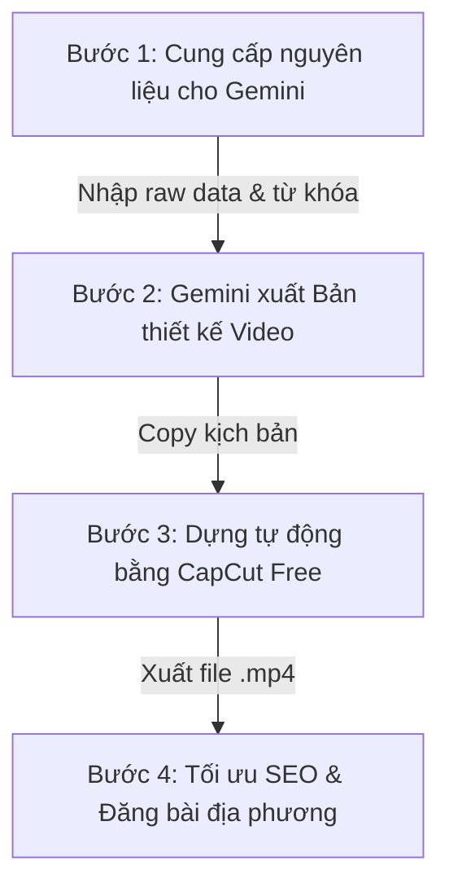

# 📖 QUY TRÌNH 4 BƯỚC TẠO VIDEO CHUẨN SEO BẰNG GEMINI & CAPCUT (FREE 100%)

*   **Tác giả**: Gemini Nexus & John
*   **Mục tiêu**: Tự sản xuất video ngắn hàng loạt để làm Local SEO mà không tốn chi phí mua credit trên các nền tảng AI trả phí.
*   **Nguyên lý hoạt động**: **Gemini làm Biên kịch & Đạo diễn** (viết kịch bản và prompt phân cảnh), còn **CapCut làm Kỹ thuật viên dựng hình** (tự động ghép clip và lồng tiếng).

---

---

## 🟢 BƯỚC 1: CUNG CẤP NGUYÊN LIỆU (BRIEFING CHO GEMINI)

John chỉ cần gửi cho Gemini thông tin thô dạng tin nhắn chat theo cú pháp sau:
> *"Tôi muốn làm 1 video ngắn về [Chủ đề].*
> *Thông tin thô gồm: [Ghi các ý chính của bạn tại đây, ví dụ: các bước sửa, lưu ý...].*
> *Từ khóa cần SEO: [Ghi từ khóa chính, từ khóa địa phương]."*

---

## 🟢 BƯỚC 2: GEMINI BIÊN TẬP & XUẤT "BẢN THIẾT KẾ VIDEO"

Nhận được nguyên liệu, Gemini sẽ tự động xử lý và trả về cho bạn một **Bản thiết kế Video** gồm 3 phần:
1.  **Mô tả kịch bản CapCut**: Viết sẵn định dạng cấu trúc có các nhãn phân cảnh dạng `[Cảnh ...]` và lời thoại để CapCut tự quét hình ảnh.
2.  **Thông số thiết kế (Thumbnail / Bìa)**: Ý tưởng thiết kế ảnh bìa video để thu hút người xem click.
3.  **Metadata SEO**: Tiêu đề video, đoạn mô tả ngắn (caption) kèm hashtag chuẩn để copy khi đăng.

---

## 🟢 BƯỚC 3: DỰNG VIDEO TỰ ĐỘNG BẰNG CAPCUT (FREE 100%)

Bạn lấy dữ liệu từ Bước 2 để đưa vào máy sản xuất:
1.  Mở ứng dụng **CapCut** (trên điện thoại hoặc máy tính).
2.  Chọn công cụ **Kịch bản thành video (Script to Video)**.
3.  Dán toàn bộ phần văn bản kịch bản mà Gemini đã cung cấp vào.
4.  Chọn giọng đọc AI tiếng Việt và bấm **Tạo video** -> **Tạo thông minh**.
5.  *Tùy chọn*: Thay thế các đoạn clip chưa ưng ý bằng hình ảnh thực tế công trình của Thiên Anh Door (đã nhúng GPS) để tăng tính thực tế.

---

## 🟢 BƯỚC 4: TỐI ƯU HÓA SEO KHI ĐĂNG (PUBLISHING)

Khi xuất video ra file thành công, tiến hành đăng lên TikTok/Shorts/Reels:
1.  Copy đoạn **Metadata SEO** (Caption + Hashtags) do Gemini viết sẵn dán vào phần mô tả video.
2.  **Ghim địa điểm**: Chọn vị trí địa lý là `Gia Nghĩa` hoặc `Đắk Nông`.
3.  Đăng bài và kiểm tra phản hồi của người xem để cải tiến kịch bản tiếp theo.
