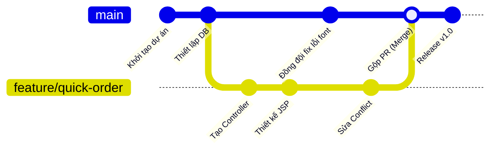

# 🚀 Quy trình Làm việc Nhóm trên GitHub (GitHub Flow)

> **Tóm tắt:** Hướng dẫn quy trình phân nhánh Git chuyên nghiệp (GitHub Flow), cách phối hợp nhóm thông qua Pull Request và quy trình giải quyết xung đột code (Merge Conflict) một cách an toàn.

---

| Cues (Câu hỏi / Từ khóa) | Notes (Nội dung bài học) |
| :--- | :--- |
| **GitHub Flow là gì?** | Mô hình phân nhánh (branching model) tinh gọn, phổ biến nhất cho các dự án phát triển web và làm việc nhóm: 1. Nhánh **`master`** (hoặc `main`) là nhánh chính: Luôn chứa code sạch, đã test chạy được, sẵn sàng deploy. 2. Mỗi tính năng/task mới: Bắt buộc code trên một nhánh độc lập (gọi là **Feature Branch**). |
| **Quy trình 6 bước làm việc hàng ngày** | **Bước 1: Cập nhật code mới nhất** Trước khi code, hãy cập nhật code từ GitHub về máy cục bộ: `git checkout master` `git pull origin master`  **Bước 2: Tạo nhánh mới cho tính năng** Tạo nhánh riêng để không ảnh hưởng đến code của người khác: `git checkout -b feature/ten-tinh-nang` *(Ví dụ: `feature/quick-order`)*  **Bước 3: Code và Commit cục bộ** Lập trình, test chạy thử trên máy cá nhân, sau đó commit code: `git add .` `git commit -m "feat: implement quick order form layout"`  **Bước 4: Đẩy nhánh lên GitHub** Đẩy nhánh tính năng của bạn lên GitHub để chia sẻ: `git push origin feature/ten-tinh-nang`  **Bước 5: Tạo Pull Request (PR)** Lên GitHub giao diện web, nhấn **New Pull Request** để xin phép gộp nhánh của bạn vào `master`. Nhóm sẽ vào xem code, review và nhận xét.  **Bước 6: Review và Merge** Sau khi được đồng đội Approve (phê duyệt) và không có lỗi, nhánh sẽ được gộp (Merge) vào nhánh `master` trên GitHub. |
| **Merge Conflict là gì?** | **Xung đột code** xảy ra khi: Hai thành viên nhóm cùng sửa đổi **trên cùng một dòng** ở **cùng một file** trên hai nhánh khác nhau. Khi gộp (merge) lại, Git không biết nên lấy dòng code của ai nên sẽ báo lỗi và yêu cầu lập trình viên tự giải quyết thủ công. |
| **Quy trình 3 bước xử lý Merge Conflict an toàn** | **Bước 1: Lấy code mới nhất về nhánh master cục bộ** `git checkout master` `git pull origin master`  **Bước 2: Chuyển về nhánh tính năng và gộp master vào** `git checkout feature/ten-tinh-nang` `git merge master` *(Git sẽ báo các file bị CONFLICT)*  **Bước 3: Mở file bị conflict để sửa thủ công** Mở file bị lỗi trên IntelliJ. IDE sẽ hiển thị giao diện so sánh trực quan hoặc anh sẽ thấy các ký hiệu của Git: - `<<<<<<< HEAD` (Code hiện tại của anh) - `=======` (Vạch phân cách) - `>>>>>>> master` (Code mới nhất trên master của đồng đội) ➔ Hãy giữ lại code đúng, xóa code sai và các ký tự đánh dấu trên đi.  **Bước 4: Lưu file, commit và push lại** `git add .` `git commit -m "fix: resolve merge conflicts with master"` `git push origin feature/ten-tinh-nang` ➔ Pull Request trên GitHub sẽ tự động được cập nhật trạng thái xanh sạch để Merge! |
| **5 Nguyên tắc vàng khi làm việc nhóm** | 1. **Tuyệt đối không push trực tiếp vào `master`:** Luôn luôn đi qua Pull Request. 2. **Pull thường xuyên:** Đầu ngày làm việc luôn luôn chạy `git pull` để tránh lệch code quá xa so với nhóm. 3. **Commit nhỏ và rõ ràng:** Đừng gom cả dự án vào 1 commit. Hãy commit theo từng đơn vị tính năng nhỏ kèm mô tả rõ ràng. 4. **Đặt tên nhánh chuẩn hóa:** Dùng tiền tố như `feature/` (tính năng), `bugfix/` (sửa lỗi), `docs/` (tài liệu). 5. **Giao tiếp trước khi sửa file chung:** Nếu sửa các file cấu hình dùng chung (`build.gradle`, `web.xml`), hãy báo trước cho nhóm để mọi người cùng chuẩn bị. |

---

## 🎨 Sơ Đồ Quy Trình Phân Nhánh (GitHub Flow)

