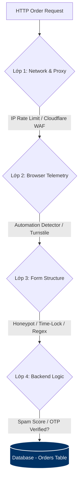

# [[Web_AppSec_Spam_Defense]] — Phòng Thủ Chống Spam Đơn Hàng Từ Cơ Bản Đến Tinh Vi

> **Mục tiêu:** Tài liệu hóa các phương pháp tấn công spam form đặt hàng (không cần đăng nhập) và xây dựng hệ thống phòng thủ nhiều lớp (multi-layered defense) chạy ngầm, đảm bảo bảo mật tối đa nhưng hoàn toàn tàn hình, không gây phiền hà cho đối tượng khách hàng lớn tuổi (Không dùng Captcha truyền thống).

---

## 🗺️ BẢN ĐỒ PHÒNG THỦ TỔNG QUAN (SECURITY MAP)



---

## 💥 PHẦN 1: CÁC PHƯƠNG THỨC TẤN CÔNG (ATTACK VECTORS)

Kẻ phá hoại hoặc đối thủ cạnh tranh có nhiều cấp độ spam để đánh sập database hoặc làm nhiễu dữ liệu đơn hàng:

| Cấp độ | Tên phương thức | Cơ chế hoạt động | Khả năng bypass (vượt rào) |
| :--- | :--- | :--- | :--- |
| **1. Sơ cấp (Basic)** | **Curl / Postman / Simple Scripts** | Sử dụng HTTP client gửi liên tục các request POST thô với dữ liệu rác đến API đặt đơn. | Bị chặn dễ dàng bởi Token CSRF hoặc CORS. |
| **2. Trung cấp** | **Basic Selenium / Headless Bot** | Sử dụng bot duyệt web tự động mở giao diện, tự điền tên, SĐT và bấm nút gửi đơn. | Bypass được CSRF vì chạy trên trình duyệt thật, nhưng để lộ các biến môi trường của bot. |
| **3. Cao cấp (Advanced)** | **Puppeteer / Playwright + Residential Proxy** | Sử dụng trình duyệt ẩn danh tinh vi có thể giả lập di chuột, click và sử dụng proxy xoay để đổi địa chỉ IP liên tục. | Vượt qua được kiểm tra IP thô, Honeypot tĩnh và Time-lock nếu được cấu hình trễ thời gian. |
| **4. Tối thượng** | **Human Click Farms (Spam bằng tay)** | Thuê người thật (hoặc đối thủ tự làm) truy cập vào web và gõ tay các thông tin giả. | Bypass 100% các bộ lọc bot tự động. Chỉ có thể lọc bằng OTP hoặc logic xác thực ở backend. |

---

## 🛡️ PHẦN 2: HỆ THỐNG PHÒNG THỦ ĐA TẦNG (DEFENSE STRATEGIES)

Để bảo vệ form "Mua nhanh" cho người lớn tuổi, chúng ta áp dụng **chiến thuật phòng thủ tàn hình (Invisible Defense)** chia làm 3 cấp độ:

### Tầng 1: Phòng thủ Sơ cấp (Tối ưu hóa UI/UX chống click nhầm)
* **Khóa nút đặt hàng (Disable Submit):** Ngay khi khách hàng click "Đặt hàng", nút bấm chuyển sang trạng thái disabled để tránh người lớn tuổi run tay bấm liên tiếp tạo nhiều đơn trùng lặp.
* **HTML5 Autocomplete:** Sử dụng các thuộc tính `autocomplete="name"`, `autocomplete="tel"`, `autocomplete="street-address"` giúp trình duyệt gợi ý thông tin cũ của đúng người dùng đó.

---

### Tầng 2: Phòng thủ Trung cấp (Chống Bot thông thường - Tàng hình 100%)

#### 1. Kỹ thuật "Hũ mật" (Honeypot)
* **Nguyên lý:** Tạo 1 ô input rỗng nhưng ẩn nó đi bằng CSS. Người dùng thật không thấy nên sẽ bỏ qua, Bot quét mã HTML sẽ tự động điền giá trị vào đây.
* **Triển khai Frontend:**
  ```html
  <div style="display:none;" aria-hidden="true">
      <input type="text" name="confirm_email_address" id="confirm_email_address" tabindex="-1" autocomplete="off">
  </div>
  ```
* **Triển khai Backend (Java):**
  ```java
  String honeypot = request.getParameter("confirm_email_address");
  if (honeypot != null && !honeypot.trim().isEmpty()) {
      // Xác định là bot, từ chối xử lý đơn hàng!
      response.setStatus(HttpServletResponse.SC_BAD_REQUEST);
      return;
  }
  ```

#### 2. Phân tích tốc độ điền Form (Time-Lock)
* **Nguyên lý:** Đo khoảng thời gian từ lúc tải trang đến lúc nhấn gửi đơn. Nếu thời gian $< 3$ giây, chắc chắn là Bot.
* **Triển khai:** Lưu timestamp lúc tải trang vào một thẻ ẩn hoặc Session, khi submit thì so sánh ở backend.

#### 3. Bộ lọc định dạng SĐT Việt Nam (Regex Validation)
* Kiểm tra đầu số điện thoại hợp lệ của Việt Nam (10 chữ số, bắt đầu bằng `09, 03, 07, 08, 05`). Loại bỏ các chuỗi ký tự ngẫu nhiên hoặc số điện thoại định dạng nước ngoài do bot tự sinh.

---

### Tầng 3: Phòng thủ Cao cấp (Chống Bot tinh vi & Đối thủ phá hoại)

#### 1. Kiểm tra dấu vết giả lập (Automation & Browser Fingerprinting)
* Chặn các dấu vết mặc định của công cụ tự động hóa:
  ```javascript
  if (navigator.webdriver || navigator.languages.length === 0) {
      console.warn("Automation detected");
      // Gắn cờ spam gửi lên server
  }
  ```

#### 2. Cloudflare Turnstile (Lá chắn tàng hình thay thế CAPTCHA)
* **Mô tả:** Hệ thống thử thách ngầm của Cloudflare. Kiểm tra browser telemetry và giải mã thuật toán ở background.
* **Ưu điểm:** Khách hàng lớn tuổi không cần phải bấm chọn hình ảnh, hệ thống chạy tự động và chỉ chặn các bot tinh vi (kể cả Puppeteer giả lập).

#### 3. Thiết lập giới hạn IP thông minh ở Gateway (Rate Limiting)
* Sử dụng **Nginx** hoặc **Cloudflare WAF** để cấu hình giới hạn tần suất gửi yêu cầu POST.
* *Ví dụ:* Giới hạn mỗi IP chỉ được gọi API `/order/checkout` tối đa **3 lần trong 10 phút**. Nếu vượt quá, chặn IP đó trong vòng 1 giờ.

#### 4. Phân luồng đơn hàng ở Backend (Quarantine State Machine)
* Tạo cột `status` với các giá trị: `UNVERIFIED` (Chưa xác minh), `PENDING` (Chờ duyệt), `APPROVED` (Đã duyệt).
* Khi đơn hàng có dấu hiệu nghi ngờ (gửi từ proxy rác, trùng lặp nhiều SĐT tương tự):
  1. Server vẫn báo đặt hàng thành công ra ngoài để đối thủ tưởng đã spam thành công (tránh họ đổi chiến thuật).
  2. Ở backend, lưu đơn đó vào trạng thái `UNVERIFIED` và đưa vào thư mục spam để quản trị viên lọc thủ công sau.

---

## ☕ PHẦN 3: HƯỚNG DẪN TRIỂN KHAI TRONG JAVA (SERVLET / JDBC)

### 1. Filter giới hạn tần suất yêu cầu (IP Rate Limiting Filter)
Bạn có thể viết một Filter đơn giản sử dụng `ConcurrentHashMap` trong Java để theo dõi số lần truy cập từ mỗi IP:

```java
package com.fengshui.filter;

import javax.servlet.*;
import javax.servlet.annotation.WebFilter;
import javax.servlet.http.HttpServletRequest;
import javax.servlet.http.HttpServletResponse;
import java.io.IOException;
import java.util.Map;
import java.util.concurrent.ConcurrentHashMap;
import java.util.concurrent.atomic.AtomicInteger;

@WebFilter("/checkout")
public class RateLimitFilter implements Filter {
    // Lưu trữ số lần request của mỗi IP
    private final Map<String, RequestTracker> ipMap = new ConcurrentHashMap<>();
    private static final int MAX_REQUESTS = 3;
    private static final long TIME_WINDOW_MS = 600000; // 10 phút

    @Override
    public void doFilter(ServletRequest request, ServletResponse response, FilterChain chain)
            throws IOException, ServletException {
        
        HttpServletRequest req = (HttpServletRequest) request;
        HttpServletResponse resp = (HttpServletResponse) response;
        
        if ("POST".equalsIgnoreCase(req.getMethod())) {
            String ip = req.getRemoteAddr();
            long currentTime = System.currentTimeMillis();
            
            ipMap.putIfAbsent(ip, new RequestTracker(currentTime));
            RequestTracker tracker = ipMap.get(ip);
            
            synchronized (tracker) {
                if (currentTime - tracker.startTime > TIME_WINDOW_MS) {
                    tracker.startTime = currentTime;
                    tracker.count.set(0);
                }
                
                if (tracker.count.incrementAndGet() > MAX_REQUESTS) {
                    resp.setStatus(429); // Too Many Requests
                    resp.getWriter().write("He thong phat hien truy cap bat thuong. Vui long thu lai sau 10 phut.");
                    return;
                }
            }
        }
        chain.doFilter(request, response);
    }

    private static class RequestTracker {
        long startTime;
        final AtomicInteger count = new AtomicInteger(0);

        RequestTracker(long startTime) {
            this.startTime = startTime;
        }
    }
}
```

---

## 🔗 RELATED
* [[Relational_Database_Fundamentals]]
* [[Java_3_Layer_Architecture]]
* [[MySQL_8.4_Features]]
