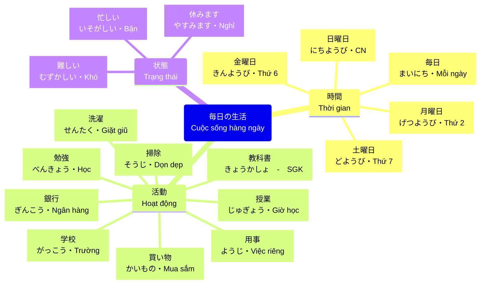
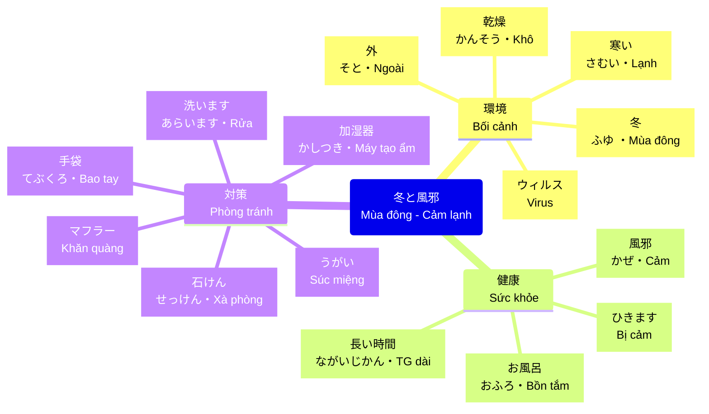
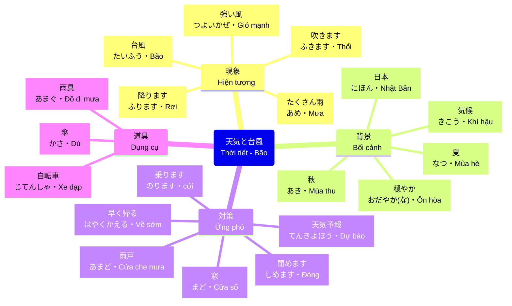

# Ngữ cảnh Từ vựng N5 - Bài 12 (Video)

**Summary**: Trích xuất các câu trong video bài học để giải thích từ vựng trong ngữ cảnh thực tế, kết hợp mẫu ngữ pháp ～ほうがいいです và ～たり、～たりします.

---

## Video Bài học

[Video Lesson](https://storage.googleapis.com/nilc02-storage/activities/1703589144_IUokzZNZrDZV37nP.mp4)

## Trích đoạn và Giải thích

### 1. Cuộc sống bận rộn hàng ngày

* **[0:09](https://storage.googleapis.com/nilc02-storage/activities/1703589144_IUokzZNZrDZV37nP.mp4#t=9) 毎日とても[[N5_Unit_12_Vocabulary#Danh sách từ vựng chính|忙しい]]です。**
  * (Mỗi ngày đều rất bận rộn.)
  * **忙しい (いそがしい)**: bận rộn.
* **[0:13](https://storage.googleapis.com/nilc02-storage/activities/1703589144_IUokzZNZrDZV37nP.mp4#t=13) [[N5_Unit_12_Vocabulary#Danh sách từ vựng chính|月曜日]]から[[N5_Unit_12_Vocabulary#Danh sách từ vựng chính|金曜日]]までは毎日[[N5_Unit_12_Vocabulary#Danh sách từ vựng chính|学校]]に行きます。**
  * (Từ thứ Hai đến thứ Sáu ngày nào cũng đi học.)
  * **月曜日 (げつようび)**: Thứ hai.
  * **金曜日 (きんようび)**: Thứ sáu.
  * **学校 (がっこう)**: Trường học.
* **[0:18](https://storage.googleapis.com/nilc02-storage/activities/1703589144_IUokzZNZrDZV37nP.mp4#t=18) [[N5_Unit_12_Vocabulary#Danh sách từ vựng chính|授業]]は週に12[[N5_Unit_12_Vocabulary#Danh sách từ vựng chính|コマ]]もあります。**
  * (Mỗi tuần có đến tận 12 tiết học.)
  * **授業 (じゅぎょう)**: Giờ học.
  * **コマ**: Tiết học.
* **[0:23](https://storage.googleapis.com/nilc02-storage/activities/1703589144_IUokzZNZrDZV37nP.mp4#t=23) [[N5_Unit_12_Vocabulary#Danh sách từ vựng chính|授業]]は[[N5_Unit_12_Vocabulary#Danh sách từ vựng chính|難しい]]です。**
  * (Giờ học rất khó.)
  * **難しい (むずかしい)**: Khó.
* **[0:26](https://storage.googleapis.com/nilc02-storage/activities/1703589144_IUokzZNZrDZV37nP.mp4#t=26) 毎日2時くらいまで[[N5_Unit_12_Vocabulary#Từ vựng mở rộng (Xuất hiện trong Video)|勉強]]しています。**
  * (Mỗi ngày học đến tận khoảng 2 giờ sáng.)
  * **勉強 (べんきょう)**: Học.
* **[0:31](https://storage.googleapis.com/nilc02-storage/activities/1703589144_IUokzZNZrDZV37nP.mp4#t=31) [[N5_Unit_12_Vocabulary#Danh sách từ vựng chính|土曜日]]はいろいろな[[N5_Unit_12_Vocabulary#Từ vựng mở rộng (Xuất hiện trong Video)|用事]]をします。**
  * (Thứ Bảy thì làm nhiều việc.)
  * **土曜日 (どようび)**: Thứ bảy.
  * **用事 (ようじ)**: Việc riêng/Công chuyện.
* **[0:36](https://storage.googleapis.com/nilc02-storage/activities/1703589144_IUokzZNZrDZV37nP.mp4#t=36) [[N5_Unit_12_Vocabulary#Từ vựng mở rộng (Xuất hiện trong Video)|銀行]]に行ったり[[N5_Unit_12_Vocabulary#Từ vựng mở rộng (Xuất hiện trong Video)|買い物]]に行ったりします。**
  * (Làm các việc như đi ngân hàng, đi mua sắm.)
  * **銀行 (ぎんこう)**: Ngân hàng.
  * **買い物 (かいもの)**: Mua sắm.
* **[0:41](https://storage.googleapis.com/nilc02-storage/activities/1703589144_IUokzZNZrDZV37nP.mp4#t=41) [[N5_Unit_12_Vocabulary#Danh sách từ vựng chính|日曜日]]も [[N5_Unit_12_Vocabulary#Từ vựng mở rộng (Xuất hiện trong Video)|掃除]]をしたり、[[N5_Unit_12_Vocabulary#Từ vựng mở rộng (Xuất hiện trong Video)|洗濯]]をしたりします。**
  * (Chủ Nhật cũng làm những việc như dọn dẹp, giặt giũ.)
  * **日曜日 (にちようび)**: Chủ nhật.
  * **掃除 (そうじ)**: Dọn dẹp.
  * **洗濯 (せんたく)**: Giặt giũ.
* **[0:47](https://storage.googleapis.com/nilc02-storage/activities/1703589144_IUokzZNZrDZV37nP.mp4#t=47) そして、午後から[[N5_Unit_12_Vocabulary#Danh sách từ vựng chính|教科書]]を読んだり、[[N5_Unit_12_Vocabulary#Từ vựng mở rộng (Xuất hiện trong Video)|レポート]]を書いたりします。**
  * (Và từ buổi chiều, làm các việc như đọc sách giáo khoa, viết báo cáo.)
  * **教科書 (きょうかしょ)**: Sách giáo khoa.
  * **レポート**: Báo cáo.
* **[0:57](https://storage.googleapis.com/nilc02-storage/activities/1703589144_IUokzZNZrDZV37nP.mp4#t=57) 少し[[N5_Unit_12_Vocabulary#Danh sách từ vựng chính|休んだ]][[N5_G12_Hou_ga_ii_desu|ほうがいい]]と[[N5_Unit_12_Vocabulary#Danh sách từ vựng chính|思います]]。**
  * (Tôi nghĩ là nên nghỉ ngơi một chút.)
  * **休みます (やすみます)**: Nghỉ.
  * **思います (おもいます)**: Nghĩ.

### 2. Mùa đông và Cảm lạnh

* **[1:06](https://storage.googleapis.com/nilc02-storage/activities/1703589144_IUokzZNZrDZV37nP.mp4#t=66) 日本の[[N5_Unit_12_Vocabulary#Danh sách từ vựng chính|冬]]は[[N5_Unit_12_Vocabulary#Danh sách từ vựng chính|寒い]]です。**
  * (Mùa đông ở Nhật Bản thì lạnh.)
  * **冬 (ふゆ)**: Mùa đông.
  * **寒い (さむい)**: Lạnh.
* **[1:13](https://storage.googleapis.com/nilc02-storage/activities/1703589144_IUokzZNZrDZV37nP.mp4#t=73) ですから、よく[[N5_Unit_12_Vocabulary#Danh sách từ vựng chính|風邪]]を[[N5_Unit_12_Vocabulary#Danh sách từ vựng chính|ひきます]]。**
  * (Vì vậy, thường hay bị cảm.)
  * **風邪 (かぜ)**: Cảm.
  * **ひきます (風邪を)**: Bị cảm.
* **[1:18](https://storage.googleapis.com/nilc02-storage/activities/1703589144_IUokzZNZrDZV37nP.mp4#t=78) [[N5_Unit_12_Vocabulary#Danh sách từ vựng chính|寒い]][[N5_Unit_12_Vocabulary#Danh sách từ vựng chính|日]]は[[N5_Unit_12_Vocabulary#Danh sách từ vựng chính|手袋]]を[[N5_Unit_12_Vocabulary#Danh sách từ vựng chính|した]][[N5_G12_Hou_ga_ii_desu|ほうがいいです]]。**
  * (Những ngày lạnh thì nên đeo bao tay.)
  * **日 (ひ)**: Ngày.
  * **手袋 (てぶくろ)**: Bao tay.
  * **します (手袋 を)**: Đeo (bao tay).
* **[1:23](https://storage.googleapis.com/nilc02-storage/activities/1703589144_IUokzZNZrDZV37nP.mp4#t=83) そして, [[N5_Unit_12_Vocabulary#Danh sách từ vựng chính|マフラー]] cũng [[N5_Unit_12_Vocabulary#Danh sách từ vựng chính|した]][[N5_G12_Hou_ga_ii_desu|ほうがいいです]]。**
  * (Và cũng nên quàng khăn cổ.)
  * **マフラー**: Khăn quàng cổ.
* **[1:28](https://storage.googleapis.com/nilc02-storage/activities/1703589144_IUokzZNZrDZV37nP.mp4#t=88) [[N5_Unit_12_Vocabulary#Từ vựng mở rộng (Xuất hiện trong Video)|お風呂]] cũng [[N5_Unit_12_Vocabulary#Danh sách từ vựng chính|長い]]時間[[N5_Unit_12_Vocabulary#Danh sách từ vựng chính|入った]][[N5_G12_Hou_ga_ii_desu|ほうがいいです]]。**
  * (Cũng nên ngâm bồn tắm thời gian dài.)
  * **お風呂 (おふろ)**: Bồn tắm.
  * **長い (ながい)**: Dài.
* **[1:34](https://storage.googleapis.com/nilc02-storage/activities/1703589144_IUokzZNZrDZV37nP.mp4#t=94) [[N5_Unit_12_Vocabulary#Danh sách từ vựng chính|外]]には[[N5_Unit_12_Vocabulary#Danh sách từ vựng chính|風邪]] của [[N5_Unit_12_Vocabulary#Từ vựng mở rộng (Xuất hiện trong Video)|ウイルス]]がいます。乾燥**
  * (Bên ngoài có virus cảm lạnh.)
  * **外 (そと)**: Bên ngoài.
  * **ウイルス**: Virus.
* **[1:37](https://storage.googleapis.com/nilc02-storage/activities/1703589144_IUokzZNZrDZV37nP.mp4#t=97) ですから、[[N5_Unit_12_Vocabulary#Từ vựng mở rộng (Xuất hiện trong Video)|うちに]]帰ったら[[N5_Unit_12_Vocabulary#Danh sách từ vựng chính|すぐに]]手を[[N5_Unit_12_Vocabulary#Danh sách từ vựng chính|洗って]]ください。**
  * (Vì vậy, khi về nhà hãy rửa tay ngay lập tức.)
  * **うち**: Nhà.
  * **すぐに**: Liền, ngay lập tức.
  * **洗います (あらいます)**: Rửa.
* **[1:40](https://storage.googleapis.com/nilc02-storage/activities/1703589144_IUokzZNZrDZV37nP.mp4#t=100) [[N5_Unit_12_Vocabulary#Từ vựng mở rộng (Xuất hiện trong Video)|石けん]]で洗った[[N5_G12_Hou_ga_ii_desu|ほうがいいです]]。**
  * (Nên rửa bằng xà phòng.)
  * **石けん (せっけん)**: Xà phòng.
* **[1:45](https://storage.googleapis.com/nilc02-storage/activities/1703589144_IUokzZNZrDZV37nP.mp4#t=103) そして[[N5_Unit_12_Vocabulary#Từ vựng mở rộng (Xuất hiện trong Video)|うがい]]をしてください。**
  * (Và hãy súc miệng.)
  * **うがい**: Súc miệng.
* **[1:53](https://storage.googleapis.com/nilc02-storage/activities/1703589144_IUokzZNZrDZV37nP.mp4#t=111) ですから[[N5_Unit_12_Vocabulary#Từ vựng mở rộng (Xuất hiện trong Video)|加湿器]]を使った[[N5_G12_Hou_ga_ii_desu|ほうがいいです]]。**
  * (Vì vậy nên sử dụng máy tạo ẩm.)
  * **加湿器(かしつき)**: Máy tạo độ ẩm.

### 3. Thời tiết và Bão

* **[1:58](https://storage.googleapis.com/nilc02-storage/activities/1703589144_IUokzZNZrDZV37nP.mp4#t=117) [[N5_Unit_12_Vocabulary#Danh sách từ vựng chính|日本]]の[[N5_Unit_12_Vocabulary#Từ vựng mở rộng (Xuất hiện trong Video)|気候]]は[[N5_Unit_12_Vocabulary#Danh sách từ vựng chính|穏やか]]です。**
  * (Khí hậu của Nhật Bản thì ôn hòa.)
  * **気候 (きこう)**: Khí hậu.
  * **穏やかな (おだやかな)**: Nhẹ nhàng/Ôn hòa.
* **[2:02](https://storage.googleapis.com/nilc02-storage/activities/1703589144_IUokzZNZrDZV37nP.mp4#t=122) でも, [[N5_Unit_12_Vocabulary#Danh sách từ vựng chính|台風]]が来ます。**
  * (Nhưng mà bão sẽ đến.)
  * **台風 (たいふう)**: Bão.
* **[2:07](https://storage.googleapis.com/nilc02-storage/activities/1703589144_IUokzZNZrDZV37nP.mp4#t=127) 毎年[[N5_Unit_12_Vocabulary#Danh sách từ vựng chính|夏]] từ [[N5_Unit_12_Vocabulary#Danh sách từ vựng chính|秋]]に[[N5_Unit_12_Vocabulary#Danh sách từ vựng chính|台風]]が来ます。**
  * (Mỗi năm từ mùa hè đến mùa thu bão sẽ đến.)
  * **夏 (なつ)**: Mùa hè.
  * **秋 (あき)**: Mùa thu.
* **[2:11](https://storage.googleapis.com/nilc02-storage/activities/1703589144_IUokzZNZrDZV37nP.mp4#t=131) [[N5_Unit_12_Vocabulary#Danh sách từ vựng chính|台風]]の時はとても[[N5_Unit_12_Vocabulary#Danh sách từ vựng chính|強い]][[N5_Unit_12_Vocabulary#Danh sách từ vựng chính|風]]が[[N5_Unit_12_Vocabulary#Danh sách từ vựng chính|吹きます]]。**
  * (Khi có bão thì gió thổi rất mạnh.)
  * **強い (つよい)**: Mạnh.
  * **風 (かぜ)**: Gió.
  * **吹きます (ふきます)**: Thổi.
* **[2:17](https://storage.googleapis.com/nilc02-storage/activities/1703589144_IUokzZNZrDZV37nP.mp4#t=137) そして, たくさん[[N5_Unit_12_Vocabulary#Danh sách từ vựng chính|雨]]が[[N5_Unit_12_Vocabulary#Danh sách từ vựng chính|降ります]]。**
  * (Và mưa rơi rất nhiều.)
  * **雨 (あめ)**: Mưa.
  * **降ります (ふります)**: Rơi.
* **[2:23](https://storage.googleapis.com/nilc02-storage/activities/1703589144_IUokzZNZrDZV37nP.mp4#t=143) [[N5_Unit_12_Vocabulary#Danh sách từ vựng chính|台風]]の時は[[N5_Unit_12_Vocabulary#Danh sách từ vựng chính|傘]]は[[N5_Unit_12_Vocabulary#Danh sách từ vựng chính|役に立ちません]]。**
  * (Khi có bão thì ô dù không có tác dụng.)
  * **傘 (かさ)**: Dù.
  * **役に立ちます (やくにたちます)**: Có ích, có lợi.
* **[2:26](https://storage.googleapis.com/nilc02-storage/activities/1703589144_IUokzZNZrDZV37nP.mp4#t=146) ですから[[N5_Unit_12_Vocabulary#Từ vựng mở rộng (Xuất hiện trong Video)|雨具]]を使った[[N5_G12_Hou_ga_ii_desu|ほうがいいです]]。**
  * (Vì thế nên sử dụng đồ đi mưa.)
  * **雨具 (あまぐ)**: Đồ đi mưa.
* **[2:30](https://storage.googleapis.com/nilc02-storage/activities/1703589144_IUokzZNZrDZV37nP.mp4#t=150) [[N5_Unit_12_Vocabulary#Từ vựng mở rộng (Xuất hiện trong Video)|自転車]]は[[N5_Unit_12_Vocabulary#Danh sách từ vựng chính|乗らない]][[N5_G12_Hou_ga_ii_desu|ほうがいいです]]。**
  * (Không nên đi xe đạp.)
  * **自転車 (じてんしゃ)**: Xe đạp.
  * **乗ります (のります)**: Chạy, lái/Đi (xe).
* **[2:33](https://storage.googleapis.com/nilc02-storage/activities/1703589144_IUokzZNZrDZV37nP.mp4#t=153) [[N5_Unit_12_Vocabulary#Danh sách từ vựng chính|台風]]の時は[[N5_Unit_12_Vocabulary#Danh sách từ vựng chính|天気予報]]を見てください。**
  * (Khi có bão hãy xem dự báo thời tiết.)
  * **天気予報 (てんきよほう)**: Dự báo thời tiết.
- [02:36](https://storage.googleapis.com/nilc02-storage/activities/1703589144_IUokzZNZrDZV37nP.mp4#t=02:36.81)そして、[[N5_Unit_12_Vocabulary#Danh sách từ vựng chính|台風情報]]をよく聞いてください。
  * (Và hãy nghe kỹ tin tức cơn bão)
  * 台風情報(たいふうじょうほう): tin tức bão
* **[2:43](https://storage.googleapis.com/nilc02-storage/activities/1703589144_IUokzZNZrDZV37nP.mp4#t=163) そして, [[N5_Unit_12_Vocabulary#Danh sách từ vựng chính|台風]]が来る時は[[N5_Unit_12_Vocabulary#Danh sách từ vựng chính|早く]][[N5_Unit_12_Vocabulary#Từ vựng mở rộng (Xuất hiện trong Video)|うちに]]帰った[[N5_G12_Hou_ga_ii_desu|ほうがいいです]]。**
  * (Và khi bão đến thì nên về nhà sớm.)
  * **早く (はやく)**: Sớm.
* [02:48](https://storage.googleapis.com/nilc02-storage/activities/1703589144_IUokzZNZrDZV37nP.mp4#t=02:48.82)そして、外に出ないほうがいいです。
  * (Và không nên ra ngoài)
* **[2:53](https://storage.googleapis.com/nilc02-storage/activities/1703589144_IUokzZNZrDZV37nP.mp4#t=173) 家の[[N5_Unit_12_Vocabulary#Từ vựng mở rộng (Xuất hiện trong Video)|窓]]は[[N5_Unit_12_Vocabulary#Danh sách từ vựng chính|全部]][[N5_Unit_12_Vocabulary#Từ vựng mở rộng (Xuất hiện trong Video)|閉めて]]ください。**
  * (Hãy đóng toàn bộ cửa sổ trong nhà lại.)
  * **窓 (まど)**: Cửa sổ.
  * **全部 (ぜんぶ)**: Tất cả.
  * **閉めます (しめます)**: Đóng.
* **[2:58](https://storage.googleapis.com/nilc02-storage/activities/1703589144_IUokzZNZrDZV37nP.mp4#t=178) [[N5_Unit_12_Vocabulary#Từ vựng mở rộng (Xuất hiện trong Video)|雨戸]] cũng [[N5_Unit_12_Vocabulary#Từ vựng mở rộng (Xuất hiện trong Video)|閉めた]][[N5_G12_Hou_ga_ii_desu|ほうがいいです]]。**
  * (Cũng nên đóng cửa che mưa.)
  * **雨戸 (あまど)**: Cửa che mưa (bằng gỗ).

---

## Related
- [[MOC_Japanese_N5]]
- [[N5_Unit_12_Vocabulary]]
- [[N5_G12_Hou_ga_ii_desu|Ngữ pháp: ～ほうがいいです]]
- [[N5_G12_Tari_Tari_shimasu|Ngữ pháp: ～たり、～たりします]]
